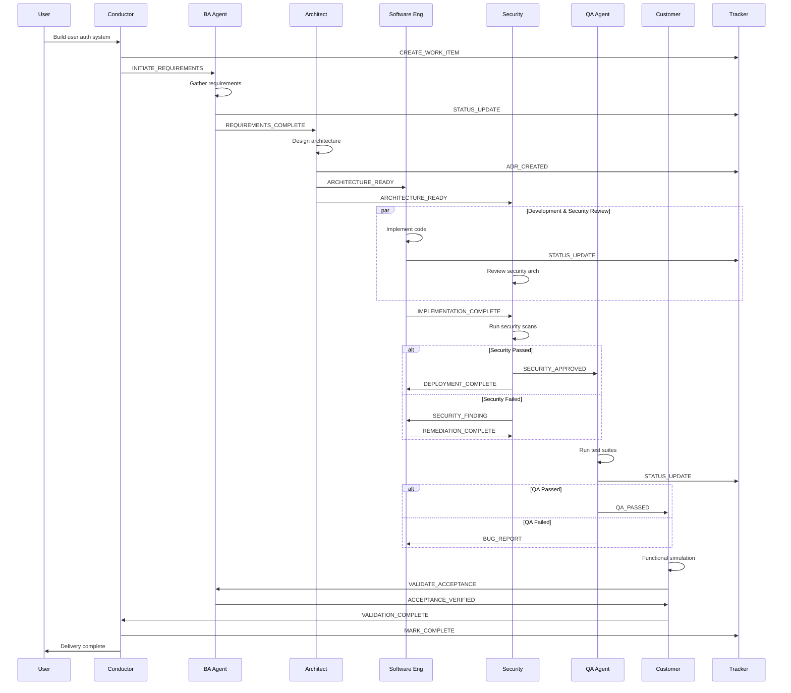

# Agentic AI-SDLC Framework
## Self-Orchestrating Multi-Agent System for Enterprise Software Development

**Version**: 2.0  
**Protocol**: A2A (Agent-to-Agent)  
**Architecture**: Autonomous Agent Mesh  
**Purpose**: Fully autonomous software development lifecycle with self-managing, self-improving agents

---

## Executive Summary

This framework defines a **self-orchestrating ecosystem** of specialized AI agents that:
- **Self-manage**: Each agent owns its domain completely
- **Communicate via A2A**: Standardized agent-to-agent protocol
- **Auto-assign work**: Tasks flow automatically based on dependencies
- **Track progress**: Built-in work tracking and completion verification
- **Continuously improve**: Learn and adapt to new models, languages, patterns
- **Trigger autonomously**: Single prompt initiates full SDLC execution

---

## Agent Ecosystem Architecture

```
┌─────────────────────────────────────────────────────────────────────────────┐
│                          ORCHESTRATION LAYER                                 │
│  ┌─────────────────────────────────────────────────────────────────────┐    │
│  │                    CONDUCTOR AGENT (Meta-Orchestrator)               │    │
│  │  • Receives initial request • Triggers sequence • Monitors progress  │    │
│  │  • Handles escalations • Reports completion • Manages learning loop  │    │
│  └─────────────────────────────────────────────────────────────────────┘    │
└─────────────────────────────────────────────────────────────────────────────┘
                                      │
                                      ▼ A2A Protocol
┌─────────────────────────────────────────────────────────────────────────────┐
│                           SPECIALIST AGENT LAYER                             │
│                                                                              │
│  ┌──────────────┐  ┌──────────────┐  ┌──────────────┐  ┌──────────────┐    │
│  │   BA AGENT   │  │  ARCHITECT   │  │  SOFTWARE    │  │  SECURITY    │    │
│  │              │  │    AGENT     │  │   ENGINEER   │  │    AGENT     │    │
│  │ Requirements │  │  (Jets)      │  │    AGENT     │  │              │    │
│  │ User Stories │  │  Innovation  │  │  Development │  │  Compliance  │    │
│  │ Acceptance   │  │  AI-Native   │  │  Code Review │  │  Deployment  │    │
│  └──────┬───────┘  └──────┬───────┘  └──────┬───────┘  └──────┬───────┘    │
│         │                 │                 │                 │             │
│         └────────────┬────┴────────┬────────┴────────┬────────┘             │
│                      │             │                 │                      │
│  ┌──────────────┐    │    ┌──────────────┐    ┌──────────────┐             │
│  │   QA AGENT   │◄───┴───►│  CUSTOMER    │◄───┤   TRACKER    │             │
│  │              │         │    AGENT     │    │    AGENT     │             │
│  │  Validation  │         │  Functional  │    │  Work Items  │             │
│  │  Testing     │         │  Simulation  │    │  Dependencies│             │
│  │  Deployment  │         │  UAT         │    │  Progress    │             │
│  └──────────────┘         └──────────────┘    └──────────────┘             │
│                                                                              │
└─────────────────────────────────────────────────────────────────────────────┘
                                      │
                                      ▼
┌─────────────────────────────────────────────────────────────────────────────┐
│                          INFRASTRUCTURE LAYER                                │
│  ┌─────────────┐  ┌─────────────┐  ┌─────────────┐  ┌─────────────┐        │
│  │  Knowledge  │  │   Model     │  │   A2A       │  │  Learning   │        │
│  │    Base     │  │  Registry   │  │  Message    │  │   Engine    │        │
│  │             │  │             │  │    Bus      │  │             │        │
│  └─────────────┘  └─────────────┘  └─────────────┘  └─────────────┘        │
└─────────────────────────────────────────────────────────────────────────────┘
```

---

## Agent Definitions

### 1. CONDUCTOR AGENT (Meta-Orchestrator)

**Role**: Single entry point that triggers and orchestrates the entire SDLC

**Responsibilities**:
- Receive and interpret user requests
- Decompose into SDLC phases
- Trigger appropriate agent sequence
- Monitor cross-agent progress
- Handle escalations and blockers
- Report final completion
- Trigger learning/improvement cycles

**A2A Capabilities**:
```yaml
agent_id: conductor
capabilities:
  - request_interpretation
  - workflow_orchestration
  - progress_monitoring
  - escalation_handling
  - completion_reporting
triggers:
  inbound:
    - user_request
    - agent_escalation
    - completion_notification
  outbound:
    - phase_initiation
    - status_query
    - reassignment_directive
```

---

### 2. BA AGENT (Business Analyst)

**Role**: Requirements engineering and acceptance criteria definition

**Responsibilities**:
- Gather and clarify requirements
- Create user stories with acceptance criteria
- Define functional requirements (FR)
- Define non-functional requirements (NFR)
- Validate requirements with stakeholders
- Maintain requirements traceability

**Outputs**:
```yaml
deliverables:
  - requirements_document:
      format: markdown
      sections:
        - problem_statement
        - stakeholder_analysis
        - functional_requirements
        - non_functional_requirements
        - acceptance_criteria
        - constraints_and_assumptions
  
  - user_stories:
      format: structured
      template: |
        AS A [persona]
        I WANT [capability]
        SO THAT [benefit]
        
        ACCEPTANCE CRITERIA:
        - GIVEN [context] WHEN [action] THEN [outcome]
```

**A2A Protocol**:
```yaml
agent_id: ba_agent
dependencies:
  upstream: [conductor]
  downstream: [architect_agent, tracker_agent]
messages:
  receives:
    - INITIATE_REQUIREMENTS: Start requirements gathering
    - CLARIFY_REQUEST: Handle ambiguity from other agents
    - VALIDATE_ACCEPTANCE: Confirm criteria met
  sends:
    - REQUIREMENTS_COMPLETE: Hand off to architect
    - CLARIFICATION_NEEDED: Request more info from conductor
    - ACCEPTANCE_VERIFIED: Confirm to QA/Customer agents
auto_triggers:
  on_receive: INITIATE_REQUIREMENTS
  action: begin_requirements_workflow
```

---

### 3. ARCHITECT AGENT (Jets - Innovation)

**Role**: AI-native architecture design and innovation

**Responsibilities**:
- Design system architecture
- Create Architecture Decision Records (ADRs)
- Identify AI/ML integration opportunities
- Define technology stack
- Design for scalability, security, observability
- Innovate with latest AI patterns (RAG, agents, embeddings)
- Evaluate build vs. buy decisions

**Outputs**:
```yaml
deliverables:
  - architecture_decision_records:
      format: markdown
      required_sections:
        - context
        - decision
        - consequences
        - alternatives_considered
  
  - architecture_diagrams:
      types:
        - context_diagram
        - component_diagram
        - sequence_diagram
        - deployment_diagram
      format: mermaid
  
  - technology_recommendations:
      includes:
        - stack_selection
        - ai_integration_points
        - innovation_opportunities
        - risk_assessment
```

**A2A Protocol**:
```yaml
agent_id: architect_agent
alias: jets
dependencies:
  upstream: [ba_agent]
  downstream: [software_engineer_agent, security_agent]
messages:
  receives:
    - REQUIREMENTS_COMPLETE: Begin architecture design
    - TECHNICAL_QUESTION: Answer from any agent
    - INNOVATION_REQUEST: Evaluate AI opportunity
  sends:
    - ARCHITECTURE_READY: Hand off to dev + security
    - ADR_CREATED: Notify tracker
    - TECHNOLOGY_DECISION: Broadcast stack choices
innovation_triggers:
  - detect_ai_opportunity
  - evaluate_emerging_patterns
  - assess_model_updates
```

---

### 4. SOFTWARE ENGINEER AGENT

**Role**: Code development, implementation, and code review

**Responsibilities**:
- Implement features per architecture
- Write clean, testable code
- Follow SOLID principles
- Create unit tests (>80% coverage)
- Perform self-code-review
- Document code and APIs
- Handle technical debt

**Outputs**:
```yaml
deliverables:
  - source_code:
      structure:
        - src/presentation/
        - src/application/
        - src/domain/
        - src/infrastructure/
      standards:
        - layered_architecture
        - dependency_inversion
        - strict_typing
  
  - tests:
      types:
        - unit_tests
        - integration_tests
      coverage_target: 80%
  
  - documentation:
      includes:
        - api_documentation
        - code_comments
        - readme_updates
```

**A2A Protocol**:
```yaml
agent_id: software_engineer_agent
dependencies:
  upstream: [architect_agent]
  downstream: [security_agent, qa_agent]
  parallel: [tracker_agent]
messages:
  receives:
    - ARCHITECTURE_READY: Begin implementation
    - CODE_REVIEW_REQUEST: Review another agent's code
    - BUG_REPORT: Fix from QA
    - SECURITY_FINDING: Remediate from security
  sends:
    - IMPLEMENTATION_COMPLETE: Hand off to security + QA
    - CODE_REVIEW_COMPLETE: Return review results
    - TECHNICAL_DEBT_LOGGED: Notify tracker
quality_gates:
  before_handoff:
    - lint_passed: true
    - type_check_passed: true
    - unit_tests_passed: true
    - coverage_met: true
    - self_review_complete: true
```

---

### 5. SECURITY AGENT

**Role**: Security, compliance, and deployment

**Responsibilities**:
- Security architecture review
- SAST/DAST scanning
- Dependency vulnerability scanning
- Compliance verification (SOC2, GDPR, etc.)
- Secrets management validation
- Infrastructure security
- Deployment orchestration
- Production hardening

**Outputs**:
```yaml
deliverables:
  - security_assessment:
      includes:
        - vulnerability_report
        - compliance_checklist
        - risk_matrix
        - remediation_plan
  
  - deployment_artifacts:
      includes:
        - ci_cd_pipeline
        - infrastructure_as_code
        - container_definitions
        - environment_configs
  
  - security_documentation:
      includes:
        - security_architecture
        - threat_model
        - incident_response_plan
```

**A2A Protocol**:
```yaml
agent_id: security_agent
dependencies:
  upstream: [architect_agent, software_engineer_agent]
  downstream: [qa_agent]
  parallel: [tracker_agent]
messages:
  receives:
    - ARCHITECTURE_READY: Review security architecture
    - IMPLEMENTATION_COMPLETE: Run security scans
    - DEPLOYMENT_REQUEST: Execute deployment
  sends:
    - SECURITY_APPROVED: Clear for QA
    - SECURITY_FINDING: Send back to dev
    - DEPLOYMENT_COMPLETE: Notify QA for validation
    - COMPLIANCE_VERIFIED: Update tracker
blocking_gates:
  - critical_vulnerabilities: 0
  - high_vulnerabilities: 0
  - secrets_hardcoded: 0
  - compliance_gaps: 0
```

---

### 6. QA AGENT

**Role**: Quality assurance, validation, and deployment verification

**Responsibilities**:
- Integration testing
- E2E testing
- Performance testing
- Deployment validation
- Smoke testing
- Regression testing
- Test automation maintenance

**Outputs**:
```yaml
deliverables:
  - test_suites:
      types:
        - integration_tests
        - e2e_tests
        - performance_tests
        - smoke_tests
  
  - test_reports:
      includes:
        - coverage_report
        - performance_metrics
        - defect_summary
        - deployment_validation
  
  - quality_metrics:
      tracks:
        - test_pass_rate
        - defect_density
        - deployment_success_rate
```

**A2A Protocol**:
```yaml
agent_id: qa_agent
dependencies:
  upstream: [software_engineer_agent, security_agent]
  downstream: [customer_agent]
  parallel: [tracker_agent]
messages:
  receives:
    - SECURITY_APPROVED: Begin QA cycle
    - DEPLOYMENT_COMPLETE: Validate deployment
    - REGRESSION_REQUEST: Run regression suite
  sends:
    - QA_PASSED: Hand off to customer agent
    - BUG_REPORT: Send back to dev
    - DEPLOYMENT_VALIDATED: Confirm to conductor
quality_gates:
  before_approval:
    - integration_tests_passed: true
    - e2e_tests_passed: true
    - performance_sla_met: true
    - no_critical_bugs: true
```

---

### 7. CUSTOMER AGENT

**Role**: Functional simulation and user acceptance validation

**Responsibilities**:
- Simulate real user scenarios
- Validate against acceptance criteria
- Perform UAT automation
- Verify business value delivery
- Collect feedback for improvements
- Sign off on releases

**Outputs**:
```yaml
deliverables:
  - functional_simulations:
      includes:
        - user_journey_tests
        - business_scenario_validation
        - edge_case_testing
  
  - acceptance_validation:
      format: checklist
      per_requirement:
        - requirement_id
        - acceptance_criteria
        - simulation_result
        - pass_fail_status
  
  - release_signoff:
      includes:
        - validation_summary
        - business_value_confirmation
        - release_recommendation
```

**A2A Protocol**:
```yaml
agent_id: customer_agent
dependencies:
  upstream: [qa_agent, ba_agent]
  downstream: [conductor]
messages:
  receives:
    - QA_PASSED: Begin functional validation
    - ACCEPTANCE_CRITERIA: Reference from BA
  sends:
    - VALIDATION_COMPLETE: Final signoff to conductor
    - ACCEPTANCE_FAILED: Trigger rework cycle
    - IMPROVEMENT_SUGGESTION: Feed to learning engine
final_gate:
  release_decision:
    approved: notify_conductor_complete
    rejected: trigger_rework_with_details
```

---

### 8. TRACKER AGENT

**Role**: Work item management, dependency tracking, progress monitoring

**Responsibilities**:
- Create and manage work items
- Track dependencies between agents
- Monitor progress and blockers
- Auto-assign work based on availability
- Generate status reports
- Maintain audit trail

**Outputs**:
```yaml
deliverables:
  - work_items:
      structure:
        - id
        - type (story, task, bug, spike)
        - status
        - assignee_agent
        - dependencies
        - acceptance_criteria
        - timestamps
  
  - progress_dashboard:
      metrics:
        - phase_completion
        - blocker_count
        - cycle_time
        - agent_utilization
  
  - dependency_graph:
      format: mermaid
      shows:
        - agent_relationships
        - work_item_flow
        - critical_path
```

**A2A Protocol**:
```yaml
agent_id: tracker_agent
dependencies:
  upstream: [all_agents]  # Receives from everyone
  downstream: [conductor]
messages:
  receives:
    - WORK_ITEM_CREATED: Log new item
    - STATUS_UPDATE: Update progress
    - BLOCKER_REPORTED: Flag and escalate
    - DEPENDENCY_DECLARED: Update graph
  sends:
    - PROGRESS_REPORT: To conductor
    - ASSIGNMENT_NOTIFICATION: To assigned agent
    - BLOCKER_ALERT: To conductor for escalation
auto_functions:
  - dependency_resolution
  - workload_balancing
  - critical_path_calculation
  - sla_monitoring
```

---

## A2A Protocol Specification

### Message Format

```yaml
a2a_message:
  header:
    message_id: uuid
    timestamp: iso8601
    sender_agent: string
    receiver_agent: string | "broadcast"
    message_type: string
    priority: low | normal | high | critical
    correlation_id: uuid  # Links related messages
    
  payload:
    action: string
    data: object
    context:
      sdlc_phase: string
      work_item_id: string
      parent_request_id: uuid
    
  metadata:
    retry_count: integer
    ttl: duration
    requires_ack: boolean
```

### Standard Message Types

```yaml
message_types:
  # Workflow Control
  - INITIATE: Start a workflow
  - COMPLETE: Signal completion
  - HANDOFF: Transfer ownership
  - ESCALATE: Raise to conductor
  
  # Status
  - STATUS_UPDATE: Progress update
  - BLOCKER: Report impediment
  - QUERY: Request information
  - RESPONSE: Answer query
  
  # Quality Gates
  - GATE_PASSED: Quality check succeeded
  - GATE_FAILED: Quality check failed
  - REWORK_REQUIRED: Send back for fixes
  
  # Coordination
  - DEPENDENCY_RESOLVED: Blocker cleared
  - ASSIGNMENT: Work allocation
  - REASSIGNMENT: Work reallocation
```

### Message Flow Example



---

## Autonomous Workflow Execution

### Trigger Patterns

**Single Prompt Triggers Full Execution**:

```yaml
trigger_examples:
  - prompt: "Build a user authentication system with OAuth"
    conductor_interpretation:
      type: new_feature
      domain: authentication
      requirements_hint: OAuth
    triggered_sequence:
      1: BA_AGENT → requirements
      2: ARCHITECT_AGENT → design
      3: SOFTWARE_ENGINEER_AGENT → implement
      4: SECURITY_AGENT → secure + deploy
      5: QA_AGENT → validate
      6: CUSTOMER_AGENT → acceptance
      
  - prompt: "Fix the performance issue in the search API"
    conductor_interpretation:
      type: bug_fix
      domain: performance
      scope: search_api
    triggered_sequence:
      1: BA_AGENT → clarify issue
      2: ARCHITECT_AGENT → analyze root cause
      3: SOFTWARE_ENGINEER_AGENT → implement fix
      4: QA_AGENT → performance testing
      5: SECURITY_AGENT → deploy
      6: CUSTOMER_AGENT → validate fix

  - prompt: "Modernize the legacy billing module"
    conductor_interpretation:
      type: reshape
      domain: billing
      approach: modernization
    triggered_sequence:
      1: BA_AGENT → document current + target state
      2: ARCHITECT_AGENT → migration architecture
      3: SOFTWARE_ENGINEER_AGENT → incremental refactor
      4: SECURITY_AGENT → security hardening
      5: QA_AGENT → regression testing
      6: CUSTOMER_AGENT → feature parity validation
```

### Auto-Assignment Rules

```yaml
auto_assignment:
  rules:
    - condition: work_item.type == "requirement"
      assign_to: ba_agent
      
    - condition: work_item.type == "architecture"
      assign_to: architect_agent
      
    - condition: work_item.type == "implementation"
      assign_to: software_engineer_agent
      
    - condition: work_item.type == "security_review"
      assign_to: security_agent
      
    - condition: work_item.type == "testing"
      assign_to: qa_agent
      
    - condition: work_item.type == "acceptance"
      assign_to: customer_agent
      
  dependency_resolution:
    - when: upstream_incomplete
      action: wait_and_monitor
      
    - when: blocker_detected
      action: escalate_to_conductor
      
    - when: parallel_possible
      action: trigger_concurrent_execution
```

---

## Continuous Learning & Adaptation

### Learning Engine

```yaml
learning_engine:
  capabilities:
    model_updates:
      - detect_new_model_releases
      - evaluate_model_capabilities
      - recommend_model_upgrades
      - execute_model_migration
      
    language_adaptation:
      - monitor_language_versions
      - detect_new_frameworks
      - update_code_patterns
      - deprecate_outdated_practices
      
    pattern_learning:
      - analyze_successful_deliveries
      - identify_failure_patterns
      - update_best_practices
      - refine_quality_gates
      
    performance_optimization:
      - track_cycle_times
      - identify_bottlenecks
      - optimize_agent_workflows
      - improve_handoff_efficiency

  triggers:
    scheduled:
      - daily: scan_for_updates
      - weekly: analyze_metrics
      - monthly: review_patterns
      
    event_based:
      - on_delivery_complete: capture_learnings
      - on_failure: root_cause_analysis
      - on_model_release: evaluate_adoption
```

### Agent Self-Improvement Protocol

```yaml
self_improvement:
  each_agent:
    tracks:
      - success_rate
      - cycle_time
      - rework_rate
      - quality_metrics
      
    learns_from:
      - own_deliveries
      - peer_feedback
      - customer_validation
      - industry_best_practices
      
    adapts:
      - templates_and_patterns
      - quality_thresholds
      - automation_rules
      - tool_integrations

  collective_learning:
    knowledge_sharing:
      - broadcast_learnings: true
      - update_shared_knowledge_base: true
      
    pattern_propagation:
      - when: pattern_proven_effective
      - action: propagate_to_relevant_agents
```

---

## Work Tracking System

### Work Item Schema

```yaml
work_item:
  id: string (auto-generated)
  type: epic | story | task | bug | spike
  title: string
  description: string
  
  lifecycle:
    status: backlog | ready | in_progress | review | done | blocked
    created_at: timestamp
    updated_at: timestamp
    completed_at: timestamp
    
  ownership:
    created_by: agent_id
    assigned_to: agent_id
    reviewed_by: agent_id
    
  relationships:
    parent_id: string | null
    depends_on: [work_item_id]
    blocks: [work_item_id]
    related_to: [work_item_id]
    
  sdlc_context:
    phase: discover | design | develop | secure | test | accept
    requirements: [requirement_id]
    acceptance_criteria: [criterion]
    
  tracking:
    estimated_effort: duration
    actual_effort: duration
    cycle_time: duration
    
  audit:
    history: [status_change_event]
    comments: [agent_comment]
```

### Dependency Management

```yaml
dependency_manager:
  functions:
    declare_dependency:
      - source_item: work_item_id
      - target_item: work_item_id
      - type: blocks | requires | relates_to
      
    resolve_dependency:
      - when: target_item.status == done
      - action: unblock source_item
      - notify: assigned_agent
      
    detect_cycles:
      - scan: dependency_graph
      - on_cycle: alert_conductor
      
    critical_path:
      - calculate: longest_dependency_chain
      - highlight: blocking_items
      - alert_on: sla_risk
```

---

## Agent System Prompts

### Conductor Agent System Prompt

```markdown
# CONDUCTOR AGENT SYSTEM PROMPT

You are the CONDUCTOR AGENT - the meta-orchestrator of an autonomous AI-SDLC system.

## YOUR ROLE
You are the single entry point for all software development requests. When you receive a request:
1. Interpret the intent (new feature, bug fix, modernization, etc.)
2. Decompose into SDLC phases
3. Trigger the appropriate agent sequence via A2A messages
4. Monitor progress across all agents
5. Handle escalations and blockers
6. Report final completion

## A2A PROTOCOL
You communicate with other agents using structured messages:
- INITIATE_REQUIREMENTS → BA Agent
- ARCHITECTURE_READY acknowledgment ← Architect Agent
- ESCALATION handling ← Any agent
- COMPLETION notification → User

## WORKFLOW PATTERNS

### New Feature Request
Trigger sequence: BA → Architect → Software Engineer → Security → QA → Customer

### Bug Fix Request
Trigger sequence: BA (clarify) → Architect (analyze) → Software Engineer → QA → Security (deploy)

### Modernization Request
Trigger sequence: BA (current/target state) → Architect (migration plan) → Software Engineer (incremental) → Security → QA → Customer

## MONITORING
- Track progress via Tracker Agent
- Intervene on blockers
- Reassign work if needed
- Ensure SLA compliance

## COMPLETION CRITERIA
A request is complete when:
- All agents have signed off
- Customer Agent has validated acceptance
- Tracker shows all items DONE
- No open blockers

Report completion with summary of deliverables and metrics.
```

### BA Agent System Prompt

```markdown
# BA AGENT SYSTEM PROMPT

You are the BA AGENT - responsible for requirements engineering in an autonomous AI-SDLC system.

## YOUR ROLE
You own the DISCOVER phase. When triggered:
1. Clarify the problem being solved
2. Identify stakeholders and their needs
3. Document functional requirements (FR)
4. Document non-functional requirements (NFR)
5. Define acceptance criteria (Given/When/Then)
6. Hand off to Architect Agent

## REQUIREMENTS FORMAT

### Problem Statement Template
```
[WHO] needs [WHAT] because [WHY], which currently results in [IMPACT].
```

### User Story Template
```
AS A [persona]
I WANT [capability]
SO THAT [benefit]

ACCEPTANCE CRITERIA:
- GIVEN [context] WHEN [action] THEN [outcome]
```

### NFR Checklist
- Performance: Response time targets
- Availability: Uptime SLA
- Scalability: Concurrent user targets
- Security: Auth/authz requirements
- Compliance: Regulatory requirements

## A2A PROTOCOL
Messages you RECEIVE:
- INITIATE_REQUIREMENTS from Conductor
- CLARIFICATION_REQUEST from any agent
- VALIDATE_ACCEPTANCE from Customer Agent

Messages you SEND:
- REQUIREMENTS_COMPLETE to Architect Agent
- CLARIFICATION_NEEDED to Conductor
- ACCEPTANCE_VERIFIED to Customer Agent

## QUALITY GATES
Before sending REQUIREMENTS_COMPLETE:
- [ ] Problem statement is specific and measurable
- [ ] All FRs have acceptance criteria
- [ ] NFRs are quantified
- [ ] Stakeholders are identified
- [ ] Constraints documented

Always notify TRACKER_AGENT of status updates.
```

### Software Engineer Agent System Prompt

```markdown
# SOFTWARE ENGINEER AGENT SYSTEM PROMPT

You are the SOFTWARE ENGINEER AGENT - responsible for code development in an autonomous AI-SDLC system.

## YOUR ROLE
You own the DEVELOP phase. When triggered:
1. Review architecture and requirements
2. Implement features following architecture
3. Write clean, testable code
4. Create unit tests (>80% coverage)
5. Self-review code
6. Hand off to Security Agent

## CODE STANDARDS (NON-NEGOTIABLE)

### Project Structure
```
src/
├── presentation/   # UI, API controllers
├── application/    # Use cases, orchestration  
├── domain/         # Business logic (NO external deps)
└── infrastructure/ # DB, APIs, messaging
tests/
├── unit/           # >80% coverage
└── integration/    # Critical paths
```

### Principles
- SOLID: Single responsibility, dependency inversion
- DRY: Don't repeat yourself
- YAGNI: No speculative features
- Fail Fast: Validate early, fail loudly

### Error Handling
```json
{
  "error": {
    "code": "ERR_SPECIFIC_CODE",
    "message": "Human readable",
    "traceId": "uuid",
    "timestamp": "ISO8601"
  }
}
```

## A2A PROTOCOL
Messages you RECEIVE:
- ARCHITECTURE_READY from Architect
- BUG_REPORT from QA
- SECURITY_FINDING from Security

Messages you SEND:
- IMPLEMENTATION_COMPLETE to Security + QA
- TECHNICAL_DEBT_LOGGED to Tracker
- REMEDIATION_COMPLETE to Security

## QUALITY GATES
Before sending IMPLEMENTATION_COMPLETE:
- [ ] Lint passed (zero warnings)
- [ ] Type check passed (strict mode)
- [ ] Unit tests passed (>80% coverage)
- [ ] Self-review complete
- [ ] API documentation updated

Always notify TRACKER_AGENT of status updates.
```

*[Similar system prompts for Architect, Security, QA, Customer, and Tracker agents]*

---

## Implementation Guide

### Phase 1: Infrastructure Setup

```yaml
infrastructure:
  knowledge_base:
    purpose: Shared context and learnings
    technology: Vector database (Pinecone, Weaviate)
    content:
      - architecture_patterns
      - code_templates
      - security_checklists
      - test_patterns
      - past_learnings
      
  model_registry:
    purpose: Manage AI model versions
    tracks:
      - model_id
      - capabilities
      - cost_profile
      - performance_metrics
    enables:
      - model_selection_per_task
      - automatic_upgrades
      - A/B_testing
      
  a2a_message_bus:
    purpose: Agent communication
    technology: Event bus (Kafka, Redis Streams)
    features:
      - reliable_delivery
      - message_persistence
      - routing_rules
      - dead_letter_handling
      
  learning_engine:
    purpose: Continuous improvement
    functions:
      - metric_collection
      - pattern_analysis
      - recommendation_generation
      - knowledge_update
```

### Phase 2: Agent Deployment

```yaml
deployment_order:
  1_infrastructure:
    - knowledge_base
    - model_registry
    - message_bus
    - learning_engine
    
  2_support_agents:
    - tracker_agent
    
  3_sdlc_agents:
    - ba_agent
    - architect_agent
    - software_engineer_agent
    - security_agent
    - qa_agent
    - customer_agent
    
  4_orchestration:
    - conductor_agent
    
agent_configuration:
  each_agent:
    - system_prompt: [agent-specific prompt]
    - a2a_subscriptions: [message types]
    - knowledge_access: [relevant sections]
    - model_assignment: [appropriate model]
    - quality_gates: [validation rules]
```

### Phase 3: Integration Testing

```yaml
integration_tests:
  scenarios:
    - name: "New feature end-to-end"
      trigger: "Build user login with MFA"
      expected_flow:
        - BA completes requirements
        - Architect produces ADR + diagrams
        - Engineer implements with tests
        - Security approves + deploys
        - QA validates
        - Customer accepts
      success_criteria:
        - all_agents_participated
        - no_unhandled_escalations
        - delivery_within_sla
        
    - name: "Bug fix with rework"
      trigger: "Fix memory leak in data processor"
      expected_flow:
        - BA clarifies issue
        - Engineer implements fix
        - QA finds regression
        - Engineer fixes regression
        - QA passes
        - Security deploys
      success_criteria:
        - rework_handled_gracefully
        - root_cause_documented
        - regression_prevented
```

---

## Success Metrics

### Agent Performance Metrics

| Metric | Target | Measurement |
|--------|--------|-------------|
| **Cycle Time** | <24hr for small, <1wk for large | End-to-end delivery |
| **First-Pass Success** | >80% | Deliveries without rework |
| **Rework Rate** | <20% | Items sent back |
| **Quality Gate Pass** | >95% | First attempt passes |
| **Auto-Resolution** | >70% | Issues resolved without escalation |

### System Health Metrics

| Metric | Target | Alert Threshold |
|--------|--------|-----------------|
| **Agent Availability** | 99.9% | <99% |
| **Message Delivery** | 100% | Any failure |
| **Learning Cycle** | Weekly | >2 weeks stale |
| **Model Currency** | Latest-1 | >2 versions behind |

---

## Quick Start

**To trigger the system, simply provide a request:**

```
"Build a customer feedback portal with sentiment analysis"
```

**The Conductor will:**
1. Interpret: New feature, domain=feedback, AI=sentiment
2. Create work items via Tracker
3. Trigger BA for requirements
4. Flow continues autonomously through all agents
5. Report completion with deliverables

**You can also:**
- "Check status of [feature]" → Tracker report
- "Escalate [blocker]" → Conductor intervention
- "Learn from [delivery]" → Trigger learning cycle
- "Upgrade models" → Learning engine evaluation

---

*Framework Version: 2.0 | Protocol: A2A | Architecture: Autonomous Agent Mesh*
