# ARCH-20260130-ENTERPRISE-CONTROL-CENTER

## Vintiq Catalyst Enterprise Control Center Architecture

**Version**: 1.0.0
**Date**: 2026-01-30
**Author**: Jets (Enterprise Architect)
**Status**: Approved

---

## Executive Summary

This document defines the comprehensive enterprise architecture for the Vintiq Catalyst Interactive Control Center, transforming the current proof-of-concept implementation into a production-grade, enterprise-ready platform capable of supporting 10,000+ concurrent users across multiple regions with 99.99% uptime SLA.

### Key Architectural Decisions

| Decision | Choice | Rationale |
|----------|--------|-----------|
| Frontend Framework | React 18.2 + MUI 5.x | Mature ecosystem, component library, accessibility |
| Backend Framework | Node.js/Express + TypeScript | Performance, type safety, shared code with frontend |
| API Design | REST with OpenAPI 3.0 | Industry standard, tooling maturity, caching support |
| Database | PostgreSQL 15 + Redis 7 | ACID compliance, JSON support, caching layer |
| Multi-tenancy | Schema-per-tenant | Data isolation, compliance, independent scaling |
| Authentication | OAuth 2.0 + OIDC | Enterprise SSO integration, industry standard |
| Real-time | WebSocket + Server-Sent Events | Low latency updates, connection efficiency |
| Deployment | Kubernetes + GitOps | Scalability, declarative infrastructure, multi-cloud |

---

## 1. Current State Assessment

### 1.1 Existing Architecture Overview

```
                                    CURRENT ARCHITECTURE
+-----------------------------------------------------------------------------------+
|                                                                                   |
|  +-------------+        +-------------+        +-------------+                    |
|  |   Browser   |  HTTP  |  React App  |  REST  | Express API |                    |
|  |  (Client)   |------->| (Port 3001) |------->| (Port 3000) |                    |
|  +-------------+        +-------------+        +-------------+                    |
|                                                      |                            |
|                                                      v                            |
|                                              +-------------+                      |
|                                              |  In-Memory  |                      |
|                                              |   Storage   |                      |
|                                              +-------------+                      |
|                                                                                   |
+-----------------------------------------------------------------------------------+
```

### 1.2 Current Implementation Analysis

**Frontend (React 18.2 + Material-UI)**

| Aspect | Current State | Assessment |
|--------|--------------|------------|
| Component Architecture | Functional components with hooks | Good - modern patterns |
| State Management | useState/useEffect only | Needs upgrade - no global state |
| API Integration | Axios with manual token handling | Needs improvement - no retry/cache |
| Routing | React Router 6.21 | Good - latest version |
| Error Handling | Try-catch with console.error | Needs improvement - no error boundaries |
| Testing | None implemented | Critical gap |
| Accessibility | MUI defaults only | Needs audit and enhancement |

**Backend (Express + TypeScript)**

| Aspect | Current State | Assessment |
|--------|--------------|------------|
| Architecture | Controller-based with middleware | Good foundation |
| Authentication | JWT RS256 with RBAC | Good - needs OIDC integration |
| Rate Limiting | IP-based with express-rate-limit | Needs enhancement for enterprise |
| Validation | Zod schemas | Good - type-safe |
| Error Handling | Centralized middleware | Good foundation |
| Logging | Custom Winston wrapper | Needs structured logging |
| Testing | None implemented | Critical gap |
| Database | In-memory storage | Critical gap - no persistence |

### 1.3 Gap Analysis

| Category | Gap | Priority | Effort |
|----------|-----|----------|--------|
| **Data Persistence** | No database, in-memory only | Critical | High |
| **Multi-tenancy** | Single tenant architecture | Critical | High |
| **High Availability** | Single instance, no redundancy | Critical | Medium |
| **Real-time Updates** | Polling at 3-second intervals | High | Medium |
| **Enterprise SSO** | JWT only, no SAML/OIDC | High | Medium |
| **Audit Logging** | Basic request logging only | High | Medium |
| **Test Coverage** | 0% coverage | High | High |
| **Observability** | No metrics, basic logging | Medium | Medium |
| **API Gateway** | None - direct access | Medium | Medium |
| **CDN/Caching** | None | Medium | Low |

---

## 2. Enterprise Target Architecture

### 2.1 High-Level Architecture

```
                           ENTERPRISE TARGET ARCHITECTURE

+-------------------------------------------------------------------------------------------+
|                                  EDGE LAYER                                               |
|  +---------------+    +---------------+    +---------------+    +---------------+         |
|  | CloudFront/   |    | Azure Front   |    | Fastly CDN    |    | Akamai        |         |
|  | AWS CDN       |    | Door          |    |               |    |               |         |
|  +-------+-------+    +-------+-------+    +-------+-------+    +-------+-------+         |
|          |                    |                    |                    |                 |
|          +--------------------+--------------------+--------------------+                 |
|                                        |                                                  |
|                               +--------v--------+                                         |
|                               |  Global Load    |                                         |
|                               |  Balancer       |                                         |
|                               +--------+--------+                                         |
+------------------------------------------------------------------------------------------|
|                                  API GATEWAY LAYER                                        |
|  +-----------------------------------------------------------------------------------+   |
|  |                        Kong / AWS API Gateway / Azure APIM                        |   |
|  |  +----------+  +----------+  +----------+  +----------+  +----------+            |   |
|  |  | Auth     |  | Rate     |  | Request  |  | Circuit  |  | API      |            |   |
|  |  | (OIDC)   |  | Limiting |  | Transform|  | Breaker  |  | Versioning|            |   |
|  |  +----------+  +----------+  +----------+  +----------+  +----------+            |   |
|  +-----------------------------------------------------------------------------------+   |
+------------------------------------------------------------------------------------------|
|                                  APPLICATION LAYER                                        |
|                                                                                           |
|  +-----------------------------+  +-----------------------------+                        |
|  |     FRONTEND CLUSTER        |  |      BACKEND CLUSTER        |                        |
|  |  +-------+  +-------+       |  |  +-------+  +-------+       |                        |
|  |  | React |  | React |       |  |  |  API  |  |  API  |       |                        |
|  |  | Pod 1 |  | Pod 2 |  ...  |  |  | Pod 1 |  | Pod 2 |  ...  |                        |
|  |  +-------+  +-------+       |  |  +-------+  +-------+       |                        |
|  |     Nginx Ingress           |  |     Nginx Ingress           |                        |
|  +-----------------------------+  +-----------------------------+                        |
|                                                                                           |
|  +-----------------------------+  +-----------------------------+                        |
|  |   AI AGENT CLUSTER          |  |   WORKER CLUSTER            |                        |
|  |  +-------+  +-------+       |  |  +-------+  +-------+       |                        |
|  |  |Agent 1|  |Agent 2|       |  |  |Worker1|  |Worker2|       |                        |
|  |  +-------+  +-------+       |  |  +-------+  +-------+       |                        |
|  +-----------------------------+  +-----------------------------+                        |
+------------------------------------------------------------------------------------------|
|                                  DATA LAYER                                               |
|                                                                                           |
|  +----------------+  +----------------+  +----------------+  +----------------+           |
|  |  PostgreSQL    |  |    Redis       |  |  Elasticsearch |  |   S3/Blob      |           |
|  |  Primary +     |  |  Cluster       |  |  Cluster       |  |   Storage      |           |
|  |  Replicas      |  |  (Sentinel)    |  |  (3 nodes)     |  |                |           |
|  +----------------+  +----------------+  +----------------+  +----------------+           |
|                                                                                           |
|  +----------------+  +----------------+  +----------------+                               |
|  |  Kafka/SQS     |  |  Vector DB     |  |  TimescaleDB   |                               |
|  |  Event Bus     |  |  (Pinecone/    |  |  (Metrics)     |                               |
|  |                |  |   pgvector)    |  |                |                               |
|  +----------------+  +----------------+  +----------------+                               |
+------------------------------------------------------------------------------------------|
|                                  OBSERVABILITY LAYER                                      |
|                                                                                           |
|  +----------------+  +----------------+  +----------------+  +----------------+           |
|  |  Prometheus    |  |  Grafana       |  |  Jaeger/Tempo  |  |  AlertManager  |           |
|  |  (Metrics)     |  |  (Dashboards)  |  |  (Tracing)     |  |  (Alerts)      |           |
|  +----------------+  +----------------+  +----------------+  +----------------+           |
|                                                                                           |
+-------------------------------------------------------------------------------------------+
```

### 2.2 Multi-Region Deployment Architecture

```
                            MULTI-REGION DEPLOYMENT

    +------------------+                      +------------------+
    |   US-EAST-1      |                      |   EU-WEST-1      |
    |  (Primary)       |                      |  (Secondary)     |
    |                  |                      |                  |
    | +-------------+  |                      | +-------------+  |
    | | K8s Cluster |  |                      | | K8s Cluster |  |
    | |  (3 AZs)    |  |                      | |  (3 AZs)    |  |
    | +-------------+  |                      | +-------------+  |
    |       |          |                      |       |          |
    | +-------------+  |   Cross-Region      | +-------------+  |
    | | PostgreSQL  |<-|--- Replication ---->| | PostgreSQL  |  |
    | | Primary     |  |                      | | Replica     |  |
    | +-------------+  |                      | +-------------+  |
    |       |          |                      |       |          |
    | +-------------+  |                      | +-------------+  |
    | |   Redis     |<-|--- Replication ---->|   Redis      |  |
    | |   Primary   |  |                      |   Replica    |  |
    | +-------------+  |                      | +-------------+  |
    +------------------+                      +------------------+
              |                                        |
              +------------------+---------------------+
                                 |
                       +------------------+
                       |  Global Traffic  |
                       |   Manager (GTM)  |
                       |  Route 53/Azure  |
                       +------------------+
                                 |
                       +------------------+
                       |  Health Checks   |
                       |  Auto-Failover   |
                       +------------------+
```

### 2.3 Component Architecture

```mermaid
graph TB
    subgraph "Presentation Layer"
        UI[React SPA]
        MUI[Material-UI Components]
        Router[React Router]
        Store[Redux Toolkit]
    end

    subgraph "API Gateway Layer"
        Gateway[Kong/APIM]
        Auth[OAuth 2.0/OIDC]
        RateLimit[Rate Limiter]
        Cache[Response Cache]
    end

    subgraph "Application Layer"
        API[REST API Services]
        WS[WebSocket Server]
        Queue[Job Queue]
        Agents[AI Agents]
    end

    subgraph "Domain Layer"
        Deploy[Deployment Domain]
        Infra[Infrastructure Domain]
        Security[Security Domain]
        Cost[Cost Domain]
    end

    subgraph "Infrastructure Layer"
        Repo[Repositories]
        Cloud[Cloud Providers]
        Messaging[Event Bus]
    end

    subgraph "Data Layer"
        PG[(PostgreSQL)]
        Redis[(Redis)]
        ES[(Elasticsearch)]
        S3[(Object Storage)]
    end

    UI --> Gateway
    Gateway --> API
    API --> Deploy
    API --> Infra
    API --> Security
    API --> Cost
    Deploy --> Repo
    Repo --> PG
    Repo --> Redis
```



---

## 3. Detailed Component Design

### 3.1 Frontend Architecture

```
webapp/
├── src/
│   ├── app/                          # Application setup
│   │   ├── store.ts                  # Redux store configuration
│   │   ├── rootReducer.ts            # Combined reducers
│   │   └── hooks.ts                  # Typed hooks (useAppDispatch, useAppSelector)
│   │
│   ├── features/                     # Feature-based modules (Domain-Driven)
│   │   ├── auth/
│   │   │   ├── components/           # Auth-specific components
│   │   │   ├── hooks/                # useAuth, usePermissions
│   │   │   ├── authSlice.ts          # Redux slice
│   │   │   ├── authApi.ts            # RTK Query endpoints
│   │   │   └── types.ts              # TypeScript interfaces
│   │   │
│   │   ├── deployments/
│   │   │   ├── components/
│   │   │   │   ├── DeploymentWizard.tsx
│   │   │   │   ├── DeploymentList.tsx
│   │   │   │   └── DeploymentDetails.tsx
│   │   │   ├── hooks/
│   │   │   │   └── useDeployment.ts
│   │   │   ├── deploymentsSlice.ts
│   │   │   ├── deploymentsApi.ts
│   │   │   └── types.ts
│   │   │
│   │   ├── resources/                # Cloud resources feature
│   │   ├── agents/                   # AI agents feature
│   │   ├── costs/                    # Cost optimization feature
│   │   └── security/                 # Security center feature
│   │
│   ├── shared/                       # Shared/Common code
│   │   ├── components/               # Reusable UI components
│   │   │   ├── DataTable/
│   │   │   ├── FormFields/
│   │   │   ├── Dialogs/
│   │   │   └── Charts/
│   │   ├── hooks/                    # Shared hooks
│   │   │   ├── useWebSocket.ts
│   │   │   ├── usePolling.ts
│   │   │   └── usePagination.ts
│   │   ├── utils/                    # Utility functions
│   │   └── constants/                # Application constants
│   │
│   ├── layouts/                      # Layout components
│   │   ├── MainLayout.tsx
│   │   ├── AuthLayout.tsx
│   │   └── ErrorLayout.tsx
│   │
│   ├── pages/                        # Route-level components
│   │   ├── Dashboard.tsx
│   │   ├── Deployments.tsx
│   │   └── Settings.tsx
│   │
│   ├── services/                     # External service integrations
│   │   ├── api/
│   │   │   ├── baseApi.ts            # RTK Query base API
│   │   │   └── apiSlice.ts           # API slice configuration
│   │   ├── websocket/
│   │   │   └── WebSocketManager.ts
│   │   └── analytics/
│   │       └── telemetry.ts
│   │
│   ├── styles/                       # Global styles
│   │   ├── theme.ts                  # MUI theme customization
│   │   └── global.css
│   │
│   └── types/                        # Global TypeScript types
│       └── global.d.ts
│
├── tests/                            # Test files
│   ├── unit/
│   ├── integration/
│   └── e2e/
│
└── public/                           # Static assets
```

### 3.2 Backend Architecture

```
api/
├── src/
│   ├── presentation/                 # HTTP/API Layer
│   │   ├── controllers/
│   │   │   ├── deployment.controller.ts
│   │   │   ├── infrastructure.controller.ts
│   │   │   ├── security.controller.ts
│   │   │   ├── cost.controller.ts
│   │   │   └── agent.controller.ts
│   │   │
│   │   ├── middleware/
│   │   │   ├── auth.middleware.ts
│   │   │   ├── rateLimit.middleware.ts
│   │   │   ├── validation.middleware.ts
│   │   │   ├── tenant.middleware.ts      # Multi-tenant context
│   │   │   ├── audit.middleware.ts       # Audit logging
│   │   │   └── error.middleware.ts
│   │   │
│   │   ├── routes/
│   │   │   ├── index.ts                  # Route aggregation
│   │   │   ├── deployments.routes.ts
│   │   │   ├── infrastructure.routes.ts
│   │   │   └── ...
│   │   │
│   │   ├── validators/
│   │   │   ├── deployment.validator.ts
│   │   │   └── ...
│   │   │
│   │   └── dto/                          # Data Transfer Objects
│   │       ├── deployment.dto.ts
│   │       └── ...
│   │
│   ├── application/                      # Application/Use Case Layer
│   │   ├── services/
│   │   │   ├── deployment.service.ts
│   │   │   ├── infrastructure.service.ts
│   │   │   ├── security.service.ts
│   │   │   ├── cost.service.ts
│   │   │   └── agent.service.ts
│   │   │
│   │   ├── commands/                     # CQRS Commands
│   │   │   ├── CreateDeploymentCommand.ts
│   │   │   └── ...
│   │   │
│   │   ├── queries/                      # CQRS Queries
│   │   │   ├── GetDeploymentQuery.ts
│   │   │   └── ...
│   │   │
│   │   └── events/                       # Domain Events
│   │       ├── DeploymentCreatedEvent.ts
│   │       └── ...
│   │
│   ├── domain/                           # Domain Layer (Pure Business Logic)
│   │   ├── entities/
│   │   │   ├── Deployment.ts
│   │   │   ├── CloudResource.ts
│   │   │   ├── Agent.ts
│   │   │   └── Tenant.ts
│   │   │
│   │   ├── value-objects/
│   │   │   ├── DeploymentId.ts
│   │   │   ├── Environment.ts
│   │   │   └── ResourceQuota.ts
│   │   │
│   │   ├── aggregates/
│   │   │   └── DeploymentAggregate.ts
│   │   │
│   │   ├── repositories/                 # Repository Interfaces
│   │   │   ├── IDeploymentRepository.ts
│   │   │   └── ...
│   │   │
│   │   └── services/                     # Domain Services
│   │       ├── DeploymentOrchestrator.ts
│   │       └── CostCalculator.ts
│   │
│   ├── infrastructure/                   # Infrastructure Layer
│   │   ├── persistence/
│   │   │   ├── repositories/
│   │   │   │   ├── PostgresDeploymentRepository.ts
│   │   │   │   └── ...
│   │   │   ├── migrations/
│   │   │   │   └── ...
│   │   │   └── seeds/
│   │   │       └── ...
│   │   │
│   │   ├── cloud/                        # Cloud Provider Adapters
│   │   │   ├── aws/
│   │   │   │   ├── EKSAdapter.ts
│   │   │   │   ├── RDSAdapter.ts
│   │   │   │   └── S3Adapter.ts
│   │   │   ├── oci/
│   │   │   │   ├── OKEAdapter.ts
│   │   │   │   └── ...
│   │   │   └── CloudProviderFactory.ts
│   │   │
│   │   ├── messaging/
│   │   │   ├── KafkaProducer.ts
│   │   │   ├── KafkaConsumer.ts
│   │   │   └── EventBus.ts
│   │   │
│   │   ├── cache/
│   │   │   ├── RedisCache.ts
│   │   │   └── CacheManager.ts
│   │   │
│   │   ├── external/                     # External Service Integrations
│   │   │   ├── OIDCProvider.ts
│   │   │   └── TerraformRunner.ts
│   │   │
│   │   └── observability/
│   │       ├── MetricsCollector.ts
│   │       ├── TracingProvider.ts
│   │       └── LogAggregator.ts
│   │
│   └── config/                           # Configuration
│       ├── database.ts
│       ├── redis.ts
│       ├── kafka.ts
│       └── cloud.ts
│
├── tests/
│   ├── unit/
│   ├── integration/
│   └── e2e/
│
└── scripts/
    ├── migrate.ts
    ├── seed.ts
    └── generate-keys.ts
```

### 3.3 Database Schema Design

```sql
-- Multi-tenant schema design with Row-Level Security

-- Core Tenants Table
CREATE TABLE tenants (
    id UUID PRIMARY KEY DEFAULT gen_random_uuid(),
    name VARCHAR(255) NOT NULL,
    subdomain VARCHAR(100) UNIQUE NOT NULL,
    status VARCHAR(50) DEFAULT 'active',
    plan_tier VARCHAR(50) DEFAULT 'standard',
    settings JSONB DEFAULT '{}',
    created_at TIMESTAMPTZ DEFAULT NOW(),
    updated_at TIMESTAMPTZ DEFAULT NOW()
);

-- Users with tenant association
CREATE TABLE users (
    id UUID PRIMARY KEY DEFAULT gen_random_uuid(),
    tenant_id UUID NOT NULL REFERENCES tenants(id),
    email VARCHAR(255) NOT NULL,
    name VARCHAR(255),
    role VARCHAR(50) NOT NULL DEFAULT 'viewer',
    permissions TEXT[] DEFAULT '{}',
    external_id VARCHAR(255), -- For SSO mapping
    last_login_at TIMESTAMPTZ,
    created_at TIMESTAMPTZ DEFAULT NOW(),
    updated_at TIMESTAMPTZ DEFAULT NOW(),
    UNIQUE(tenant_id, email)
);

-- Deployments
CREATE TABLE deployments (
    id UUID PRIMARY KEY DEFAULT gen_random_uuid(),
    tenant_id UUID NOT NULL REFERENCES tenants(id),
    name VARCHAR(255) NOT NULL,
    version VARCHAR(100) NOT NULL,
    environment VARCHAR(50) NOT NULL,
    cloud_provider VARCHAR(50) NOT NULL,
    cluster_id UUID REFERENCES clusters(id),
    strategy VARCHAR(50) DEFAULT 'rolling',
    replicas INTEGER DEFAULT 3,
    resources JSONB DEFAULT '{}',
    status VARCHAR(50) DEFAULT 'pending',
    progress INTEGER DEFAULT 0,
    started_at TIMESTAMPTZ,
    completed_at TIMESTAMPTZ,
    created_by UUID REFERENCES users(id),
    created_at TIMESTAMPTZ DEFAULT NOW(),
    updated_at TIMESTAMPTZ DEFAULT NOW()
);

-- Cloud Resources (VPCs, Clusters, Databases)
CREATE TABLE cloud_resources (
    id UUID PRIMARY KEY DEFAULT gen_random_uuid(),
    tenant_id UUID NOT NULL REFERENCES tenants(id),
    type VARCHAR(50) NOT NULL, -- 'vpc', 'cluster', 'database', 'storage'
    name VARCHAR(255) NOT NULL,
    cloud_provider VARCHAR(50) NOT NULL,
    region VARCHAR(100) NOT NULL,
    status VARCHAR(50) DEFAULT 'provisioning',
    configuration JSONB DEFAULT '{}',
    external_id VARCHAR(255), -- Cloud provider resource ID
    cost_per_hour DECIMAL(10, 4),
    created_by UUID REFERENCES users(id),
    created_at TIMESTAMPTZ DEFAULT NOW(),
    updated_at TIMESTAMPTZ DEFAULT NOW()
);

-- AI Agent Configurations
CREATE TABLE agent_configurations (
    id UUID PRIMARY KEY DEFAULT gen_random_uuid(),
    tenant_id UUID NOT NULL REFERENCES tenants(id),
    agent_type VARCHAR(100) NOT NULL,
    name VARCHAR(255) NOT NULL,
    enabled BOOLEAN DEFAULT true,
    schedule VARCHAR(100), -- Cron expression
    config JSONB DEFAULT '{}',
    last_run_at TIMESTAMPTZ,
    next_run_at TIMESTAMPTZ,
    created_at TIMESTAMPTZ DEFAULT NOW(),
    updated_at TIMESTAMPTZ DEFAULT NOW()
);

-- Agent Execution History
CREATE TABLE agent_executions (
    id UUID PRIMARY KEY DEFAULT gen_random_uuid(),
    tenant_id UUID NOT NULL REFERENCES tenants(id),
    agent_config_id UUID REFERENCES agent_configurations(id),
    status VARCHAR(50) NOT NULL,
    started_at TIMESTAMPTZ NOT NULL,
    completed_at TIMESTAMPTZ,
    result JSONB,
    error_message TEXT,
    created_at TIMESTAMPTZ DEFAULT NOW()
);

-- Audit Log (Immutable)
CREATE TABLE audit_logs (
    id UUID PRIMARY KEY DEFAULT gen_random_uuid(),
    tenant_id UUID NOT NULL,
    user_id UUID,
    action VARCHAR(100) NOT NULL,
    resource_type VARCHAR(100) NOT NULL,
    resource_id UUID,
    old_values JSONB,
    new_values JSONB,
    ip_address INET,
    user_agent TEXT,
    trace_id VARCHAR(100),
    created_at TIMESTAMPTZ DEFAULT NOW()
);

-- Cost Records
CREATE TABLE cost_records (
    id UUID PRIMARY KEY DEFAULT gen_random_uuid(),
    tenant_id UUID NOT NULL REFERENCES tenants(id),
    resource_id UUID REFERENCES cloud_resources(id),
    period_start DATE NOT NULL,
    period_end DATE NOT NULL,
    cloud_provider VARCHAR(50) NOT NULL,
    service_type VARCHAR(100) NOT NULL,
    amount DECIMAL(12, 4) NOT NULL,
    currency VARCHAR(3) DEFAULT 'USD',
    metadata JSONB DEFAULT '{}',
    created_at TIMESTAMPTZ DEFAULT NOW()
);

-- Security Scan Results
CREATE TABLE security_scans (
    id UUID PRIMARY KEY DEFAULT gen_random_uuid(),
    tenant_id UUID NOT NULL REFERENCES tenants(id),
    target_type VARCHAR(50) NOT NULL, -- 'application', 'infrastructure', 'container'
    target_id UUID,
    scan_type VARCHAR(50) NOT NULL,
    status VARCHAR(50) DEFAULT 'pending',
    score INTEGER,
    findings JSONB DEFAULT '[]',
    started_at TIMESTAMPTZ,
    completed_at TIMESTAMPTZ,
    created_at TIMESTAMPTZ DEFAULT NOW()
);

-- Row Level Security Policies
ALTER TABLE deployments ENABLE ROW LEVEL SECURITY;
ALTER TABLE cloud_resources ENABLE ROW LEVEL SECURITY;
ALTER TABLE agent_configurations ENABLE ROW LEVEL SECURITY;
ALTER TABLE audit_logs ENABLE ROW LEVEL SECURITY;

CREATE POLICY tenant_isolation_deployments ON deployments
    USING (tenant_id = current_setting('app.current_tenant')::UUID);

CREATE POLICY tenant_isolation_resources ON cloud_resources
    USING (tenant_id = current_setting('app.current_tenant')::UUID);

-- Indexes for performance
CREATE INDEX idx_deployments_tenant_status ON deployments(tenant_id, status);
CREATE INDEX idx_deployments_tenant_env ON deployments(tenant_id, environment);
CREATE INDEX idx_resources_tenant_type ON cloud_resources(tenant_id, type);
CREATE INDEX idx_audit_tenant_created ON audit_logs(tenant_id, created_at);
CREATE INDEX idx_cost_tenant_period ON cost_records(tenant_id, period_start, period_end);
```

---

## 4. Security Architecture

### 4.1 Authentication Flow (OAuth 2.0 + OIDC)

```
                        ENTERPRISE SSO AUTHENTICATION FLOW

+--------+                                   +---------------+
|  User  |                                   |  Identity     |
| Browser|                                   |  Provider     |
+---+----+                                   |  (Okta/Azure  |
    |                                        |   AD/Auth0)   |
    |  1. Access App                         +-------+-------+
    |--------------------------------->             |
    |                                               |
    |  2. Redirect to IdP                          |
    |<----------------------------------------------+
    |                                               |
    |  3. Authenticate (MFA)                       |
    +---------------------------------------------->
    |                                               |
    |  4. Authorization Code                       |
    |<----------------------------------------------+
    |                                               |
    |  5. Exchange Code for Tokens                 |
    +---------------------------------------------->+---------------+
    |                                               |  Catalyst      |
    |  6. Access Token + ID Token + Refresh        |  Backend      |
    |<----------------------------------------------+---------------+
    |                                               |
    |  7. API Request with Access Token            |
    +---------------------------------------------->
    |                                               |
    |  8. Validate Token, Check Permissions        |
    |                                               |
    |  9. Response                                 |
    |<----------------------------------------------+
```

### 4.2 Authorization Model (RBAC + ABAC)

```yaml
# Role-Based Access Control (RBAC)
roles:
  admin:
    description: "Full system access"
    permissions:
      - "*"

  operator:
    description: "Deployment and infrastructure management"
    permissions:
      - "deployments:*"
      - "infrastructure:*"
      - "agents:execute"
      - "agents:configure"
      - "costs:read"
      - "security:read"
      - "security:scan"

  developer:
    description: "Development environment access"
    permissions:
      - "deployments:create:dev"
      - "deployments:read"
      - "deployments:rollback:dev"
      - "infrastructure:read"
      - "logs:read"
      - "metrics:read"

  viewer:
    description: "Read-only access"
    permissions:
      - "deployments:read"
      - "infrastructure:read"
      - "costs:read"
      - "security:read"
      - "metrics:read"

  security_analyst:
    description: "Security operations"
    permissions:
      - "security:*"
      - "audit:read"
      - "deployments:read"

  finops:
    description: "Financial operations"
    permissions:
      - "costs:*"
      - "infrastructure:read"
      - "deployments:read"

# Attribute-Based Access Control (ABAC) Rules
abac_policies:
  - name: "environment_restriction"
    description: "Restrict production access to specific roles"
    condition: "resource.environment == 'production'"
    required_roles: ["admin", "operator"]

  - name: "cost_threshold"
    description: "Require approval for high-cost operations"
    condition: "action.estimated_cost > 1000"
    required_approval: true
    approver_roles: ["admin", "finops"]

  - name: "business_hours"
    description: "Production changes only during business hours"
    condition: "resource.environment == 'production' AND NOT is_business_hours()"
    action: "deny"
    exception_roles: ["admin"]
```

### 4.3 Data Encryption Strategy

```
                        DATA ENCRYPTION ARCHITECTURE

+------------------+     +------------------+     +------------------+
|   APPLICATION    |     |     TRANSIT      |     |    AT REST       |
+------------------+     +------------------+     +------------------+
|                  |     |                  |     |                  |
| - Field-level    |     | - TLS 1.3        |     | - AES-256-GCM    |
|   encryption     |     | - mTLS between   |     | - Transparent    |
| - PII masking    |     |   services       |     |   Data Encryption|
| - Tokenization   |     | - Certificate    |     | - Column-level   |
|                  |     |   rotation       |     |   encryption     |
+--------+---------+     +--------+---------+     +--------+---------+
         |                        |                        |
         v                        v                        v
+------------------+     +------------------+     +------------------+
|   KEY MANAGEMENT (HashiCorp Vault / AWS KMS / Azure Key Vault)   |
+------------------------------------------------------------------+
|  - Automatic key rotation (90 days)                              |
|  - Hardware Security Module (HSM) backed                         |
|  - Audit logging of all key operations                           |
|  - Separation of key management and data access                  |
+------------------------------------------------------------------+
```

---

## 5. Scalability Architecture

### 5.1 Horizontal Scaling Strategy

```
                    AUTO-SCALING ARCHITECTURE

+------------------------------------------------------------------+
|                    KUBERNETES HPA / KEDA                          |
+------------------------------------------------------------------+
|                                                                   |
|  +-------------------+     +-------------------+                  |
|  |   API Pods        |     |   Worker Pods     |                  |
|  +-------------------+     +-------------------+                  |
|  | Min: 3            |     | Min: 2            |                  |
|  | Max: 50           |     | Max: 20           |                  |
|  | Target CPU: 70%   |     | Queue depth: 100  |                  |
|  | Target Mem: 80%   |     |                   |                  |
|  +-------------------+     +-------------------+                  |
|                                                                   |
|  +-------------------+     +-------------------+                  |
|  |   Agent Pods      |     |   Frontend Pods   |                  |
|  +-------------------+     +-------------------+                  |
|  | Min: 1 per type   |     | Min: 3            |                  |
|  | Max: 5 per type   |     | Max: 10           |                  |
|  | Event-based       |     | Target: 1000 RPS  |                  |
|  +-------------------+     +-------------------+                  |
|                                                                   |
+------------------------------------------------------------------+

                    DATABASE SCALING STRATEGY

+------------------------------------------------------------------+
|                                                                   |
|  +-------------------+          +-------------------+             |
|  |   PostgreSQL      |          |   Read Replicas   |             |
|  |   Primary         |   --->   |   (3-5 replicas)  |             |
|  |   (Writes)        |          |   (Read scaling)  |             |
|  +-------------------+          +-------------------+             |
|                                                                   |
|  +-------------------+          +-------------------+             |
|  |   Redis Cluster   |          |   Connection      |             |
|  |   (6 nodes,       |   --->   |   Pooling         |             |
|  |    3 masters)     |          |   (PgBouncer)     |             |
|  +-------------------+          +-------------------+             |
|                                                                   |
+------------------------------------------------------------------+
```

### 5.2 Caching Strategy

```
                        MULTI-LAYER CACHING

+------------------------------------------------------------------+
|  LAYER 1: CDN (CloudFront/Akamai)                                |
|  - Static assets: 1 year TTL                                     |
|  - API responses (public): 5 min TTL                             |
|  - Geographic distribution                                        |
+------------------------------------------------------------------+
            |
            v
+------------------------------------------------------------------+
|  LAYER 2: API Gateway Cache                                       |
|  - Authenticated API responses: 30 sec TTL                        |
|  - Per-tenant cache isolation                                     |
|  - Cache invalidation on writes                                   |
+------------------------------------------------------------------+
            |
            v
+------------------------------------------------------------------+
|  LAYER 3: Application Cache (Redis)                               |
|  - Session data: 24 hour TTL                                      |
|  - User permissions: 5 min TTL                                    |
|  - Deployment status: 10 sec TTL                                  |
|  - Cost calculations: 1 hour TTL                                  |
+------------------------------------------------------------------+
            |
            v
+------------------------------------------------------------------+
|  LAYER 4: Database Query Cache                                    |
|  - PostgreSQL shared buffers                                      |
|  - Prepared statement caching                                     |
+------------------------------------------------------------------+
```

---

## 6. Observability Architecture

### 6.1 Metrics, Logging, and Tracing

```
                    OBSERVABILITY STACK

+------------------------------------------------------------------+
|                          METRICS                                  |
+------------------------------------------------------------------+
|  +-------------+     +-------------+     +-------------+          |
|  | Application |     | Prometheus  |     |  Grafana    |          |
|  | Metrics     | --> |  (TSDB)     | --> |  Dashboards |          |
|  +-------------+     +-------------+     +-------------+          |
|                                                                   |
|  Key Metrics:                                                     |
|  - API latency (p50, p95, p99)                                   |
|  - Error rates by endpoint                                        |
|  - Deployment success/failure rates                               |
|  - Agent execution times                                          |
|  - Cloud resource utilization                                     |
+------------------------------------------------------------------+

+------------------------------------------------------------------+
|                          LOGGING                                  |
+------------------------------------------------------------------+
|  +-------------+     +-------------+     +-------------+          |
|  | Application |     | Fluentd/    |     |Elasticsearch|          |
|  | Logs (JSON) | --> | Fluent Bit  | --> |   + Kibana  |          |
|  +-------------+     +-------------+     +-------------+          |
|                                                                   |
|  Log Format:                                                      |
|  {                                                                |
|    "timestamp": "2026-01-30T10:00:00Z",                          |
|    "level": "info",                                               |
|    "service": "catalyst-api",                                      |
|    "tenant_id": "uuid",                                          |
|    "trace_id": "abc123",                                         |
|    "message": "Deployment created",                               |
|    "context": { ... }                                            |
|  }                                                                |
+------------------------------------------------------------------+

+------------------------------------------------------------------+
|                         TRACING                                   |
+------------------------------------------------------------------+
|  +-------------+     +-------------+     +-------------+          |
|  | OpenTelemetry|    |   Jaeger/   |     |   Trace     |          |
|  |   SDK       | --> |   Tempo     | --> |   Analysis  |          |
|  +-------------+     +-------------+     +-------------+          |
|                                                                   |
|  Trace Context:                                                   |
|  - Request ID propagation                                         |
|  - Service-to-service tracing                                     |
|  - Database query tracing                                         |
|  - External API call tracing                                      |
+------------------------------------------------------------------+
```

### 6.2 SLO/SLI Definitions

| SLI | Target SLO | Measurement |
|-----|------------|-------------|
| API Availability | 99.99% | (Successful requests / Total requests) |
| API Latency (p99) | < 200ms | 99th percentile response time |
| Deployment Success Rate | 99.5% | (Successful deploys / Total deploys) |
| Agent Execution Success | 99% | (Successful executions / Total executions) |
| Data Durability | 99.9999% | (Data retained / Data stored) |
| Error Budget | 0.01% | Monthly error budget consumption |

---

## 7. Disaster Recovery Architecture

### 7.1 RPO and RTO Targets

| Component | RPO | RTO | Strategy |
|-----------|-----|-----|----------|
| Database | 1 minute | 15 minutes | Streaming replication + Point-in-time recovery |
| Application State | 0 | 5 minutes | Stateless + Redis cluster |
| Object Storage | 0 | 5 minutes | Cross-region replication |
| Kubernetes Workloads | N/A | 10 minutes | GitOps + ArgoCD |
| DNS/Traffic | N/A | 1 minute | Multi-region GTM |

### 7.2 Failover Architecture

```
                    DISASTER RECOVERY FLOW

    PRIMARY REGION (US-EAST-1)              DR REGION (US-WEST-2)
    +----------------------+                +----------------------+
    |                      |                |                      |
    |  +--------------+    |                |  +--------------+    |
    |  | Active       |    |  Replication  |  | Standby      |    |
    |  | Kubernetes   |<---|--------------->|  | Kubernetes   |    |
    |  | Cluster      |    |                |  | Cluster      |    |
    |  +--------------+    |                |  +--------------+    |
    |                      |                |                      |
    |  +--------------+    |  Streaming    |  +--------------+    |
    |  | PostgreSQL   |<---|-- Replication-|->| PostgreSQL   |    |
    |  | Primary      |    |                |  | Hot Standby  |    |
    |  +--------------+    |                |  +--------------+    |
    |                      |                |                      |
    +----------+-----------+                +----------+-----------+
               |                                       |
               |         HEALTH MONITORING             |
               |         +----------------+            |
               +-------->| Route 53 / GTM |<-----------+
                         | Health Checks  |
                         +-------+--------+
                                 |
                                 v
                         AUTOMATIC FAILOVER
                         (DNS cutover: 60s)
```

---

## 8. Migration Roadmap

### Phase 1: Foundation (Weeks 1-4)

| Week | Milestone | Deliverables |
|------|-----------|--------------|
| 1 | Database Setup | PostgreSQL cluster, schema migration, connection pooling |
| 2 | State Management | Redux Toolkit integration, RTK Query setup |
| 3 | Authentication | OIDC integration, session management |
| 4 | Testing Foundation | Unit test framework, CI/CD pipeline |

### Phase 2: Enterprise Features (Weeks 5-8)

| Week | Milestone | Deliverables |
|------|-----------|--------------|
| 5 | Multi-tenancy | Tenant isolation, schema separation |
| 6 | Real-time Updates | WebSocket server, event-driven updates |
| 7 | Observability | Prometheus, Grafana, distributed tracing |
| 8 | Audit Logging | Comprehensive audit trail, compliance reports |

### Phase 3: Scale & Security (Weeks 9-12)

| Week | Milestone | Deliverables |
|------|-----------|--------------|
| 9 | API Gateway | Kong/APIM setup, rate limiting, caching |
| 10 | Security Hardening | Penetration testing, compliance audit |
| 11 | Multi-region | Cross-region replication, failover testing |
| 12 | Performance Optimization | Load testing, bottleneck resolution |

---

## 9. Technology Stack Summary

### 9.1 Current vs. Enterprise Stack

| Layer | Current | Enterprise Target |
|-------|---------|-------------------|
| **Frontend** | React 18.2, MUI 5, Axios | React 18.2, MUI 5, RTK Query, Redux Toolkit |
| **Backend** | Express, TypeScript | Express, TypeScript, Prisma ORM |
| **Database** | In-memory | PostgreSQL 15, Redis 7, Elasticsearch 8 |
| **Auth** | JWT RS256 | OAuth 2.0 + OIDC (Okta/Azure AD) |
| **API Gateway** | None | Kong / AWS API Gateway |
| **Cache** | None | Redis Cluster, CloudFront CDN |
| **Message Queue** | None | Apache Kafka / AWS SQS |
| **Observability** | Winston logging | Prometheus, Grafana, Jaeger, ELK |
| **Container** | None | Docker, Kubernetes |
| **CI/CD** | None | GitHub Actions, ArgoCD |
| **IaC** | None | Terraform, Helm |

### 9.2 Cost Estimation

| Component | Monthly Cost (Estimate) |
|-----------|------------------------|
| Kubernetes (3 nodes x 2 regions) | $2,400 |
| PostgreSQL RDS (Multi-AZ) | $1,200 |
| Redis ElastiCache | $600 |
| Elasticsearch | $800 |
| API Gateway | $400 |
| CDN (CloudFront) | $300 |
| Monitoring (Datadog/Grafana Cloud) | $500 |
| Load Balancers | $200 |
| Object Storage | $100 |
| **Total** | **~$6,500/month** |

---

## 10. Appendix

### A. Sequence Diagrams

#### A.1 Deployment Creation Flow

```
sequenceDiagram
    participant U as User
    participant FE as Frontend
    participant GW as API Gateway
    participant API as Backend API
    participant DB as PostgreSQL
    participant Q as Message Queue
    participant W as Worker
    participant K8s as Kubernetes
    participant WS as WebSocket

    U->>FE: Click Deploy
    FE->>GW: POST /deployments
    GW->>GW: Auth + Rate Limit
    GW->>API: Forward Request
    API->>DB: Insert Deployment (pending)
    API->>Q: Publish DeploymentCreated
    API-->>GW: 202 Accepted
    GW-->>FE: Deployment ID

    Q->>W: Consume Event
    W->>K8s: Apply Manifests
    W->>DB: Update Status (in_progress)
    W->>WS: Broadcast Progress
    WS-->>FE: Real-time Update

    K8s-->>W: Deployment Ready
    W->>DB: Update Status (completed)
    W->>WS: Broadcast Complete
    WS-->>FE: Final Update
```

### B. API Version Strategy

```
/api/v1/deployments          # Current stable
/api/v2/deployments          # Next version (breaking changes)
/api/beta/deployments        # Beta features
```

### C. Error Code Reference

| Code | HTTP Status | Description |
|------|-------------|-------------|
| AUTH_001 | 401 | Missing authentication token |
| AUTH_002 | 401 | Invalid or expired token |
| AUTH_003 | 403 | Insufficient permissions |
| TENANT_001 | 404 | Tenant not found |
| TENANT_002 | 403 | Tenant suspended |
| DEPLOY_001 | 400 | Invalid deployment configuration |
| DEPLOY_002 | 409 | Deployment already in progress |
| DEPLOY_003 | 404 | Deployment not found |
| RESOURCE_001 | 400 | Invalid resource configuration |
| RESOURCE_002 | 409 | Resource already exists |
| RATE_001 | 429 | Rate limit exceeded |

---

**Document Control**

| Version | Date | Author | Changes |
|---------|------|--------|---------|
| 1.0.0 | 2026-01-30 | Jets | Initial enterprise architecture |

**Approval**

| Role | Name | Date | Signature |
|------|------|------|-----------|
| Enterprise Architect | Jets | 2026-01-30 | Approved |
| Security Architect | | | |
| Platform Lead | | | |
