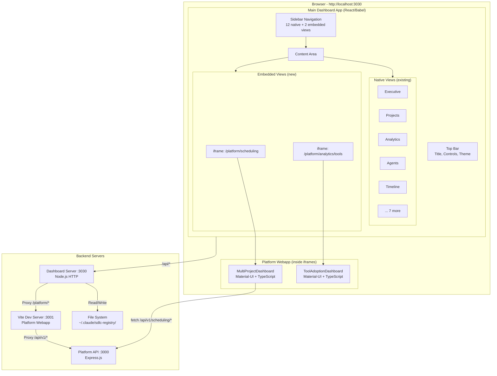
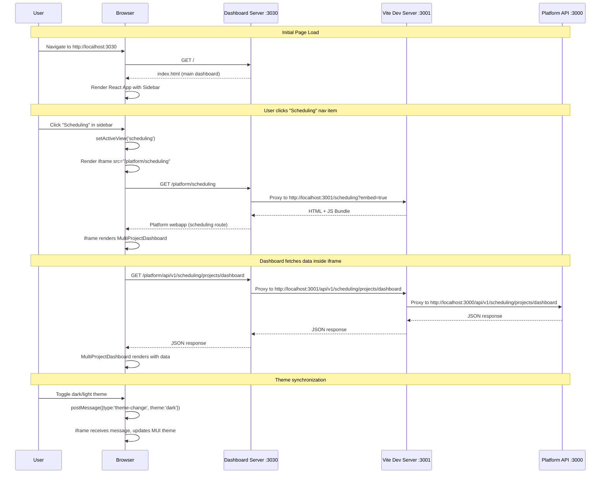
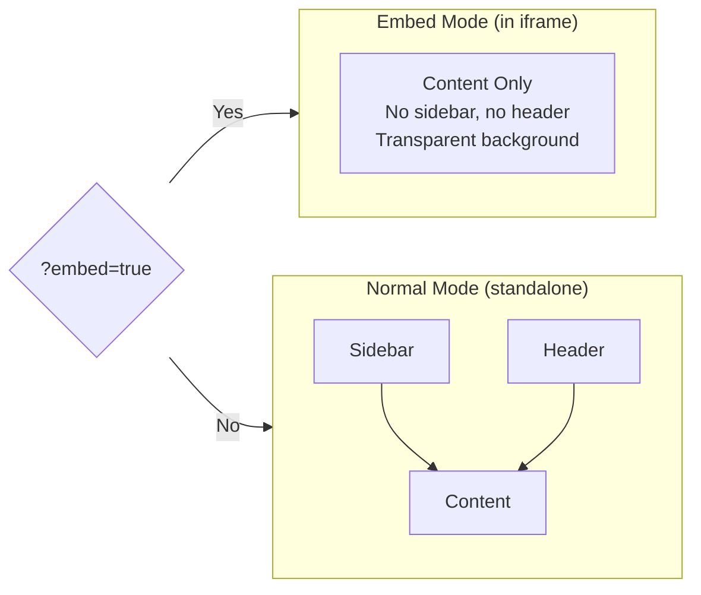

# ARCH-20260210-DASHBOARD-INTEGRATION

## Dashboard Integration Architecture: Unified AI-SDLC Control Center

**Author**: Jets (Architect Agent)
**Date**: 2026-02-10
**Status**: PROPOSED
**Version**: 1.0

---

## 1. Executive Summary

**Problem**: The AI-SDLC platform has two separate React applications serving dashboard capabilities -- a legacy Control Center (port 3030, single-file HTML with embedded React/Babel) and a modern platform webapp (port 3001, Vite + TypeScript + Material-UI). Users must navigate between two browser tabs to access scheduling and analytics features, creating a fragmented experience.

**Solution**: Adopt a **Reverse Proxy with iframe Embedding** hybrid approach (Option 5+1). The main dashboard server at port 3030 will serve as the unified entry point. It will proxy API calls to the platform backend (port 3000), and embed the platform webapp views via styled iframes with a postMessage communication bridge. This preserves both codebases, avoids risky migrations, and delivers a seamless user experience from a single URL.

**Impact**: Users access all features from `http://localhost:3030` with consistent navigation. Zero changes to existing dashboard views. Platform webapp components remain independently maintainable and deployable.

**Confidence**: HIGH -- This approach uses well-established patterns, requires minimal code changes to either application, and the iframe isolation prevents any CSS/JS conflicts.

---

## 2. Current State Analysis

### 2.1 Main Dashboard (Port 3030)

| Attribute | Value |
|-----------|-------|
| **Location** | `/dashboard/index.html` |
| **Technology** | Single HTML file, React via CDN + Babel transform |
| **Size** | ~7,800 lines |
| **Server** | Custom Node.js HTTP server (`dashboard/server.js`) |
| **Port** | 3030 |
| **State Management** | React `useState` / `useRef` in a single `App()` function |
| **Styling** | CSS custom properties (Vintiq Harmony Design System) |
| **Real-time** | SSE (Server-Sent Events) at `/api/events` |
| **Navigation** | Sidebar with `activeView` state, renders components conditionally |

**Navigation Structure** (12 views):
```
Dashboard Section:
  - Executive (default)
  - Value & ROI
  - Projects
  - Timeline
  - Analytics
  - Compare
  - Agents
  - Integrations
  - AI Learning
  - Activity
  - Settings
  - Help & Docs
```

**API Endpoints (port 3030)**:
- `GET /api/events` -- SSE real-time updates
- `GET /api/registry` -- SDLC registry data
- `GET /api/projects` -- All projects with costs
- `GET /api/costs` -- FinOps cost data
- `GET /api/activity` -- Activity log
- `GET /api/projects/:id/details` -- Project details
- `GET /api/autofix` -- Auto-fix stalled projects
- `POST /api/run-sdlc` -- Trigger SDLC workflows
- `GET /api/refresh` -- Force broadcast

### 2.2 Platform Webapp (Port 3001)

| Attribute | Value |
|-----------|-------|
| **Location** | `src/platform/webapp/` |
| **Technology** | Vite + React 18 + TypeScript + Material-UI 5 |
| **Build** | Modern ESM build with HMR |
| **Server** | Vite dev server (port 3001), proxies `/api` to port 3000 |
| **Styling** | Material-UI ThemeProvider (Vintiq Catalyst theme) |
| **Routing** | React Router v6 |

**Routes**:
```
/                -> Dashboard
/visual-designer -> Visual Designer
/designer        -> Infrastructure Designer
/scheduling      -> Project Scheduling (MultiProjectDashboard)
/deploy          -> Deploy Application
/resources       -> Cloud Resources
/agents          -> AI Agents
/costs           -> Cost Optimization
/security        -> Security Center
/environments    -> Environments
```

**Key Components to Integrate**:

1. **MultiProjectDashboard** (`src/platform/webapp/src/components/scheduling/MultiProjectDashboard.tsx`)
   - 700+ lines, TypeScript
   - Dependencies: `@mui/material`, `@mui/icons-material`
   - Data: Fetches from `GET /api/v1/scheduling/projects/dashboard`
   - Features: Metrics strip, project pipeline table, agent pool, phase analytics

2. **ToolAdoptionDashboard** (`src/platform/webapp/src/components/analytics/ToolAdoptionDashboard.tsx`)
   - 500+ lines, TypeScript
   - Sub-components: `MetricsStrip`, `ToolCard`, `InsightsPanel`, `types`
   - Dependencies: `@mui/material`, `@mui/icons-material`
   - Data: Pure presentation component (receives `ToolAdoptionData` as props)
   - Features: KPI metrics, tool breakdown, AI insights

### 2.3 Platform Backend (Port 3000)

| Attribute | Value |
|-----------|-------|
| **Location** | `src/platform/` |
| **Technology** | Express.js API server |
| **Port** | 3000 |
| **APIs** | `/api/v1/scheduling/*` and others |

---

## 3. Integration Strategy Decision

### 3.1 Options Evaluated

| # | Approach | Complexity | Risk | Maintenance | UX Quality | Score |
|---|----------|-----------|------|-------------|-----------|-------|
| 1 | iframe Embedding (raw) | Low | Low | Medium | Medium | 6/10 |
| 2 | Component Migration | High | High | Poor | High | 4/10 |
| 3 | Micro-Frontend (Module Fed.) | Very High | Medium | Good | High | 5/10 |
| 4 | API Proxy + Component Port | High | Medium | Poor | High | 5/10 |
| 5 | Reverse Proxy Routing | Medium | Low | Good | Medium | 7/10 |
| **5+1** | **Reverse Proxy + Styled iframe** | **Medium** | **Low** | **Good** | **High** | **9/10** |

### 3.2 Recommended Approach: Reverse Proxy + Styled iframe (Option 5+1)

This hybrid approach combines the strengths of Options 1 and 5 while mitigating their weaknesses:

1. **Reverse Proxy** in the dashboard server routes API calls to the platform backend
2. **Styled iframe** embeds platform webapp views within the main dashboard shell
3. **postMessage Bridge** enables communication between parent and child frames
4. **Shared Navigation** -- sidebar items in the main dashboard control which view is shown (native or iframe)
5. **Chromeless Mode** -- platform webapp renders without its own sidebar/header when embedded

**Why this wins**:
- Zero changes to existing 12 dashboard views
- Zero migration of TypeScript/Material-UI code
- Both apps remain independently developable
- iframe isolation prevents CSS/JS conflicts between Harmony (Figtree) and Material-UI
- API proxy eliminates CORS issues entirely
- postMessage bridge enables theme sync and navigation coordination
- Pattern scales to N additional dashboards

---

## 4. Architecture Design

### 4.1 High-Level Architecture

```
+------------------------------------------------------------------+
|                    User's Browser                                  |
|  http://localhost:3030                                             |
|                                                                    |
|  +-------------------------------------------------------------+  |
|  |  Main Dashboard (React via Babel)                            |  |
|  |  +-----------+  +----------------------------------------+  |  |
|  |  | Sidebar   |  | Content Area                            |  |  |
|  |  |           |  |                                          |  |  |
|  |  | Dashboard |  |  activeView === 'executive'              |  |  |
|  |  |  - Exec   |  |    --> <Executive ... />  (native)       |  |  |
|  |  |  - Value  |  |                                          |  |  |
|  |  |  - Projs  |  |  activeView === 'scheduling'             |  |  |
|  |  |  - ...    |  |    --> <EmbeddedView src="/platform/      |  |  |
|  |  |           |  |         scheduling" />  (iframe)         |  |  |
|  |  | Platform  |  |                                          |  |  |
|  |  |  - Sched  |  |  activeView === 'tool-adoption'          |  |  |
|  |  |  - Tools  |  |    --> <EmbeddedView src="/platform/      |  |  |
|  |  |           |  |         analytics/tools" />  (iframe)    |  |  |
|  |  +-----------+  +----------------------------------------+  |  |
|  +-------------------------------------------------------------+  |
+------------------------------------------------------------------+
         |                          |
         | /api/* (dashboard)       | /platform/* (proxy)
         v                          v
   +-------------+          +----------------+
   | Dashboard   |          | Platform       |
   | Server      |  proxy   | Webapp (Vite)  |
   | :3030       |--------->| :3001          |
   +-------------+          +-------+--------+
         |                          |
         | /api/* (registry)        | /api/v1/* (platform)
         v                          v
   +-------------+          +----------------+
   | File System |          | Platform API   |
   | ~/.claude/  |          | :3000          |
   +-------------+          +----------------+
```

### 4.2 Component Diagram



### 4.3 Request Flow Diagram



### 4.4 Chromeless Embed Mode

The platform webapp must detect when it is running inside an iframe and hide its own navigation (sidebar + header), leaving only the content. This is achieved via a URL query parameter.

```
Normal mode:     http://localhost:3001/scheduling
Embedded mode:   http://localhost:3001/scheduling?embed=true
```

When `embed=true` is detected:
- Hide the Sidebar component
- Hide the Header component
- Remove padding/margins from the outer Box
- Set background to transparent
- Listen for postMessage events from the parent



---

## 5. Detailed Design

### 5.1 Dashboard Server Changes (`dashboard/server.js`)

New capabilities to add to the existing server:

**5.1.1 Reverse Proxy for Platform Webapp**

```javascript
// Route: /platform/* -> http://localhost:3001/*
// Strips "/platform" prefix before forwarding

if (req.url.startsWith('/platform/')) {
  const targetUrl = req.url.replace('/platform', '');
  // Proxy to Vite dev server at port 3001
  proxyRequest(req, res, 'http://localhost:3001', targetUrl);
  return;
}
```

The proxy function will:
1. Forward all HTTP methods (GET, POST, etc.)
2. Forward all headers (except Host, which gets rewritten)
3. Stream response body back to client
4. Handle WebSocket upgrade for Vite HMR (development)
5. Append `?embed=true` query parameter for HTML page requests

**5.1.2 API Proxy for Platform Backend**

```javascript
// Route: /platform-api/* -> http://localhost:3000/*
// Alternative: The Vite proxy already handles /api/v1 -> :3000
// This is only needed if iframes need direct API access
```

Because the iframe loads from `/platform/scheduling` which resolves to the Vite dev server, and Vite already proxies `/api` to port 3000, the iframe's API calls will route naturally through the existing proxy chain:

```
iframe fetch("/api/v1/scheduling/...")
  -> request goes to iframe's origin (localhost:3030)
  -> dashboard server sees /platform/api/v1/...
  -> proxies to Vite at :3001/api/v1/...
  -> Vite proxies to :3000/api/v1/...
```

Wait -- this is important to get right. Because the iframe's `src` is `/platform/scheduling`, the iframe's origin is the same as the parent (`localhost:3030`). When the iframe makes a `fetch('/api/v1/scheduling/...')` call, it will go to `localhost:3030/api/v1/scheduling/...`. The dashboard server currently does NOT have a handler for `/api/v1/*` routes.

**Solution**: Add an API proxy route in the dashboard server:

```javascript
// Route: /api/v1/* -> http://localhost:3000/api/v1/*
// This enables iframe-embedded platform components to reach the platform API

if (req.url.startsWith('/api/v1/')) {
  proxyRequest(req, res, 'http://localhost:3000', req.url);
  return;
}
```

This is clean because:
- The dashboard server's own APIs use `/api/events`, `/api/projects`, `/api/registry` etc. (no `/v1/` prefix)
- The platform API uses `/api/v1/*` prefix
- No route conflicts

### 5.2 Main Dashboard UI Changes (`dashboard/index.html`)

**5.2.1 New Navigation Items**

Add a new "Platform" section to the sidebar navigation:

```javascript
// In the sidebar JSX, after the existing "Dashboard" section:

<div className="nav-section">
  <div className="nav-section-title">Platform</div>
  {[
    { id: 'scheduling', icon: 'assets/brand/icons/data-flow.svg', label: 'Scheduling', badge: 'New' },
    { id: 'tool-adoption', icon: 'assets/brand/icons/gear-integration.svg', label: 'Tool Adoption', badge: 'New' },
  ].map(nav => (
    <div
      key={nav.id}
      className={`nav-item ${activeView === nav.id ? 'active' : ''}`}
      onClick={() => setActiveView(nav.id)}
    >
      <span className="nav-item-icon"></span>
      {nav.label}
      {nav.badge && <span className="nav-item-badge">{nav.badge}</span>}
    </div>
  ))}
</div>
```

**5.2.2 EmbeddedView Component**

A reusable component to render platform views in iframes:

```javascript
function EmbeddedView({ src, title }) {
  const iframeRef = useRef(null);
  const [loading, setLoading] = useState(true);
  const [error, setError] = useState(false);

  // Sync theme with embedded view
  useEffect(() => {
    if (iframeRef.current && iframeRef.current.contentWindow) {
      iframeRef.current.contentWindow.postMessage(
        { type: 'theme-change', theme: theme },
        '*'
      );
    }
  }, [theme]);

  // Listen for messages from embedded view
  useEffect(() => {
    const handler = (event) => {
      if (event.data.type === 'navigation') {
        setActiveView(event.data.view);
      }
      if (event.data.type === 'ready') {
        setLoading(false);
        // Send initial theme
        iframeRef.current?.contentWindow?.postMessage(
          { type: 'theme-change', theme },
          '*'
        );
      }
    };
    window.addEventListener('message', handler);
    return () => window.removeEventListener('message', handler);
  }, [theme]);

  const embedSrc = src.includes('?') ? `${src}&embed=true` : `${src}?embed=true`;

  return (
    <div style={{ position: 'relative', height: 'calc(100vh - 120px)' }}>
      {loading && (
        <div style={{
          position: 'absolute', inset: 0,
          display: 'flex', alignItems: 'center', justifyContent: 'center',
          background: 'var(--bg-primary)', zIndex: 1
        }}>
          <div>Loading...</div>
        </div>
      )}
      {error && (
        <div className="card" style={{ padding: '40px', textAlign: 'center' }}>
          <h3>Unable to load view</h3>
          <p style={{ color: 'var(--text-muted)', margin: '8px 0 16px' }}>
            Make sure the platform webapp is running on port 3001.
          </p>
          <button className="btn btn-primary" onClick={() => {
            setError(false);
            setLoading(true);
            iframeRef.current.src = embedSrc;
          }}>
            Retry
          </button>
        </div>
      )}
      <iframe
        ref={iframeRef}
        src={embedSrc}
        title={title}
        onLoad={() => setLoading(false)}
        onError={() => { setLoading(false); setError(true); }}
        style={{
          width: '100%',
          height: '100%',
          border: 'none',
          borderRadius: 'var(--radius-lg)',
          display: error ? 'none' : 'block',
          background: 'transparent',
        }}
      />
    </div>
  );
}
```

**5.2.3 Content Area Integration**

Add the embedded views to the content area rendering:

```javascript
// In the content-area div, alongside existing views:

{activeView === 'scheduling' && (
  <EmbeddedView
    src="/platform/scheduling"
    title="Project Scheduling & Orchestration"
  />
)}
{activeView === 'tool-adoption' && (
  <EmbeddedView
    src="/platform/analytics/tools"
    title="Tool Adoption Analytics"
  />
)}
```

**5.2.4 Top Bar Title Mapping**

Update the title mapping object:

```javascript
{{
  executive: 'Executive Dashboard',
  value: 'Value & ROI',
  projects: 'Projects',
  analytics: 'Analytics',
  // ... existing ...
  scheduling: 'Project Scheduling',
  'tool-adoption': 'Tool Adoption Analytics',
}[activeView]}
```

### 5.3 Platform Webapp Changes

**5.3.1 Embed Mode Detection (`src/platform/webapp/src/App.tsx`)**

```typescript
function App() {
  const isEmbedded = new URLSearchParams(window.location.search).get('embed') === 'true';

  return (
    <ThemeProvider theme={theme}>
      <CssBaseline />
      <Router>
        <Box sx={{ display: 'flex', minHeight: '100vh' }}>
          {!isEmbedded && <Sidebar />}
          <Box sx={{ flexGrow: 1, display: 'flex', flexDirection: 'column' }}>
            {!isEmbedded && <Header />}
            <Box
              component="main"
              sx={{
                flexGrow: 1,
                p: isEmbedded ? 1 : 3,
                bgcolor: isEmbedded ? 'transparent' : 'background.default',
              }}
            >
              <Routes>
                {/* ... existing routes ... */}
              </Routes>
            </Box>
          </Box>
        </Box>
      </Router>
    </ThemeProvider>
  );
}
```

**5.3.2 postMessage Bridge (`src/platform/webapp/src/hooks/useEmbedBridge.ts`)**

```typescript
import { useEffect, useCallback } from 'react';

interface EmbedMessage {
  type: 'theme-change' | 'navigation' | 'ready';
  theme?: 'light' | 'dark';
  view?: string;
}

export function useEmbedBridge(options: {
  onThemeChange?: (theme: 'light' | 'dark') => void;
}) {
  const isEmbedded = new URLSearchParams(window.location.search).get('embed') === 'true';

  // Listen for messages from parent
  useEffect(() => {
    if (!isEmbedded) return;

    const handler = (event: MessageEvent<EmbedMessage>) => {
      if (event.data.type === 'theme-change' && event.data.theme) {
        options.onThemeChange?.(event.data.theme);
      }
    };

    window.addEventListener('message', handler);
    return () => window.removeEventListener('message', handler);
  }, [isEmbedded, options]);

  // Signal ready to parent
  useEffect(() => {
    if (isEmbedded) {
      window.parent.postMessage({ type: 'ready' }, '*');
    }
  }, [isEmbedded]);

  // Navigate parent
  const navigateParent = useCallback((view: string) => {
    if (isEmbedded) {
      window.parent.postMessage({ type: 'navigation', view }, '*');
    }
  }, [isEmbedded]);

  return { isEmbedded, navigateParent };
}
```

**5.3.3 New Route for Tool Adoption**

Add a dedicated route in the platform webapp:

```typescript
// In App.tsx routes:
<Route path="/analytics/tools" element={<ToolAdoptionPage />} />
```

### 5.4 API Route Summary

After integration, the dashboard server handles these route patterns:

| Route Pattern | Handler | Target |
|--------------|---------|--------|
| `GET /` | Serve `index.html` | Dashboard HTML |
| `GET /assets/*` | Static file server | Dashboard assets |
| `GET /api/events` | SSE handler | Dashboard SSE |
| `GET /api/registry` | Read file | `~/.claude/sdlc-registry/registry.json` |
| `GET /api/projects` | Read file | `~/.claude/sdlc-registry/projects/` |
| `GET /api/costs` | Read file | `~/.claude/finops-registry/costs/` |
| `GET /api/activity` | Read file | `~/.claude/sdlc-registry/activity.log` |
| `GET /api/projects/:id/details` | Read files | Multiple SDLC docs |
| `POST /api/run-sdlc` | Exec command | Registry script |
| `GET /api/autofix` | Exec command | Registry script |
| `GET /api/refresh` | Broadcast | SSE clients |
| **`GET /api/v1/*`** | **Proxy** | **http://localhost:3000** |
| **`GET /platform/*`** | **Proxy** | **http://localhost:3001** |

---

## 6. Data Flow Architecture

### 6.1 Data Sources by View

```
+---------------------------+--------------------+-------------------+
| View                      | Data Source         | API Pattern       |
+---------------------------+--------------------+-------------------+
| Executive, Projects, etc. | File system         | /api/* -> :3030   |
| (12 native views)         | (~/.claude/)        | (direct read)     |
+---------------------------+--------------------+-------------------+
| Scheduling                | Platform DB         | /api/v1/* -> :3000|
| (MultiProjectDashboard)   | (via platform API)  | (proxied)         |
+---------------------------+--------------------+-------------------+
| Tool Adoption             | Platform DB / Props | /api/v1/* -> :3000|
| (ToolAdoptionDashboard)   | (via platform API)  | (proxied)         |
+---------------------------+--------------------+-------------------+
```

### 6.2 Authentication & Session

Current state: Neither application implements authentication (local development tool). For future production deployment:

1. The dashboard server should implement session-based auth or JWT tokens
2. Auth tokens should be passed to iframes via postMessage after authentication
3. The platform API should validate tokens on `/api/v1/*` routes
4. Consider a shared auth service (OAuth 2.0 / SAML) for production deployment

For the current local development scope, no authentication changes are needed.

### 6.3 Real-Time Updates

| Source | Mechanism | Scope |
|--------|-----------|-------|
| Dashboard SSE (`/api/events`) | SSE from dashboard server | Native views only |
| Platform polling | `setInterval(fetch, 15000)` inside iframe | Scheduling view |

The iframe-embedded views have their own data fetching lifecycle. The parent dashboard does not need to coordinate real-time updates for embedded views.

---

## 7. Styling & Branding Consistency

### 7.1 Design System Comparison

| Aspect | Main Dashboard (Harmony) | Platform Webapp (Catalyst) |
|--------|--------------------------|---------------------------|
| **Font** | Figtree (Google Fonts) | System fonts (-apple-system) |
| **Primary** | `#1742F6` (Vintiq Blue) | `#00A3E0` (Vintiq Cyan) |
| **Navy** | `#081581` | `#002B49` |
| **Background** | `#F1F5FA` | `#F8F9FA` |
| **Cards** | `#FFFFFF` | `#FFFFFF` |
| **Border Radius** | 8px (lg) | 10px |
| **Shadows** | `0 1px 3px rgba(0,0,0,0.08)` | `0 4px 6px rgba(0,0,0,0.1)` |

### 7.2 Alignment Strategy

Rather than force both applications to use identical CSS (which would require massive Material-UI theme overrides), the approach is:

1. **Accept minor visual differences** -- both are Vintiq-branded, both look professional. The iframe boundary naturally separates the visual contexts.
2. **Synchronize the mode** -- dark/light theme should be consistent across parent and iframe.
3. **Match spacing** -- the iframe content area padding should match the parent's content area.
4. **Future unification** -- if desired, create a shared CSS custom properties file that both applications import, aligning colors and typography.

The detailed style alignment plan is in **ADR-029**.

### 7.3 Theme Synchronization Flow

```
Parent (Harmony theme, dark mode toggled)
  |
  v
postMessage({ type: 'theme-change', theme: 'dark' })
  |
  v
iframe (Catalyst theme) receives message
  |
  v
Updates MUI ThemeProvider to dark palette
  |
  v
All Material-UI components re-render in dark mode
```

---

## 8. Error Handling & Resilience

### 8.1 Platform Webapp Not Running

If port 3001 is not available:
- The proxy will fail with a connection error
- The iframe will show a load error
- The `EmbeddedView` component catches this via `onError` and shows a friendly message: "Make sure the platform webapp is running on port 3001"
- A "Retry" button allows re-attempting the connection
- All 12 native dashboard views continue working normally

### 8.2 Platform API Not Running

If port 3000 is not available:
- The iframe loads successfully (Vite serves the React app)
- API calls from MultiProjectDashboard fail
- The component shows its own error state (built-in `Alert` with retry)
- The main dashboard is completely unaffected

### 8.3 Graceful Degradation

```
+-------------------------------------------+
| Component          | Fallback              |
+-------------------------------------------+
| Platform webapp    | "Service unavailable" |
| Platform API       | Component error state |
| Dashboard server   | Everything down       |
| SSE connection     | Polling fallback      |
+-------------------------------------------+
```

---

## 9. Performance Considerations

### 9.1 Initial Load

- Main dashboard loads normally (~7,800 lines inline, no additional network requests for JS)
- iframe is NOT loaded until user clicks "Scheduling" or "Tool Adoption"
- Lazy loading: iframe `src` is set only when `activeView` matches

### 9.2 Bundle Sizes

| App | Size (approx) | Load Time |
|-----|---------------|-----------|
| Main Dashboard | ~300KB (HTML + inline JS + CSS) | <500ms |
| Platform Webapp | ~2MB (Vite bundle with MUI tree-shaking) | <1.5s |

The platform webapp bundle loads only when the user first navigates to a platform view. Subsequent navigations between Scheduling and Tool Adoption are instant (the iframe is cached or recycled).

### 9.3 iframe Optimization

```javascript
// Option A: Single iframe, navigate within it
// - Lower memory footprint
// - Instant navigation between platform views

// Option B: Multiple iframes, one per view
// - Simpler state management
// - Views are preserved when switching away

// RECOMMENDED: Option A (single iframe)
// The EmbeddedView component manages a single iframe
// and changes its src when switching between platform views
```

However, since there are only 2 embedded views currently, Option B (one iframe per view, hidden when inactive) is simpler and preserves state. The memory overhead of 2 iframes is negligible.

### 9.4 iframe Caching Strategy

```javascript
// Keep iframes alive but hidden when switching to native views
// This preserves the component state inside the iframe

function EmbeddedView({ src, title, active }) {
  return (
    <div style={{ display: active ? 'block' : 'none', height: '100%' }}>
      <iframe src={src} ... />
    </div>
  );
}

// In the content area:
<EmbeddedView src="/platform/scheduling" active={activeView === 'scheduling'} />
<EmbeddedView src="/platform/analytics/tools" active={activeView === 'tool-adoption'} />
```

---

## 10. Development Workflow

### 10.1 Starting All Services

```bash
# Terminal 1: Platform API (port 3000)
cd src/platform && npm run dev

# Terminal 2: Platform Webapp (port 3001)
cd src/platform/webapp && npm run dev

# Terminal 3: Dashboard Server (port 3030)
node dashboard/server.js
```

### 10.2 Development Scripts

Create a convenience script:

```bash
#!/bin/bash
# start-all.sh - Start all dashboard services
echo "Starting AI-SDLC Control Center (unified)..."

# Start platform API
(cd src/platform && npm run dev) &

# Start platform webapp
(cd src/platform/webapp && npm run dev) &

# Wait for services to be ready
sleep 3

# Start dashboard server
node dashboard/server.js
```

### 10.3 Hot Module Replacement

- Platform webapp changes: Vite HMR works through the proxy (WebSocket upgrade handled)
- Main dashboard changes: Refresh browser (no build step, direct HTML edits)
- Platform API changes: Express auto-restart via nodemon

### 10.4 Independent Development

Each team/developer can work independently:
- Dashboard team: Edit `dashboard/index.html`, test at `http://localhost:3030`
- Platform team: Edit `src/platform/webapp/`, test at `http://localhost:3001`
- Integration testing: Access everything at `http://localhost:3030`

---

## 11. Scalability & Future Extensibility

### 11.1 Adding More Embedded Views

The pattern is plug-and-play. To add a new platform view:

1. Create the route in platform webapp
2. Add a nav item to the sidebar in `dashboard/index.html`
3. Add the `EmbeddedView` in the content area

Example: Adding a "Compliance Dashboard":

```javascript
// 1. In sidebar nav items array:
{ id: 'compliance', icon: 'assets/brand/icons/shield-badge.svg', label: 'Compliance', badge: 'New' }

// 2. In content area:
{activeView === 'compliance' && (
  <EmbeddedView src="/platform/compliance" title="Compliance Dashboard" />
)}

// 3. In top bar title mapping:
compliance: 'Compliance Dashboard',
```

### 11.2 Migration Path to Full SPA

If desired in the future, the dashboard can gradually migrate to the platform webapp:

1. **Phase 1** (current): iframe embedding, both apps coexist
2. **Phase 2**: Port native views one by one to platform webapp (TypeScript + MUI)
3. **Phase 3**: Platform webapp becomes the primary app, served at port 3030
4. **Phase 4**: Remove legacy dashboard, single Vite-based application

Each phase is independent and can be done incrementally.

### 11.3 Production Deployment (AWS)

For AWS deployment, replace the Node.js proxy with proper infrastructure:

```
CloudFront (CDN)
  |
  +-> /                -> S3 (main dashboard static files)
  +-> /platform/*      -> ALB -> ECS (platform webapp)
  +-> /api/*           -> ALB -> ECS (dashboard API / Lambda)
  +-> /api/v1/*        -> ALB -> ECS (platform API)
```

Or with a single entry point:

```
ALB / API Gateway
  |
  +-> Path: /                -> ECS Service: dashboard
  +-> Path: /platform/*      -> ECS Service: platform-webapp
  +-> Path: /api/*           -> ECS Service: dashboard-api
  +-> Path: /api/v1/*        -> ECS Service: platform-api
```

---

## 12. Implementation Plan

### Phase 1: Server-Side Proxy (Day 1)

**Goal**: Dashboard server can proxy requests to platform webapp and API.

Tasks:
1. Add HTTP proxy utility function to `dashboard/server.js`
2. Add route handler for `/platform/*` -> proxy to `:3001`
3. Add route handler for `/api/v1/*` -> proxy to `:3000`
4. Handle WebSocket upgrade for Vite HMR
5. Test proxy with direct browser requests

Deliverables:
- Updated `dashboard/server.js`
- Proxy working for both static and API routes

### Phase 2: Embed Mode in Platform Webapp (Day 1-2)

**Goal**: Platform webapp can render in chromeless mode.

Tasks:
1. Add `embed` query parameter detection to `App.tsx`
2. Conditionally hide Sidebar and Header
3. Create `useEmbedBridge` hook for postMessage communication
4. Add `/analytics/tools` route for ToolAdoptionDashboard
5. Test standalone and embedded modes

Deliverables:
- Updated `App.tsx` with embed detection
- New `useEmbedBridge.ts` hook
- New `ToolAdoptionPage` component
- Both modes verified

### Phase 3: Dashboard UI Integration (Day 2-3)

**Goal**: Main dashboard has new navigation items and EmbeddedView component.

Tasks:
1. Add `EmbeddedView` component to `dashboard/index.html`
2. Add "Platform" nav section with Scheduling and Tool Adoption items
3. Add embedded view rendering in content area
4. Update top bar title mapping
5. Update command palette with new navigation options
6. Add loading states and error handling

Deliverables:
- Updated `dashboard/index.html`
- Two new views accessible from sidebar
- Graceful error handling for unavailable services

### Phase 4: Theme Synchronization (Day 3)

**Goal**: Dark/light mode synced between parent and iframes.

Tasks:
1. Implement theme postMessage in EmbeddedView
2. Implement theme listener in useEmbedBridge
3. Create dynamic MUI theme toggling in platform webapp
4. Test dark mode consistency

Deliverables:
- Theme sync working in both directions
- Both views respect parent theme toggle

### Phase 5: Polish & Testing (Day 4)

**Goal**: Production-quality integration.

Tasks:
1. Test all 14 views (12 native + 2 embedded) navigate correctly
2. Test error scenarios (services down)
3. Test keyboard shortcuts work across views
4. Optimize iframe loading (lazy load, caching)
5. Create start-all convenience script
6. Update documentation

Deliverables:
- All views working
- Error scenarios handled
- Development workflow documented
- Start scripts created

---

## 13. Risk Assessment

| Risk | Likelihood | Impact | Mitigation |
|------|-----------|--------|------------|
| Vite HMR through proxy breaks | Medium | Low | Fallback to manual refresh; configure WebSocket proxy |
| iframe keyboard events not bubbling | Medium | Low | Use postMessage for keyboard shortcuts; scope shortcuts per view |
| Theme mismatch between apps | Low | Low | postMessage bridge; fallback to light mode default |
| Platform webapp slow to load in iframe | Low | Medium | Lazy loading; loading skeleton; preload on hover |
| Port conflicts in development | Low | Low | Configurable ports via env vars; startup validation |
| CORS issues with proxied requests | Low | Medium | Same-origin proxy eliminates CORS; test all API patterns |

---

## 14. Security Considerations

### 14.1 iframe Security

- Same-origin: Both parent and iframe are served from `localhost:3030` (via proxy), so they share the same origin. This means:
  - postMessage works without cross-origin restrictions
  - Cookies/localStorage are shared
  - No `X-Frame-Options` or CSP issues

- For production, add explicit CSP headers:
  ```
  Content-Security-Policy: frame-src 'self'; frame-ancestors 'self';
  ```

### 14.2 postMessage Validation

Always validate message origin in the bridge:

```javascript
const handler = (event) => {
  // Only accept messages from same origin
  if (event.origin !== window.location.origin) return;
  // Process message
};
```

### 14.3 Proxy Security

The proxy should:
- Only proxy to known targets (localhost:3001 and localhost:3000)
- Not forward sensitive headers (Authorization) to external targets
- Rate-limit proxy requests in production
- Validate that proxied responses are well-formed

---

## 15. Monitoring & Observability

### 15.1 Health Checks

```javascript
// Add to dashboard server
if (req.url === '/api/health') {
  const platformApi = await checkPort(3000);
  const platformWebapp = await checkPort(3001);

  res.writeHead(200, { 'Content-Type': 'application/json' });
  res.end(JSON.stringify({
    dashboard: 'healthy',
    platformApi: platformApi ? 'healthy' : 'unavailable',
    platformWebapp: platformWebapp ? 'healthy' : 'unavailable',
    timestamp: new Date().toISOString()
  }));
}
```

### 15.2 Console Logging

The proxy should log:
- Proxy requests (path, target, response time)
- Proxy errors (connection refused, timeout)
- WebSocket upgrade events

---

## 16. ADR References

| ADR | Decision |
|-----|----------|
| [ADR-027](/docs/sdlc/architecture/ADR-027-dashboard-integration-strategy.md) | Reverse Proxy + Styled iframe hybrid approach |
| [ADR-028](/docs/sdlc/architecture/ADR-028-routing-strategy.md) | Path-based proxy routing at dashboard server |
| [ADR-029](/docs/sdlc/architecture/ADR-029-style-consistency.md) | Accept visual diversity with theme synchronization |

---

## 17. Acceptance Criteria

1. User navigates to `http://localhost:3030` and sees the existing dashboard with no regressions
2. Sidebar shows a new "Platform" section with "Scheduling" and "Tool Adoption" items
3. Clicking "Scheduling" renders the MultiProjectDashboard within the main dashboard shell
4. Clicking "Tool Adoption" renders the ToolAdoptionDashboard within the main dashboard shell
5. All 12 existing views continue to work exactly as before
6. Dark/light theme toggle affects both native and embedded views
7. If platform webapp is not running, a friendly error message is shown with a retry option
8. All API calls from embedded views succeed (no CORS or routing errors)
9. Navigation between native and embedded views is smooth (no page reloads)
10. Each application can be developed and tested independently

---

## 18. Appendix: File Change Summary

### Files to Modify

| File | Changes |
|------|---------|
| `dashboard/server.js` | Add proxy routes for `/platform/*` and `/api/v1/*` |
| `dashboard/index.html` | Add EmbeddedView component, Platform nav section, view rendering, title mapping |
| `src/platform/webapp/src/App.tsx` | Add embed mode detection, conditional sidebar/header |

### Files to Create

| File | Purpose |
|------|---------|
| `src/platform/webapp/src/hooks/useEmbedBridge.ts` | postMessage communication bridge |
| `src/platform/webapp/src/pages/ToolAdoption.tsx` | Page wrapper for ToolAdoptionDashboard |
| `start-all.sh` | Convenience script to start all services |
| `docs/sdlc/architecture/ARCH-20260210-DASHBOARD-INTEGRATION.md` | This document |
| `docs/sdlc/architecture/ADR-027-dashboard-integration-strategy.md` | Integration approach decision |
| `docs/sdlc/architecture/ADR-028-routing-strategy.md` | URL routing decision |
| `docs/sdlc/architecture/ADR-029-style-consistency.md` | Design system alignment |

### Files NOT Modified (Preserved)

| File | Reason |
|------|--------|
| `src/platform/webapp/src/components/scheduling/MultiProjectDashboard.tsx` | No changes needed |
| `src/platform/webapp/src/components/analytics/ToolAdoptionDashboard.tsx` | No changes needed |
| `src/platform/webapp/src/components/analytics/MetricsStrip.tsx` | No changes needed |
| `src/platform/webapp/src/components/analytics/ToolCard.tsx` | No changes needed |
| `src/platform/webapp/src/components/analytics/InsightsPanel.tsx` | No changes needed |
| `src/platform/webapp/src/components/analytics/types.ts` | No changes needed |

---

**End of Architecture Document**
