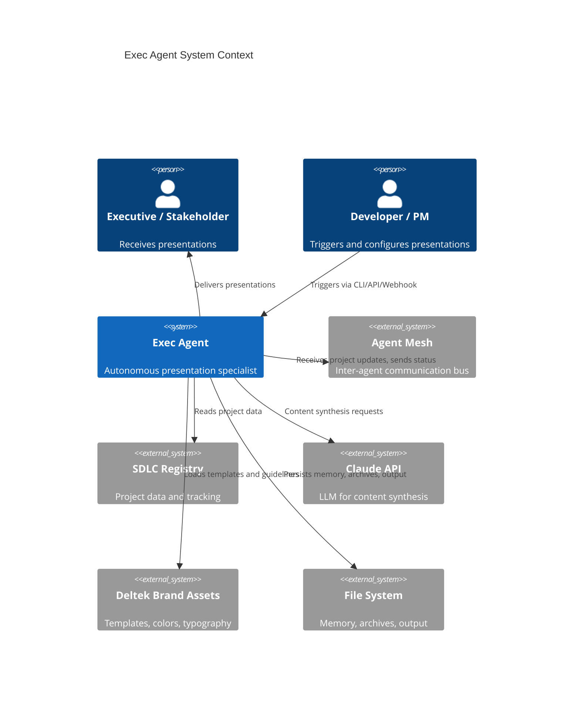
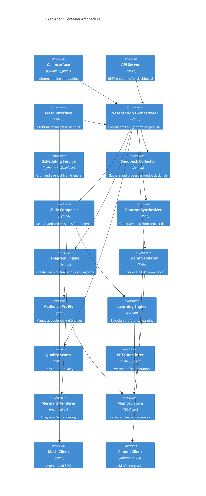
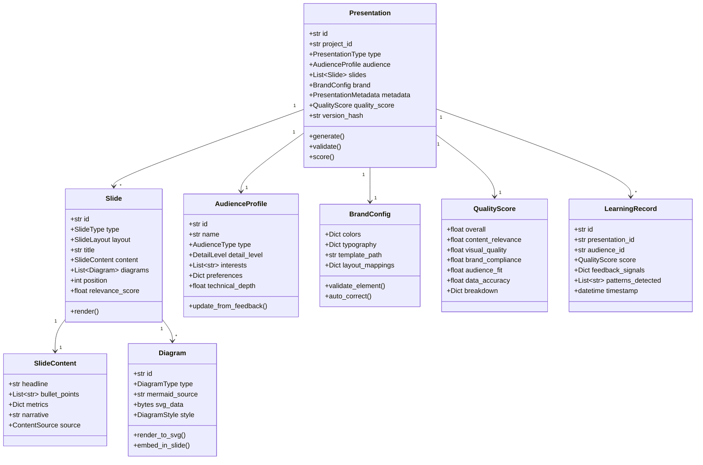
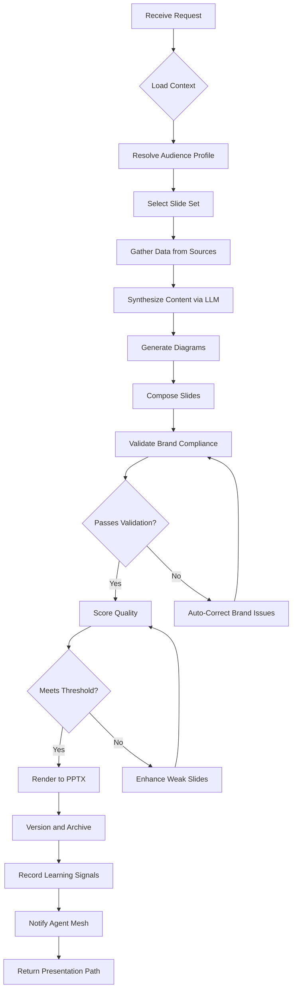
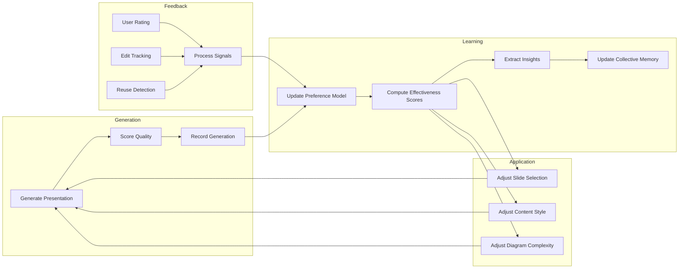
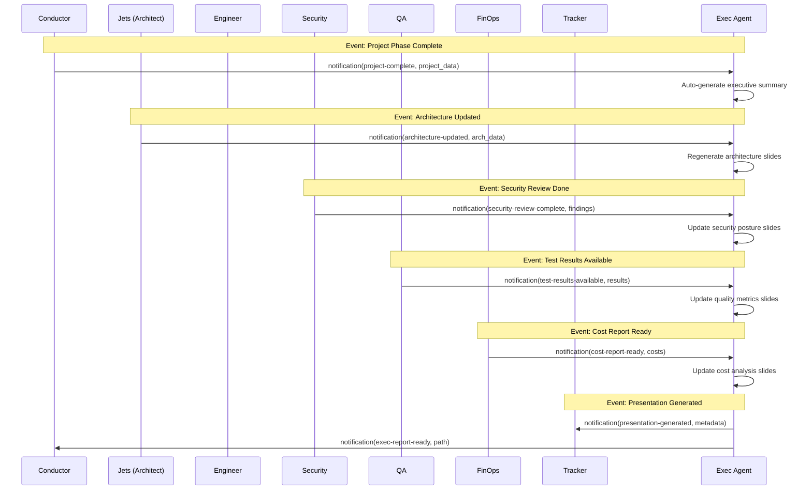
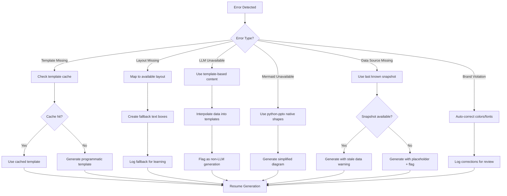

# ARCH-20260217-EXEC-AGENT

## Architecture: World-Class Agentic Executive Presentation Specialist

**Version**: 1.0.0
**Date**: 2026-02-17
**Author**: Jets (World-Class Architect)
**Status**: Proposed
**Classification**: Agent Architecture - Strategic

---

## 1. Executive Summary

This document defines the complete architecture for transforming the Exec Agent from a basic PowerPoint generator into a **world-class, fully agentic, self-learning Executive Presentation Specialist**. The redesigned agent will autonomously create, optimize, and evolve executive-grade presentations by learning from every generation, understanding audience preferences, coordinating with all 12 AI-SDLC agents, and continuously improving its output quality.

### The Transformation

| Dimension | Current State | Target State |
|-----------|--------------|--------------|
| **Architecture** | Single-class monolith (528 lines) | Layered architecture with 7 domain modules |
| **Learning** | Append-only JSON log | Multi-signal feedback loop with weighted scoring |
| **Content Generation** | Hardcoded bullet points | LLM-driven content synthesis from live project data |
| **Diagram Quality** | Placeholder rectangles with text | Programmatic vector diagrams via Mermaid + python-pptx shapes |
| **Audience Awareness** | None | Audience profiles with preference learning |
| **Agent Coordination** | None | Full agent mesh integration (message bus + collective memory) |
| **Template System** | Single POTX file, fallback to blank | Template engine with layout variants per slide type |
| **Brand Compliance** | Manual hex codes | Brand validation engine with auto-correction |
| **Version Control** | File copy to archive | Content-addressable versioning with diff and rollback |
| **Scheduling** | Manual invocation only | Event-driven triggers + cron-based auto-generation |
| **Error Handling** | None (crashes on missing template) | Self-healing with graceful degradation |
| **Testing** | None | Unit, integration, and visual regression tests |

### Key Design Principles

1. **Layered Architecture** -- Strict separation between presentation, application, domain, and infrastructure
2. **Event-Driven Learning** -- Every generation produces signals that feed back into the learning system
3. **Audience-First Design** -- Slide selection, detail level, and visual style adapt to the audience
4. **Agent Mesh Native** -- First-class participant in the AI-SDLC agent mesh
5. **Zero Cloud Dependency** -- Runs entirely locally with optional cloud enrichment
6. **Self-Healing** -- Template issues, missing data, and errors are diagnosed and recovered automatically

---

## 2. Current State Analysis

### 2.1 Strengths to Preserve

- Deltek brand color palette is accurately captured
- Template path to official POTX file is configured
- Memory directory structure is well-organized
- Archive system preserves historical presentations
- Clean Python implementation with type hints
- Integration concept with SDLC registry is sound

### 2.2 Critical Gaps

| Gap | Impact | Priority |
|-----|--------|----------|
| All content is hardcoded strings, not data-driven | Presentations contain generic placeholder text | P0 |
| No LLM integration for content generation | Cannot synthesize insights from project data | P0 |
| Diagrams are rectangles with text labels | Architecture slides have no actual diagrams | P0 |
| No audience awareness or preference system | Same output for CEO and tech lead | P1 |
| No agent mesh integration | Cannot receive data from other agents | P1 |
| No feedback loop or quality scoring | Cannot improve over time | P1 |
| Single class with 500+ lines, no separation of concerns | Difficult to extend and test | P1 |
| No error handling (IndexError on missing layouts) | Crashes when template has fewer layouts | P2 |
| Learning is append-only log, never consulted | Memory system is write-only | P2 |
| No version diffing or rollback | Cannot compare or revert presentations | P2 |

---

## 3. Target Architecture

### 3.1 Layered Architecture Overview

```
+============================================================================+
|                         PRESENTATION LAYER                                  |
|  CLI Interface | API Endpoints | Webhook Handlers | Agent Mesh Interface   |
+============================================================================+
|                         APPLICATION LAYER                                   |
|  PresentationOrchestrator | SchedulingService | FeedbackCollector          |
|  AudienceRouter | VersionManager | ExportService                          |
+============================================================================+
|                           DOMAIN LAYER                                      |
|  SlideComposer | ContentSynthesizer | DiagramEngine | BrandValidator      |
|  AudienceProfiler | LearningEngine | TemplateResolver | QualityScorer     |
+============================================================================+
|                       INFRASTRUCTURE LAYER                                  |
|  PptxRenderer | MermaidRenderer | FileMemoryStore | AgentMeshClient       |
|  SdlcRegistryClient | ClaudeApiClient | FileWatcher | CronScheduler      |
+============================================================================+

DEPENDENCY RULE: Each layer depends ONLY on the layer directly below it.
Domain layer has ZERO external dependencies (pure business logic).
```

### 3.2 System Context Diagram



### 3.3 Container Diagram



---

## 4. Domain Model

### 4.1 Core Domain Entities



### 4.2 Enumerations

```python
class PresentationType(Enum):
    EXECUTIVE_SUMMARY = "executive-summary"
    ARCHITECTURE_REVIEW = "architecture-review"
    STATUS_REPORT = "status-report"
    SPRINT_REVIEW = "sprint-review"
    SECURITY_BRIEFING = "security-briefing"
    COST_ANALYSIS = "cost-analysis"
    STAKEHOLDER_UPDATE = "stakeholder-update"
    TECHNICAL_DEEP_DIVE = "technical-deep-dive"

class AudienceType(Enum):
    C_SUITE = "c-suite"          # CEO, CTO, CFO -- high-level, outcome-focused
    VP_DIRECTOR = "vp-director"  # VP Eng, Director PM -- strategic + some detail
    TECHNICAL_LEAD = "tech-lead" # Architects, leads -- deep technical content
    PROJECT_TEAM = "project-team" # Developers, QA -- operational detail
    EXTERNAL_CLIENT = "external"  # Clients -- polished, business-focused
    BOARD = "board"              # Board members -- financial, strategic

class DetailLevel(Enum):
    MINIMAL = 1    # 3-5 slides, key metrics only
    STANDARD = 2   # 7-10 slides, balanced detail
    DETAILED = 3   # 12-18 slides, comprehensive
    DEEP_DIVE = 4  # 20+ slides, exhaustive

class SlideType(Enum):
    TITLE = "title"
    EXECUTIVE_SUMMARY = "executive-summary"
    KEY_METRICS = "key-metrics"
    ARCHITECTURE_OVERVIEW = "architecture-overview"
    ARCHITECTURE_DETAIL = "architecture-detail"
    STATUS_DASHBOARD = "status-dashboard"
    TIMELINE = "timeline"
    AGENT_PERFORMANCE = "agent-performance"
    COST_BREAKDOWN = "cost-breakdown"
    RISK_MATRIX = "risk-matrix"
    SECURITY_POSTURE = "security-posture"
    NEXT_STEPS = "next-steps"
    APPENDIX = "appendix"

class DiagramType(Enum):
    SYSTEM_ARCHITECTURE = "system-architecture"
    DATA_FLOW = "data-flow"
    DEPLOYMENT = "deployment"
    SEQUENCE = "sequence"
    COMPONENT = "component"
    GANTT = "gantt"
    PIE_CHART = "pie-chart"
    BAR_CHART = "bar-chart"
```

---

## 5. Component Architecture

### 5.1 Presentation Layer

#### 5.1.1 CLI Interface

```
src/exec_agent/presentation/cli.py

Commands:
  exec-agent generate <project_id> --type <type> --audience <audience>
  exec-agent update <presentation_path>
  exec-agent schedule <project_id> --cron "0 9 * * MON"
  exec-agent feedback <presentation_id> --rating <1-5> --notes "..."
  exec-agent status
  exec-agent learn --show-insights
  exec-agent compare <version_a> <version_b>
  exec-agent rollback <presentation_id> --to-version <hash>
```

#### 5.1.2 API Server (FastAPI)

```
src/exec_agent/presentation/api.py

Endpoints:
  POST   /api/exec/generate          -- Generate new presentation
  POST   /api/exec/update/{id}       -- Update existing presentation
  GET    /api/exec/presentations      -- List all presentations
  GET    /api/exec/presentations/{id} -- Get specific presentation
  POST   /api/exec/feedback/{id}     -- Submit feedback
  GET    /api/exec/insights          -- Get learning insights
  POST   /api/exec/schedule          -- Create/update schedule
  GET    /api/exec/health            -- Health check with metrics
  GET    /api/exec/analytics         -- Effectiveness analytics dashboard
  POST   /api/exec/compare           -- Compare two versions
  POST   /api/exec/rollback/{id}     -- Rollback to specific version
```

#### 5.1.3 Agent Mesh Interface

The Exec Agent registers itself in the agent mesh and processes messages from other agents.

```python
# Agent mesh registration
EXEC_AGENT_PROFILE = {
    "id": "exec",
    "name": "Exec Agent",
    "description": "Executive Presentation Specialist with self-learning",
    "capabilities": ["presentation-generation", "visual-reporting", "brand-compliance"],
    "model": "sonnet",
    "status": "available",
    "expertise": [
        "executive-presentations",
        "data-visualization",
        "deltek-branding",
        "audience-adaptation",
        "diagram-generation"
    ],
    "canReceiveFrom": [
        "conductor", "ba", "jets", "engineer", "security",
        "qa", "atlas", "tracker", "finops", "customer"
    ],
    "canSendTo": ["conductor", "tracker", "finops"]
}
```

**Message Handlers:**

| Message Type | From Agent(s) | Action |
|-------------|---------------|--------|
| `notification` (project-complete) | conductor | Auto-generate executive summary |
| `notification` (architecture-updated) | jets | Regenerate architecture slides |
| `notification` (security-review-complete) | security | Update security posture slides |
| `notification` (test-results-available) | qa | Update quality metrics slides |
| `notification` (cost-report-ready) | finops | Update cost analysis slides |
| `notification` (deployment-complete) | atlas | Update deployment status slides |
| `request` (generate-presentation) | any | Generate on-demand presentation |
| `learning` | any | Incorporate cross-agent learnings |

### 5.2 Application Layer

#### 5.2.1 PresentationOrchestrator

The central coordinator that manages the full generation pipeline.



**Pipeline Stages:**

1. **Context Loading** -- Read project data from SDLC registry, agent mesh collective memory, and prior presentations
2. **Audience Resolution** -- Match the audience type to a learned preference profile
3. **Slide Selection** -- Choose which slide types to include, based on presentation type + audience + learned preferences
4. **Data Gathering** -- Pull metrics, architecture docs, security reports, test results, cost data
5. **Content Synthesis** -- Use Claude API to generate natural-language content from raw data
6. **Diagram Generation** -- Create Mermaid diagrams from architecture and data flow specifications
7. **Slide Composition** -- Assemble content and diagrams into slide objects
8. **Brand Validation** -- Verify every element against Deltek brand rules
9. **Quality Scoring** -- Rate the presentation across 6 dimensions
10. **Rendering** -- Convert domain objects to PPTX file via python-pptx
11. **Versioning** -- Hash content, store version, maintain diff history
12. **Learning** -- Extract quality signals and update preference models

#### 5.2.2 SchedulingService

Manages event-driven and time-based presentation generation.

```python
class SchedulingService:
    """
    Triggers:
    1. Cron-based: Weekly status reports (configurable)
    2. Event-based: Agent mesh notifications (project complete, arch change, etc.)
    3. Data-change: File watchers on SDLC registry for significant changes
    4. Manual: CLI/API invocation
    """

    schedules: Dict[str, Schedule]      # project_id -> schedule config
    event_handlers: Dict[str, Callable]  # event_type -> handler
    file_watchers: Dict[str, FileWatch]  # path -> watcher config
```

#### 5.2.3 FeedbackCollector

Gathers feedback signals from multiple sources to drive learning.

```
Feedback Signals:
  1. Explicit Rating    -- User rates presentation 1-5 stars
  2. Explicit Notes     -- User provides written feedback
  3. Implicit Duration  -- How long the presentation was open
  4. Implicit Edits     -- Which slides the user manually edited after generation
  5. Implicit Reuse     -- Was the presentation shared or re-requested?
  6. Cross-Agent        -- Did other agents reference this presentation's content?
  7. Quality Score      -- Automated quality assessment
  8. Brand Compliance   -- Automated brand validation result
```

#### 5.2.4 VersionManager

Content-addressable versioning for all presentations.

```python
class VersionManager:
    """
    Each presentation version is identified by a SHA-256 hash of its content.

    Capabilities:
    - Create new version from presentation domain object
    - List all versions for a presentation
    - Diff two versions (structural comparison)
    - Rollback to any prior version
    - Prune old versions beyond retention policy
    """

    def create_version(self, presentation: Presentation) -> VersionRecord: ...
    def list_versions(self, presentation_id: str) -> List[VersionRecord]: ...
    def diff(self, hash_a: str, hash_b: str) -> VersionDiff: ...
    def rollback(self, presentation_id: str, target_hash: str) -> Presentation: ...
```

### 5.3 Domain Layer (Zero External Dependencies)

#### 5.3.1 SlideComposer

Decides which slides to include and their order based on audience and presentation type.

```python
class SlideComposer:
    """
    Slide Selection Algorithm:

    1. Start with the BASE_SLIDE_SET for the presentation type
    2. Apply audience filter (remove slides below relevance threshold)
    3. Apply learned preferences (boost/suppress specific slide types)
    4. Order by: audience priority weight * learned effectiveness score
    5. Enforce constraints: min 3 slides, max per detail level
    6. Insert mandatory slides (title, closing) at fixed positions
    """

    # Base slide sets per presentation type
    SLIDE_SETS: Dict[PresentationType, List[SlideSpec]] = {
        PresentationType.EXECUTIVE_SUMMARY: [
            SlideSpec(SlideType.TITLE, required=True, position="first"),
            SlideSpec(SlideType.EXECUTIVE_SUMMARY, required=True, position=2),
            SlideSpec(SlideType.KEY_METRICS, required=True),
            SlideSpec(SlideType.ARCHITECTURE_OVERVIEW, required=False),
            SlideSpec(SlideType.STATUS_DASHBOARD, required=True),
            SlideSpec(SlideType.TIMELINE, required=False),
            SlideSpec(SlideType.RISK_MATRIX, required=False),
            SlideSpec(SlideType.NEXT_STEPS, required=True, position="last"),
        ],
        # ... other types
    }

    # Audience relevance weights per slide type
    AUDIENCE_WEIGHTS: Dict[AudienceType, Dict[SlideType, float]] = {
        AudienceType.C_SUITE: {
            SlideType.EXECUTIVE_SUMMARY: 1.0,
            SlideType.KEY_METRICS: 1.0,
            SlideType.ARCHITECTURE_OVERVIEW: 0.3,  # simplified only
            SlideType.ARCHITECTURE_DETAIL: 0.0,     # never for C-suite
            SlideType.COST_BREAKDOWN: 0.9,
            SlideType.RISK_MATRIX: 0.8,
            SlideType.AGENT_PERFORMANCE: 0.2,
            # ...
        },
        AudienceType.TECHNICAL_LEAD: {
            SlideType.ARCHITECTURE_OVERVIEW: 0.6,
            SlideType.ARCHITECTURE_DETAIL: 1.0,
            SlideType.AGENT_PERFORMANCE: 0.9,
            SlideType.SECURITY_POSTURE: 0.8,
            # ...
        },
    }
```

#### 5.3.2 ContentSynthesizer

Generates human-quality narrative content from structured project data.

```python
class ContentSynthesizer:
    """
    Transforms raw project data into audience-appropriate content.

    Strategy:
    1. Collect all raw data points for a slide
    2. Build a structured prompt with audience context
    3. Call LLM to generate narrative content
    4. Post-process: enforce bullet count, word limits, tone
    5. Cache result with data hash for reuse
    """

    def synthesize(
        self,
        slide_type: SlideType,
        raw_data: Dict,
        audience: AudienceProfile,
        constraints: ContentConstraints
    ) -> SlideContent:
        """
        ContentConstraints:
        - max_bullets: int (3 for C-suite, 7 for technical)
        - max_words_per_bullet: int (15 for C-suite, 30 for technical)
        - tone: str ("executive", "technical", "client-facing")
        - include_numbers: bool (always True for metrics slides)
        - narrative_style: str ("highlight", "analytical", "action-oriented")
        """
        ...
```

**LLM Prompt Strategy:**

The synthesizer uses structured prompts with these components:

```
SYSTEM: You are an executive presentation content writer for Deltek.
        Style: {audience.tone}. Detail level: {audience.detail_level}.
        Max bullets: {constraints.max_bullets}.
        Max words per bullet: {constraints.max_words_per_bullet}.

CONTEXT: Project data follows. Synthesize into clear, actionable content.

DATA:
  Project: {project_name}
  Phase: {current_phase}
  Metrics: {metrics_json}
  Recent Changes: {changes_summary}

INSTRUCTIONS:
  Generate content for a "{slide_type}" slide.
  Audience: {audience.type} ({audience.description}).
  Focus on: {audience.interests}.
  Tone: {constraints.tone}.
  Format: JSON with keys: headline, bullet_points, metrics, narrative.
```

#### 5.3.3 DiagramEngine

Generates production-quality diagrams from system specifications.

```python
class DiagramEngine:
    """
    Diagram generation pipeline:

    1. Receive diagram specification (type + data)
    2. Generate Mermaid syntax from specification
    3. Render Mermaid to SVG via mermaid-py
    4. Apply Deltek brand styling (colors, fonts) to SVG
    5. Convert SVG to EMF/PNG for PPTX embedding
    6. Cache rendered diagrams with data hash
    """

    DIAGRAM_GENERATORS: Dict[DiagramType, Callable] = {
        DiagramType.SYSTEM_ARCHITECTURE: _generate_system_arch,
        DiagramType.DATA_FLOW: _generate_data_flow,
        DiagramType.DEPLOYMENT: _generate_deployment,
        DiagramType.SEQUENCE: _generate_sequence,
        DiagramType.COMPONENT: _generate_component,
        DiagramType.GANTT: _generate_gantt,
        DiagramType.PIE_CHART: _generate_pie_chart,
        DiagramType.BAR_CHART: _generate_bar_chart,
    }

    def generate(
        self,
        diagram_type: DiagramType,
        data: Dict,
        style: DiagramStyle
    ) -> Diagram:
        """Returns a Diagram with embedded SVG data."""
        ...
```

**Diagram Style with Deltek Branding:**

```python
DELTEK_DIAGRAM_STYLE = DiagramStyle(
    background_color="#FFFFFF",
    primary_color="#1742F6",      # Deltek Blue
    secondary_color="#081581",    # Navy
    accent_colors=["#00B6C3", "#6D18F1", "#C200CC"],  # Teal, Purple, Magenta
    gradient=["#08E9EB", "#FF5DF2", "#3895FF", "#7A62FF"],  # Dela gradient
    font_family="Figtree",
    font_size=12,
    line_width=2,
    node_shape="rounded",
    edge_style="solid"
)
```

#### 5.3.4 BrandValidator

Enforces Deltek brand compliance on every element.

```python
class BrandValidator:
    """
    Validation Rules:
    1. All text uses Figtree font family
    2. Heading sizes match brand typography spec
    3. Colors are within the approved Deltek palette
    4. Logo placement follows guidelines (if logo is present)
    5. Slide backgrounds use approved patterns/colors
    6. Chart colors use the Deltek color sequence
    7. No unapproved fonts or colors anywhere

    Auto-Correction:
    - Replace non-Deltek colors with nearest approved color
    - Replace non-Figtree fonts with Figtree equivalent
    - Fix heading sizes to match brand spec
    """

    def validate(self, presentation: Presentation) -> BrandValidationResult:
        """Returns detailed compliance report."""
        ...

    def auto_correct(self, presentation: Presentation) -> Presentation:
        """Fixes all brand violations and returns corrected presentation."""
        ...

    def nearest_brand_color(self, hex_color: str) -> str:
        """Find the closest approved Deltek color using CIE Delta-E distance."""
        ...
```

#### 5.3.5 AudienceProfiler

Manages and learns audience preferences.

```python
class AudienceProfiler:
    """
    Maintains learned preferences for each audience type.

    Learning Signal Sources:
    1. Explicit feedback ratings per presentation
    2. Slide-level edit tracking (user modified = dissatisfaction signal)
    3. Reuse frequency (more reuse = higher satisfaction)
    4. Cross-audience comparison (what works universally vs specifically)

    Preference Model:
    - Per audience type: Dict[SlideType, float] (effectiveness weight 0.0-1.0)
    - Per audience type: Dict[str, Any] (style preferences: detail, tone, etc.)
    - Decay factor: Older signals have less influence (exponential decay)
    - Confidence: Higher evidence count = more confident preferences
    """

    def get_profile(self, audience_type: AudienceType) -> AudienceProfile: ...
    def update_from_feedback(self, feedback: FeedbackRecord) -> None: ...
    def get_slide_effectiveness(
        self, audience_type: AudienceType, slide_type: SlideType
    ) -> float: ...
```

#### 5.3.6 LearningEngine (Domain)

The core learning system that improves presentation quality over time.

```python
class LearningEngine:
    """
    Multi-Signal Learning Architecture:

    INPUTS (signals from every generation):
      +------------------+--------+-----------------------------------------+
      | Signal           | Weight | Description                             |
      +------------------+--------+-----------------------------------------+
      | Explicit Rating  | 0.40   | User star rating (1-5)                  |
      | Quality Score    | 0.20   | Automated quality assessment            |
      | Brand Compliance | 0.10   | Brand validation pass rate              |
      | Slide Edits      | 0.15   | Inverse of edit count (fewer = better)  |
      | Reuse Frequency  | 0.10   | Number of times presentation was reused |
      | Cross-Agent Ref  | 0.05   | Other agents referenced this content    |
      +------------------+--------+-----------------------------------------+

    LEARNING DIMENSIONS:
      1. Slide Selection      -- Which slides work for which audiences
      2. Content Quality      -- What narrative style resonates
      3. Diagram Complexity   -- How detailed should diagrams be
      4. Layout Preferences   -- Which layouts score highest
      5. Data Presentation    -- How to present metrics (chart vs table vs number)
      6. Timing Patterns      -- When to auto-generate (day of week, time)

    ALGORITHM:
      Bayesian update with exponential decay:
        posterior = prior * likelihood(new_evidence)
        weight(signal) = base_weight * exp(-decay_rate * age_in_days)

    OUTPUT:
      Updated preference models for each audience type
      Updated slide effectiveness scores
      Pattern insights for the collective memory
    """

    def record_generation(self, record: GenerationRecord) -> None: ...
    def process_feedback(self, feedback: FeedbackRecord) -> None: ...
    def get_insights(self) -> List[LearningInsight]: ...
    def get_effectiveness_trend(
        self, audience_type: AudienceType, window_days: int = 30
    ) -> EffectivenessTrend: ...
    def export_to_collective_memory(self) -> List[CollectiveKnowledge]: ...
```

#### 5.3.7 TemplateResolver

Handles template loading, layout mapping, and fallback strategies.

```python
class TemplateResolver:
    """
    Template Resolution Strategy:

    1. Try to load official Deltek POTX template
    2. If unavailable, use cached template from memory
    3. If no cache, use built-in programmatic template

    Layout Mapping:
    - Maps SlideType to template layout index
    - Falls back to blank layout if specific layout missing
    - Remembers working mappings for each template version

    Self-Healing:
    - Detects IndexError on layout access -> maps to available layout
    - Detects missing placeholder -> creates text box at standard position
    - Logs all fallbacks for learning
    """

    def resolve_template(self) -> Tuple[Presentation, LayoutMap]: ...
    def get_layout_for_slide(
        self, prs: Presentation, slide_type: SlideType
    ) -> SlideLayout: ...
    def create_fallback_layout(
        self, prs: Presentation, slide_type: SlideType
    ) -> SlideLayout: ...
```

#### 5.3.8 QualityScorer

Automated quality assessment across 6 dimensions.

```python
class QualityScorer:
    """
    Scoring Dimensions (each 0.0 - 1.0):

    1. Content Relevance (0.25 weight)
       - Data recency (is project data current?)
       - Audience alignment (content matches audience expectations?)
       - Completeness (all expected sections present?)

    2. Visual Quality (0.20 weight)
       - Diagram presence and quality
       - Consistent spacing and alignment
       - Appropriate use of charts vs text

    3. Brand Compliance (0.15 weight)
       - Color palette adherence
       - Typography compliance
       - Template layout usage

    4. Audience Fit (0.20 weight)
       - Detail level matches audience type
       - Tone matches audience expectations
       - Slide count within expected range

    5. Data Accuracy (0.15 weight)
       - Metrics match source data
       - Status reflects current state
       - No stale or contradictory data

    6. Narrative Quality (0.05 weight)
       - Clear headlines
       - Actionable bullet points
       - Logical flow between slides

    Overall = weighted_sum(dimensions)
    Threshold for auto-release: 0.70
    Threshold for enhancement loop: 0.50
    Below 0.50: flag for human review
    """

    def score(self, presentation: Presentation) -> QualityScore: ...
```

### 5.4 Infrastructure Layer

#### 5.4.1 PptxRenderer

Converts domain Slide objects into python-pptx slide objects.

```python
class PptxRenderer:
    """
    Responsibilities:
    - Create python-pptx Presentation from template
    - Render each Slide domain object to a pptx slide
    - Handle text formatting with Deltek typography
    - Embed diagrams (SVG/PNG) at correct positions
    - Create charts from metric data
    - Apply consistent spacing and margins
    - Handle fallback for missing layouts gracefully
    """

    def render(
        self, presentation: Presentation, template_prs: PptxPresentation
    ) -> PptxPresentation: ...

    def render_slide(
        self, slide: Slide, pptx_slide: PptxSlide, brand: BrandConfig
    ) -> None: ...
```

#### 5.4.2 MermaidRenderer

Renders Mermaid diagram syntax to SVG/PNG.

```python
class MermaidRenderer:
    """
    Uses mermaid-py (or mermaid CLI via subprocess) to render diagrams.

    Pipeline:
    1. Receive Mermaid syntax string
    2. Apply Deltek theme configuration
    3. Render to SVG via mermaid
    4. Post-process SVG (adjust fonts, colors)
    5. Convert to PNG (for PPTX compatibility)
    6. Cache result with content hash

    Fallback:
    If Mermaid is not installed, generate a simple shapes-based
    diagram using python-pptx native shapes.
    """

    def render_to_svg(self, mermaid_source: str, style: DiagramStyle) -> bytes: ...
    def render_to_png(self, mermaid_source: str, style: DiagramStyle) -> bytes: ...
    def is_available(self) -> bool: ...
```

#### 5.4.3 FileMemoryStore

Persistent storage for all learning data, preferences, and archives.

```python
class FileMemoryStore:
    """
    Storage Structure:

    ~/.claude/exec-agent-memory/
    +-- config/
    |   +-- agent-profile.json          # Agent registration config
    |   +-- schedules.json              # Active schedules
    |   +-- thresholds.json             # Quality thresholds
    +-- brand/
    |   +-- colors.json                 # Deltek color palette
    |   +-- typography.json             # Typography rules
    |   +-- layouts.json                # Layout mappings per template version
    |   +-- template-cache/             # Cached template file
    +-- audiences/
    |   +-- c-suite.json                # C-suite preference profile
    |   +-- vp-director.json            # VP/Director preference profile
    |   +-- tech-lead.json              # Tech lead preference profile
    |   +-- project-team.json           # Team preference profile
    |   +-- external.json               # External client preference profile
    +-- learning/
    |   +-- generation-log.json         # All generation records (append)
    |   +-- feedback-log.json           # All feedback records (append)
    |   +-- slide-effectiveness.json    # Per audience, per slide type scores
    |   +-- content-patterns.json       # What content styles work best
    |   +-- diagram-patterns.json       # What diagram styles work best
    |   +-- insights.json               # Extracted insights from learning
    |   +-- learning-model.json         # Serialized Bayesian preference model
    +-- presentations/
    |   +-- {presentation_id}/
    |   |   +-- current.pptx            # Latest version
    |   |   +-- metadata.json           # Presentation metadata
    |   |   +-- versions/
    |   |   |   +-- {hash}.pptx         # Content-addressable versions
    |   |   |   +-- {hash}.json         # Version metadata + diff from parent
    |   |   +-- feedback/
    |   |       +-- {feedback_id}.json  # Feedback records
    |   +-- archive/                    # Older presentations
    +-- diagrams/
    |   +-- cache/                      # Rendered diagram cache (by content hash)
    |   +-- templates/                  # Reusable diagram templates
    +-- data-snapshots/
        +-- {project_id}/
            +-- {timestamp}.json        # Snapshot of project data at generation time
    """

    def read(self, path: str) -> Optional[Dict]: ...
    def write(self, path: str, data: Dict) -> None: ...
    def append(self, path: str, record: Dict) -> None: ...
    def list(self, directory: str) -> List[str]: ...
    def exists(self, path: str) -> bool: ...
```

#### 5.4.4 AgentMeshClient

Interface to the AI-SDLC agent mesh for inter-agent communication.

```python
class AgentMeshClient:
    """
    Wraps the TypeScript agent mesh infrastructure for Python access.

    Communication via file-based message bus:
    - Reads from: ~/.claude/agent-mesh/bus/inboxes/exec/
    - Writes to: ~/.claude/agent-mesh/bus/inboxes/{agent_id}/
    - Logs to: ~/.claude/agent-mesh/bus/outboxes/exec/

    Operations:
    - Register exec agent in the registry
    - Poll inbox for new messages
    - Send messages to other agents
    - Contribute to collective memory
    - Read from collective memory
    """

    def register(self) -> None: ...
    def poll_inbox(self) -> List[AgentMessage]: ...
    def send_message(self, receiver: str, message: SendMessageOptions) -> None: ...
    def contribute_knowledge(self, knowledge: AddKnowledgeOptions) -> None: ...
    def search_knowledge(self, query: str) -> List[CollectiveKnowledge]: ...
    def send_learning(self, learning: LearningEvent) -> None: ...
```

#### 5.4.5 SdlcRegistryClient

Reads project data from the SDLC registry.

```python
class SdlcRegistryClient:
    """
    Reads structured project data from:
    - ~/.claude/sdlc-registry/projects/{project_id}.json
    - docs/sdlc/requirements/REQ-{id}.md
    - docs/sdlc/architecture/ARCH-{id}.md
    - docs/sdlc/tracking/SDLC-{id}.md
    - docs/sdlc/security/SECURITY-REVIEW-{id}.md
    - docs/sdlc/testing/TEST-REPORT-{id}.md
    - docs/sdlc/costs/COST-{id}.md
    - docs/sdlc/deployments/DEPLOY-{id}.md

    Aggregates data into a unified ProjectData structure.
    """

    def load_project(self, project_id: str) -> ProjectData: ...
    def load_requirements(self, project_id: str) -> RequirementsData: ...
    def load_architecture(self, project_id: str) -> ArchitectureData: ...
    def load_metrics(self, project_id: str) -> MetricsData: ...
    def load_security_report(self, project_id: str) -> SecurityData: ...
    def load_test_results(self, project_id: str) -> TestData: ...
    def load_cost_data(self, project_id: str) -> CostData: ...
```

#### 5.4.6 ClaudeApiClient

Interface to the Claude API for content synthesis.

```python
class ClaudeApiClient:
    """
    Manages LLM calls for content generation.

    Features:
    - Structured output parsing (JSON mode)
    - Prompt caching for repeated project contexts
    - Rate limiting and retry with backoff
    - Token usage tracking for cost awareness
    - Graceful degradation when API is unavailable

    Fallback:
    When Claude API is unavailable, use template-based content
    generation with data interpolation (no LLM required).
    """

    def synthesize_content(
        self,
        prompt: str,
        system: str,
        max_tokens: int = 1024
    ) -> Dict: ...

    def is_available(self) -> bool: ...
    def get_usage_stats(self) -> UsageStats: ...
```

---

## 6. Self-Learning Architecture (Deep Dive)

### 6.1 Learning Loop Diagram



### 6.2 Learning Data Model

```python
@dataclass
class GenerationRecord:
    """Recorded after every presentation generation."""
    id: str
    timestamp: datetime
    project_id: str
    presentation_type: PresentationType
    audience_type: AudienceType
    slides_generated: List[SlideType]
    quality_score: QualityScore
    brand_compliance_score: float
    generation_time_seconds: float
    llm_tokens_used: int
    diagrams_generated: int
    template_version: str
    data_snapshot_hash: str

@dataclass
class FeedbackRecord:
    """Recorded when feedback is received."""
    id: str
    timestamp: datetime
    presentation_id: str
    generation_record_id: str
    audience_type: AudienceType
    explicit_rating: Optional[int]        # 1-5 stars
    explicit_notes: Optional[str]
    slides_edited: List[str]              # slide IDs that were manually modified
    slides_deleted: List[str]             # slide IDs that were deleted
    slides_reordered: bool
    was_shared: bool
    was_reused: bool
    time_spent_viewing_seconds: Optional[int]

@dataclass
class SlideEffectivenessRecord:
    """Per audience, per slide type learned effectiveness."""
    audience_type: AudienceType
    slide_type: SlideType
    effectiveness_score: float            # 0.0 - 1.0, Bayesian posterior
    sample_count: int                     # Number of data points
    confidence_interval: Tuple[float, float]
    last_updated: datetime
    trend: str                            # "improving", "stable", "declining"

@dataclass
class LearningInsight:
    """Extracted insight for display and collective memory."""
    id: str
    timestamp: datetime
    category: str                         # "audience_preference", "content_pattern", etc.
    title: str
    description: str
    confidence: float
    evidence_count: int
    applicable_audiences: List[AudienceType]
    recommendation: str
```

### 6.3 Bayesian Preference Update Algorithm

```
For each (audience_type, slide_type) pair:

  prior = current effectiveness score (default 0.5)
  signal_weights = {
    "explicit_rating": 0.40,
    "quality_score": 0.20,
    "brand_compliance": 0.10,
    "edit_inverse": 0.15,     # 1.0 if no edits, 0.0 if heavily edited
    "reuse_signal": 0.10,
    "cross_agent_ref": 0.05
  }

  # Compute weighted evidence
  evidence = sum(signal * weight for signal, weight in signals)

  # Apply time decay (older signals matter less)
  age_days = (now - record.timestamp).days
  decay = exp(-0.05 * age_days)  # ~60% weight after 10 days

  # Bayesian update (simplified)
  likelihood = evidence * decay
  posterior = (prior * likelihood) / normalizing_constant

  # Update effectiveness score
  new_score = 0.9 * posterior + 0.1 * global_average  # Shrinkage to prevent extremes
```

### 6.4 Insight Extraction

The learning engine periodically (after every 5 generations) extracts insights:

```python
def extract_insights(self) -> List[LearningInsight]:
    """
    Pattern detection across all generation and feedback records:

    1. Audience Divergence: "C-suite presentations score 40% higher
       without architecture detail slides"

    2. Content Patterns: "Bullet points with specific numbers get
       20% higher ratings than qualitative statements"

    3. Diagram Effectiveness: "System architecture diagrams improve
       tech lead ratings by 35% but have no effect on C-suite"

    4. Timing Patterns: "Monday morning presentations are edited
       30% less than Friday afternoon ones"

    5. Slide Order: "Presentations starting with metrics before
       narrative score 15% higher for VP-level"
    """
```

---

## 7. Agent Mesh Integration Architecture

### 7.1 Message Flow Diagram



### 7.2 Data Aggregation from Agents

```
Data Source Mapping:

Agent        | Data Consumed by Exec Agent           | Slide Types Affected
-------------|---------------------------------------|---------------------
Conductor    | Project status, phase progression     | Status Dashboard, Timeline
BA           | Requirements summary, acceptance      | Executive Summary
Jets         | Architecture specs, ADRs, diagrams    | Architecture slides
UX           | Design decisions, accessibility       | (Future: UX review slides)
Engineer     | Implementation status, code metrics   | Agent Performance, Metrics
Security     | Vulnerability findings, posture       | Security Posture
QA           | Test results, coverage, quality gates | Key Metrics, Quality
Atlas        | Deployment status, infrastructure     | Deployment, Status
Tracker      | Sprint velocity, burndown             | Timeline, Metrics
FinOps       | Cost breakdown, budget vs actual      | Cost Analysis, Metrics
Customer     | Acceptance results, UAT status        | Status Dashboard
```

### 7.3 Collective Memory Contributions

The Exec Agent contributes presentation insights to the collective memory:

```python
# Knowledge categories the Exec Agent contributes to:
EXEC_AGENT_KNOWLEDGE_CONTRIBUTIONS = {
    "best-practice": [
        "Presentation patterns that resonate with specific audiences",
        "Effective data visualization approaches",
        "Slide ordering strategies that improve comprehension"
    ],
    "cross-agent-learning": [
        "Which agent outputs produce the best presentation content",
        "Data quality issues discovered during content synthesis",
        "Integration patterns between agent outputs"
    ],
    "process-improvement": [
        "Optimal presentation timing and frequency",
        "Feedback patterns indicating process issues",
        "Automation opportunities for status reporting"
    ]
}
```

---

## 8. Self-Healing Architecture

### 8.1 Error Recovery Strategies



### 8.2 Graceful Degradation Levels

```
Level 0: FULL CAPABILITY
  LLM available, Mermaid available, template available, all data fresh
  Result: Best possible presentation

Level 1: NO LLM
  Template-based content with data interpolation
  Result: Accurate data, generic narrative style

Level 2: NO DIAGRAMS
  python-pptx shapes instead of Mermaid SVGs
  Result: Simplified visual architecture representations

Level 3: NO TEMPLATE
  Programmatic slide generation with brand colors
  Result: Correct content and branding, simpler layout

Level 4: STALE DATA
  Last known data snapshot with warning banners
  Result: Outdated but structured presentation with clear warnings

Level 5: MINIMAL
  Title slide + data-available summary only
  Result: Minimal output with explanation of what's missing
```

---

## 9. Technology Stack

### 9.1 Core Dependencies

| Component | Technology | Version | Purpose |
|-----------|-----------|---------|---------|
| Runtime | Python | 3.14 | Agent runtime (matches existing venv) |
| PPTX Generation | python-pptx | 0.6.23 | PowerPoint file generation |
| API Server | FastAPI | 0.115+ | REST API for dashboard integration |
| LLM Client | anthropic | 0.40+ | Claude API for content synthesis |
| Diagram Rendering | mermaid-py | 0.3+ | Mermaid to SVG conversion |
| Image Processing | Pillow | 10.2+ | Image manipulation for diagrams |
| Scheduling | APScheduler | 3.10+ | Cron and event-based scheduling |
| Data Validation | Pydantic | 2.6+ | Domain model validation |
| CLI Framework | typer | 0.12+ | CLI interface |
| HTTP Client | httpx | 0.27+ | Async HTTP for API calls |
| File Watching | watchdog | 4.0+ | SDLC registry change detection |
| SVG Processing | cairosvg | 2.7+ | SVG to PNG conversion |
| Hashing | hashlib | stdlib | Content-addressable versioning |
| Testing | pytest | 8.0+ | Test framework |
| Testing | pytest-asyncio | 0.23+ | Async test support |

### 9.2 Optional Dependencies

| Component | Technology | Purpose | Fallback |
|-----------|-----------|---------|----------|
| Vector Search | chromadb | Semantic memory search | File-based keyword search |
| Chart Generation | plotly | Advanced chart types | python-pptx native charts |
| PDF Export | reportlab | PDF alternative output | PPTX only |

---

## 10. Directory Structure

```
src/agents/exec-agent/
+-- exec_agent/                         # Python package root
|   +-- __init__.py
|   +-- main.py                         # Entry point, bootstrapping
|   |
|   +-- presentation/                   # PRESENTATION LAYER
|   |   +-- __init__.py
|   |   +-- cli.py                      # CLI commands (typer)
|   |   +-- api.py                      # FastAPI endpoints
|   |   +-- mesh_interface.py           # Agent mesh message handler
|   |   +-- dto.py                      # Request/Response DTOs
|   |
|   +-- application/                    # APPLICATION LAYER
|   |   +-- __init__.py
|   |   +-- orchestrator.py             # PresentationOrchestrator
|   |   +-- scheduling.py               # SchedulingService
|   |   +-- feedback.py                 # FeedbackCollector
|   |   +-- version_manager.py          # VersionManager
|   |   +-- export_service.py           # ExportService
|   |
|   +-- domain/                         # DOMAIN LAYER (zero external deps)
|   |   +-- __init__.py
|   |   +-- models.py                   # All domain entities and enums
|   |   +-- slide_composer.py           # SlideComposer
|   |   +-- content_synthesizer.py      # ContentSynthesizer (interface)
|   |   +-- diagram_engine.py           # DiagramEngine (interface)
|   |   +-- brand_validator.py          # BrandValidator
|   |   +-- audience_profiler.py        # AudienceProfiler
|   |   +-- learning_engine.py          # LearningEngine
|   |   +-- template_resolver.py        # TemplateResolver (interface)
|   |   +-- quality_scorer.py           # QualityScorer
|   |   +-- interfaces.py              # Repository and service interfaces
|   |
|   +-- infrastructure/                 # INFRASTRUCTURE LAYER
|       +-- __init__.py
|       +-- pptx_renderer.py            # PptxRenderer
|       +-- mermaid_renderer.py         # MermaidRenderer
|       +-- memory_store.py             # FileMemoryStore
|       +-- agent_mesh_client.py        # AgentMeshClient
|       +-- sdlc_registry_client.py     # SdlcRegistryClient
|       +-- claude_client.py            # ClaudeApiClient
|       +-- file_watcher.py             # File change detection
|       +-- cron_scheduler.py           # APScheduler wrapper
|
+-- tests/
|   +-- unit/
|   |   +-- domain/
|   |   |   +-- test_slide_composer.py
|   |   |   +-- test_content_synthesizer.py
|   |   |   +-- test_brand_validator.py
|   |   |   +-- test_audience_profiler.py
|   |   |   +-- test_learning_engine.py
|   |   |   +-- test_quality_scorer.py
|   |   +-- application/
|   |       +-- test_orchestrator.py
|   |       +-- test_version_manager.py
|   +-- integration/
|   |   +-- test_pptx_rendering.py
|   |   +-- test_agent_mesh.py
|   |   +-- test_sdlc_registry.py
|   +-- visual/
|       +-- test_slide_visual_regression.py
|
+-- requirements.txt                    # Production dependencies
+-- requirements-dev.txt                # Development dependencies
+-- pyproject.toml                      # Package configuration
+-- install.sh                          # Installation script
+-- README.md                           # Documentation
```

---

## 11. Security Considerations

### 11.1 Data Protection

| Concern | Mitigation |
|---------|-----------|
| Project data in presentations may be sensitive | Presentations inherit project classification; no data leaves local filesystem |
| Claude API sends project data externally | Optional: content synthesis can be disabled; fallback to local templates |
| Memory files contain project history | Memory directory permissions set to 700 (owner only) |
| Presentation archives accumulate sensitive data | Configurable retention policy with secure deletion |

### 11.2 API Security

| Concern | Mitigation |
|---------|-----------|
| FastAPI endpoints exposed locally | Bind to 127.0.0.1 only; authentication via API key |
| Claude API key storage | Read from environment variable, never stored in memory files |
| Agent mesh message injection | Validate sender ID against registry; check message signatures |

### 11.3 Brand Protection

| Concern | Mitigation |
|---------|-----------|
| Off-brand presentations shared externally | BrandValidator runs on every generation; violations block output |
| Template tampering | Hash verification on template file; fallback to cached known-good |
| Unauthorized logo usage | Logo placement rules enforced; no auto-addition of logos |

---

## 12. Scalability Considerations

### 12.1 Performance Targets

| Metric | Target | Current |
|--------|--------|---------|
| Generation time (7-slide deck) | < 15 seconds | ~3 seconds (no LLM, no diagrams) |
| Generation time (20-slide deck) | < 45 seconds | N/A |
| LLM content synthesis per slide | < 3 seconds | N/A |
| Diagram rendering per diagram | < 2 seconds | N/A |
| Memory footprint (idle) | < 50 MB | ~20 MB |
| Memory footprint (generation) | < 200 MB | ~50 MB |
| Disk usage (memory store) | < 500 MB | ~10 MB |

### 12.2 Multi-Project Support

```python
class MultiProjectManager:
    """
    Handles parallel presentation generation for multiple projects.

    Strategy:
    - Each project has isolated data snapshots
    - Shared brand config and audience profiles
    - Per-project learning records (but shared model)
    - Concurrent generation via asyncio

    Limits:
    - Max 5 concurrent generations
    - Queue with priority ordering
    - Circuit breaker per project (3 failures = skip)
    """
```

### 12.3 Caching Strategy

```
Cache Layers:

1. LLM Response Cache (content hash -> synthesized content)
   TTL: 1 hour (project data may change)
   Size: Up to 100 cached responses

2. Diagram Cache (mermaid source hash -> SVG/PNG)
   TTL: 24 hours (diagrams rarely change)
   Size: Up to 200 cached diagrams

3. Data Snapshot Cache (project_id + timestamp -> data)
   TTL: 30 minutes
   Size: Last 10 snapshots per project

4. Template Cache (template path hash -> parsed template)
   TTL: Indefinite (invalidated on file change)
   Size: 1 template
```

---

## 13. A/B Testing Architecture

### 13.1 Variant System

```python
class ABTestManager:
    """
    Supports A/B testing of presentation styles.

    Test Dimensions:
    1. Slide ordering variants
    2. Content verbosity variants (concise vs detailed)
    3. Diagram style variants (simplified vs detailed)
    4. Color scheme variants (within Deltek palette)
    5. Layout variants (for the same content)

    Process:
    1. Define test with two variants and success metric
    2. Randomly assign presentations to variant A or B
    3. Collect feedback for each variant
    4. Use Bayesian significance testing
    5. Auto-promote winner after sufficient data
    """

    def create_test(self, test: ABTestConfig) -> str: ...
    def assign_variant(self, test_id: str) -> str: ...  # "A" or "B"
    def record_outcome(self, test_id: str, variant: str, score: float) -> None: ...
    def get_results(self, test_id: str) -> ABTestResults: ...
    def is_significant(self, test_id: str) -> bool: ...
```

---

## 14. Analytics Dashboard Data Model

The Exec Agent exposes analytics data for the AI-SDLC dashboard.

```python
class ExecAnalytics:
    """Data exposed via GET /api/exec/analytics"""

    # Generation Statistics
    total_presentations_generated: int
    presentations_by_type: Dict[str, int]
    presentations_by_audience: Dict[str, int]
    average_generation_time: float
    average_quality_score: float

    # Learning Progress
    learning_records_count: int
    feedback_records_count: int
    audience_profiles_trained: int
    insights_generated: int
    quality_trend: List[Dict]       # [{date, avg_score}]
    effectiveness_by_audience: Dict  # {audience: {slide_type: score}}

    # Operational Health
    template_status: str            # "loaded" | "cached" | "programmatic"
    llm_availability: bool
    mermaid_availability: bool
    memory_usage_mb: float
    disk_usage_mb: float
    active_schedules: int
    pending_generations: int

    # Recent Activity
    recent_generations: List[Dict]  # Last 10 generations with metadata
    recent_feedback: List[Dict]     # Last 10 feedback records
    active_ab_tests: List[Dict]     # Active A/B tests with interim results
```

---

## 15. Implementation Roadmap

### Phase 1: Foundation (Week 1-2)

**Goal: Restructure into layered architecture with working pipeline**

- [ ] Create package structure with all layers
- [ ] Define all domain models with Pydantic
- [ ] Implement FileMemoryStore with new directory structure
- [ ] Implement TemplateResolver with self-healing
- [ ] Implement BrandValidator with auto-correction
- [ ] Implement basic SlideComposer with static weights
- [ ] Implement PptxRenderer with per-slide-type rendering
- [ ] Implement QualityScorer with all 6 dimensions
- [ ] Implement PresentationOrchestrator pipeline
- [ ] Implement CLI with typer
- [ ] Migrate existing test to new structure
- [ ] Write unit tests for domain layer (target: 80% coverage)

**Deliverable: Working presentation generation with layered architecture, no LLM required**

### Phase 2: Intelligence (Week 3-4)

**Goal: Add LLM content synthesis and diagram generation**

- [ ] Implement ClaudeApiClient with retry and fallback
- [ ] Implement ContentSynthesizer with structured prompts
- [ ] Implement MermaidRenderer with SVG to PNG pipeline
- [ ] Implement DiagramEngine with all diagram type generators
- [ ] Build Mermaid templates for each diagram type
- [ ] Add diagram embedding to PptxRenderer
- [ ] Implement graceful degradation (Level 0-5)
- [ ] Add content caching layer
- [ ] Add diagram caching layer
- [ ] Write integration tests for LLM and diagram paths

**Deliverable: Presentations with AI-generated content and vector diagrams**

### Phase 3: Learning (Week 5-6)

**Goal: Full self-learning system**

- [ ] Implement AudienceProfiler with Bayesian updates
- [ ] Implement LearningEngine with multi-signal processing
- [ ] Implement FeedbackCollector (explicit + implicit signals)
- [ ] Implement insight extraction engine
- [ ] Update SlideComposer to use learned effectiveness scores
- [ ] Update ContentSynthesizer to use learned style preferences
- [ ] Implement learning model serialization and loading
- [ ] Implement VersionManager with content-addressable storage
- [ ] Write tests for learning convergence

**Deliverable: Presentations that measurably improve over time**

### Phase 4: Agent Mesh (Week 7-8)

**Goal: Full integration with AI-SDLC agent mesh**

- [ ] Implement AgentMeshClient (Python wrapper for file-based bus)
- [ ] Register Exec Agent in agent mesh registry
- [ ] Implement message handlers for all event types
- [ ] Implement SdlcRegistryClient for data aggregation
- [ ] Implement collective memory contributions
- [ ] Implement event-driven presentation triggers
- [ ] Implement SchedulingService with cron + event triggers
- [ ] Implement FileWatcher for SDLC registry changes
- [ ] Write integration tests for agent mesh communication

**Deliverable: Exec Agent as first-class agent mesh participant**

### Phase 5: Enterprise (Week 9-10)

**Goal: Enterprise features and analytics**

- [ ] Implement FastAPI server with all endpoints
- [ ] Implement ABTestManager
- [ ] Implement ExecAnalytics data model and endpoints
- [ ] Implement multi-project support
- [ ] Implement presentation comparison and diffing
- [ ] Implement rollback capability
- [ ] Add security measures (API key auth, permissions)
- [ ] Performance optimization and profiling
- [ ] Visual regression testing setup
- [ ] End-to-end documentation

**Deliverable: Production-ready enterprise agent with analytics dashboard**

---

## 16. Testing Strategy

### 16.1 Test Pyramid

```
                    /  E2E Tests  \           5%
                   / (2 scenarios) \
                  /                  \
                 / Integration Tests  \       20%
                / (agent mesh, PPTX,  \
               /   LLM, file system)   \
              /                          \
             /       Unit Tests           \   75%
            / (domain logic, composers,    \
           /   validators, scorers,         \
          /    learning engine)               \
         /                                     \
```

### 16.2 Key Test Scenarios

**Domain Unit Tests:**
- SlideComposer selects correct slides for each audience type
- BrandValidator detects all Deltek color/font violations
- QualityScorer produces consistent scores for identical input
- LearningEngine converges with synthetic feedback data
- AudienceProfiler updates correctly from feedback signals
- TemplateResolver falls back gracefully for each error type

**Integration Tests:**
- Full pipeline generates valid PPTX file (openable in PowerPoint)
- Agent mesh messages trigger correct presentation generation
- SDLC registry data is correctly aggregated into slides
- Diagram cache hits prevent redundant rendering

**E2E Tests:**
- CLI generates a complete executive summary from sample project
- API endpoint generates and returns downloadable presentation

---

## 17. ADR References

The following Architecture Decision Records document the key decisions made for this architecture:

| ADR | Decision | Status |
|-----|----------|--------|
| ADR-030 | Python layered architecture for Exec Agent | Proposed |
| ADR-031 | Bayesian learning approach for audience preferences | Proposed |
| ADR-032 | Mermaid-based diagram generation with SVG pipeline | Proposed |
| ADR-033 | File-based agent mesh integration for Python agent | Proposed |

---

## 18. Success Metrics

| Metric | Baseline | Target (3 months) | Target (6 months) |
|--------|----------|-------------------|-------------------|
| Average quality score | N/A | 0.70 | 0.85 |
| Average user rating | N/A | 3.5/5 | 4.2/5 |
| Brand compliance rate | ~60% (manual) | 95% | 99% |
| Slide edit rate (lower = better) | N/A | < 40% | < 20% |
| Presentation reuse rate | N/A | > 30% | > 60% |
| Generation time (7-slide) | ~3s | < 15s | < 10s |
| Diagram quality (have vs placeholder) | 0% | 80% | 95% |
| Agent mesh events consumed | 0 | 5 event types | All 10 types |
| Learning insights generated | 0 | 10+ | 50+ |
| A/B tests completed | 0 | 3+ | 10+ |

---

## 19. Risk Register

| Risk | Probability | Impact | Mitigation |
|------|------------|--------|-----------|
| Claude API rate limits during batch generation | Medium | Medium | Response caching, template fallback, retry with backoff |
| Mermaid CLI not installable on all platforms | Medium | Low | python-pptx native shapes fallback |
| Deltek template format changes with new version | Low | High | Template version detection, backward-compatible parsing |
| Learning model overfits to small sample | High (early) | Medium | Bayesian shrinkage toward global average, minimum sample requirements |
| Agent mesh Python client incompatible with TS bus | Low | High | Direct file I/O to JSON files (same format as TS implementation) |
| Presentation file corruption during rendering | Low | High | Atomic write with temp file + rename; keep previous version |

---

## 20. Handoff

```
ARCHITECTURE COMPLETE: Exec Agent -- World-Class Agentic Presentation Specialist

Documents:
  Architecture: /Users/gauravjetly/aisdlc-2.1.0/docs/sdlc/architecture/ARCH-20260217-EXEC-AGENT.md
  ADR-030: Layered Architecture for Python Agent
  ADR-031: Bayesian Learning for Audience Preferences
  ADR-032: Mermaid Diagram Generation Pipeline
  ADR-033: File-Based Agent Mesh Integration for Python

Architecture Style: Layered Architecture + Event-Driven Learning + Agent Mesh Integration
Technology Stack: Python 3.14, FastAPI, python-pptx, Mermaid, Anthropic SDK, APScheduler, Pydantic

Key Decisions:
  ADR-030: Strict 4-layer architecture with dependency inversion
  ADR-031: Bayesian multi-signal learning with exponential decay
  ADR-032: Mermaid to SVG to PNG pipeline with native shape fallback
  ADR-033: Direct file I/O to agent mesh JSON bus (no TS dependency)

AI/ML Integration:
  Claude API for content synthesis (with template fallback)
  Bayesian preference learning for audience adaptation
  Pattern recognition for insight extraction
  A/B testing for continuous optimization

Self-Healing Levels: 6 degradation levels from full capability to minimal output

Implementation: 5 phases over 10 weeks
  Phase 1: Foundation (layered architecture, basic pipeline)
  Phase 2: Intelligence (LLM content, diagram generation)
  Phase 3: Learning (Bayesian preferences, feedback loops)
  Phase 4: Agent Mesh (full integration, event-driven triggers)
  Phase 5: Enterprise (API, analytics, A/B testing, multi-project)

Next Step: Use the software-engineer subagent to implement Phase 1.
```
