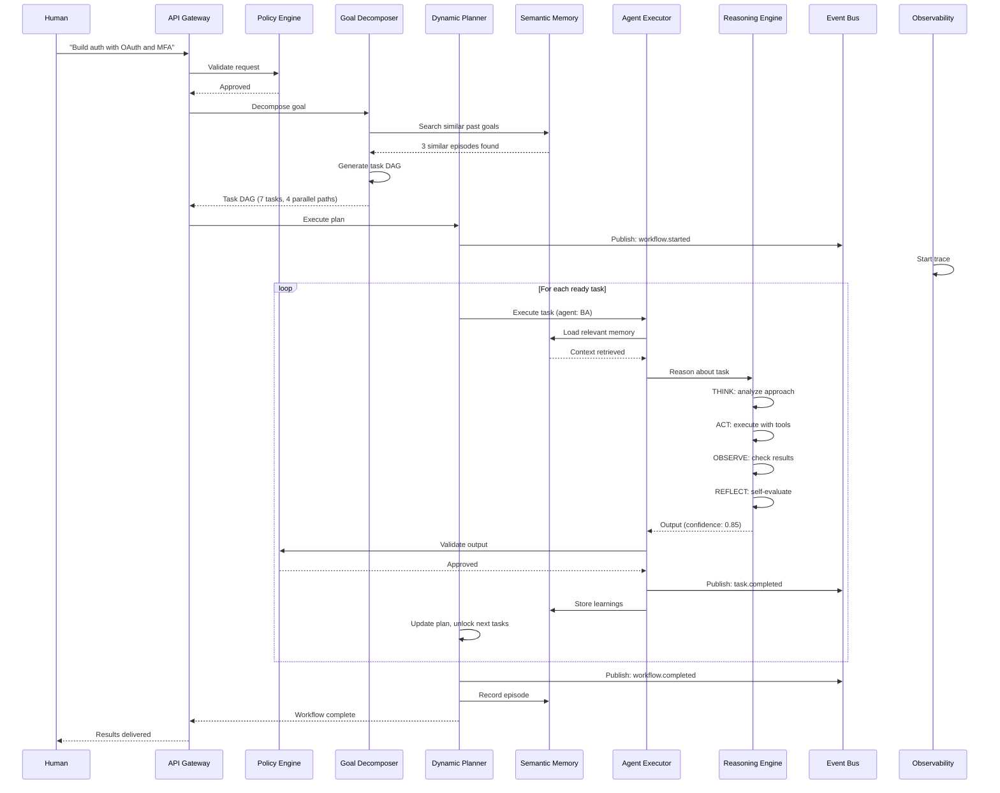
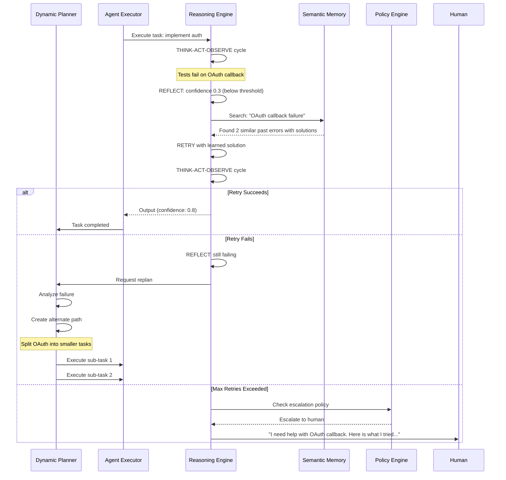

# ARCH-AGENTIC-PLATFORM-20260216

## Architecture: Transforming AI-SDLC into a True Agentic AI Platform

**Version**: 1.0.0
**Date**: 2026-02-16
**Author**: Jets (World-Class Architect)
**Status**: Proposed
**Classification**: Strategic Architecture

---

## 1. Executive Summary

This document presents the comprehensive architecture for transforming the existing AI-SDLC agent system from a **prompt-driven automation framework** into a **true Agentic AI platform** -- one where agents autonomously reason, plan, coordinate, learn, and self-correct in pursuit of high-level goals.

### The Core Distinction

| Characteristic | Current System (Automation) | Target System (Agentic) |
|---|---|---|
| **Decision Making** | Human triggers each phase via `/sdlc-*` commands | Agents autonomously decide what to do next |
| **Planning** | Fixed workflow sequence hardcoded in Conductor | Dynamic plans created and adapted in real-time |
| **Reasoning** | Single-pass LLM inference per agent | Multi-step reasoning with reflection and critique |
| **Learning** | Manual memory file updates, regex pattern detection | Continuous learning with feedback loops and metrics |
| **Tool Usage** | Fixed tool set per agent (Read, Write, Bash, etc.) | Dynamic tool discovery and composition via MCP |
| **Error Recovery** | Circuit breakers stop message delivery | Autonomous diagnosis, replanning, and retry |
| **Coordination** | Sequential handoff via Conductor | Parallel execution with shared state and negotiation |
| **Context** | Each agent starts fresh, reads file context | Persistent working memory with semantic retrieval |
| **Scalability** | Single Claude Code session | Distributed agent execution with resource management |
| **Observability** | File-based audit log | Real-time tracing, metrics, and agent behavior replay |

### Strategic Assessment

The current system is architecturally sound as a **multi-agent orchestration framework**. It has excellent foundations: typed message bus, collective memory, learning engine, conflict resolution, and a well-defined agent registry. However, it is fundamentally a **human-initiated, sequentially-orchestrated system** rather than a truly autonomous agentic platform.

The gap is not a failure -- it is a **maturity progression**. This architecture defines the path from Level 2 (Orchestrated Automation) to Level 5 (Autonomous Agentic System).

---

## 2. Agentic Maturity Model

```
Level 5: AUTONOMOUS AGENTIC SYSTEM
         Agents set their own sub-goals, self-improve, discover tools,
         and operate with bounded autonomy under safety constraints.
         ──────────────────────────────────────────────────────────────
Level 4: ADAPTIVE MULTI-AGENT SYSTEM
         Agents dynamically replan, reason about failures, coordinate
         in parallel, and learn from outcomes automatically.
         ──────────────────────────────────────────────────────────────
Level 3: INTELLIGENT ORCHESTRATION
         Agents make local decisions, share context through semantic
         memory, and have basic reflection capabilities.
         ──────────────────────────────────────────────────────────────
Level 2: ORCHESTRATED AUTOMATION  <-- CURRENT STATE
         Fixed workflow with specialized agents. Human triggers phases.
         File-based communication. Manual learning capture.
         ──────────────────────────────────────────────────────────────
Level 1: SINGLE AGENT SCRIPTING
         One LLM prompt with tool access. No coordination.
```

---

## 3. Current State Analysis

### 3.1 What We Have Built (Strengths)

```
COMPONENT                    STATUS    ASSESSMENT
────────────────────────────────────────────────────────────────
Agent Mesh Framework         BUILT     Solid TypeScript implementation
  - Message Bus              BUILT     File-based, durable, debuggable
  - Agent Registry           BUILT     12 agents, capability discovery
  - Collective Memory        BUILT     Categorized knowledge store
  - Learning Engine          BUILT     Regex-based pattern extraction
  - Conflict Resolution      BUILT     Expertise-weighted voting
  - Audit Log                BUILT     Date-partitioned file store
  - Communication Protocol   BUILT     Well-defined message format

12 Specialized Agents        BUILT     Clear SDLC role separation
  - Conductor (orchestrator) BUILT     Sequential workflow management
  - BA, Jets, UX, Engineer   BUILT     Core SDLC agents
  - Security, QA, Customer   BUILT     Quality gates
  - Atlas, Ask-Tom, Tracker  BUILT     Support agents
  - FinOps                   BUILT     Cost tracking

SDLC Workflow Commands       BUILT     /sdlc-* command interface
Registry & Tracking          BUILT     File-based project tracking
Enhanced Agents              BUILT     Regression prevention
Agent Memory System          BUILT     Per-agent file-based memory
```

### 3.2 Gap Analysis

#### MISSING: Core Agentic Capabilities

| Capability | Current State | Gap Severity | Description |
|---|---|---|---|
| **Goal Decomposition Engine** | None | CRITICAL | No mechanism for breaking high-level goals into sub-goals, task graphs, or execution plans |
| **Dynamic Planner** | Fixed sequence in Conductor | CRITICAL | Workflows are hardcoded; no ability to create, modify, or abandon plans based on runtime conditions |
| **Reasoning Engine** | Single LLM pass | CRITICAL | No chain-of-thought, reflection, critique, or multi-step reasoning loops |
| **Semantic Memory** | Keyword-based search | HIGH | No vector embeddings; `calculateRelevance()` uses string containment, not semantic similarity |
| **Agent Runtime** | Claude Code Task tool | HIGH | Agents cannot run concurrently; no resource isolation or lifecycle management |
| **Tool Discovery (MCP)** | Fixed tool set | HIGH | Agents have hardcoded tools; cannot discover or compose new tools at runtime |
| **Feedback & Evaluation** | None | HIGH | No mechanism to evaluate agent output quality or provide corrective feedback |
| **State Machine** | Implicit in Conductor | MEDIUM | No formal state machine for workflow states, transitions, or rollback |
| **Resource Manager** | None | MEDIUM | No token budget tracking, concurrency limits, or cost-aware scheduling |
| **Safety & Guardrails** | Circuit breakers only | MEDIUM | No output validation, policy enforcement, or bounded autonomy controls |
| **Real-time Observability** | File-based audit | MEDIUM | No live dashboards, distributed tracing, or agent behavior replay |
| **Event Bus** | File-based polling | MEDIUM | No pub/sub, no event streaming, no reactive triggers |

#### NEEDS ENHANCEMENT: Existing Components

| Component | Current Limitation | Enhancement Needed |
|---|---|---|
| **Collective Memory** | String containment search | Vector embeddings with semantic retrieval |
| **Learning Engine** | Regex pattern matching only | LLM-powered insight extraction with outcome tracking |
| **Message Bus** | File polling, no real-time | Event-driven with pub/sub and reactive subscriptions |
| **Agent Registry** | Static profiles | Dynamic capability advertisement, health monitoring |
| **Conflict Resolution** | Votes on text positions | Structured argument evaluation with evidence weighing |
| **Audit Log** | Write-only JSON files | Queryable store with distributed tracing correlation |
| **Conductor** | Sequential orchestration | DAG-based parallel execution with dynamic replanning |

### 3.3 Architectural Constraints of Current Design

1. **Single-Process Execution**: All agents run within a single Claude Code session. The Task tool spawns sub-agents but they are serialized, not parallel.

2. **File System as Database**: Every component (messages, knowledge, audit) uses the filesystem. This works for single-user, single-machine use but cannot scale to distributed or multi-user scenarios.

3. **No Persistent Process**: There is no long-running agent runtime. Agents are ephemeral -- invoked per command, run, and terminate. There is no background processing, no event watching, no autonomous action initiation.

4. **LLM as Only Reasoner**: The current design treats the LLM as a black box that produces output in one pass. There is no structured reasoning, no iterative refinement, no self-evaluation loop.

5. **Human-in-the-Loop by Default**: Every workflow starts with a human command. The system cannot autonomously detect that work needs to be done (e.g., a failing test, a security vulnerability, a requirements change).

---

## 4. Target Architecture

### 4.1 High-Level Architecture

```
                    AGENTIC AI PLATFORM ARCHITECTURE
======================================================================

                        HUMAN INTERFACE LAYER
    ┌─────────────────────────────────────────────────────────────┐
    │  CLI Commands  |  Web Dashboard  |  API Gateway  |  Webhooks│
    │  /sdlc-*       |  Control Center |  REST/GraphQL |  GitHub  │
    └────────────────────────────┬────────────────────────────────┘
                                 │
                        SAFETY & CONTROL LAYER
    ┌────────────────────────────┴────────────────────────────────┐
    │  Policy Engine  |  Approval Gates  |  Budget Guards  |  Audit│
    │  Bounded Autonomy  |  Human Escalation  |  Kill Switch      │
    └────────────────────────────┬────────────────────────────────┘
                                 │
                      ORCHESTRATION & PLANNING LAYER
    ┌────────────────────────────┴────────────────────────────────┐
    │                                                              │
    │   ┌──────────────┐  ┌───────────────┐  ┌────────────────┐  │
    │   │    Goal       │  │   Dynamic     │  │   Workflow     │  │
    │   │  Decomposer   │  │   Planner     │  │  State Machine │  │
    │   │              │  │              │  │               │  │
    │   │ Break goals  │  │ Create DAG   │  │ Track states, │  │
    │   │ into tasks   │  │ plans, adapt │  │ transitions   │  │
    │   └──────────────┘  └───────────────┘  └────────────────┘  │
    │                                                              │
    │   ┌──────────────┐  ┌───────────────┐  ┌────────────────┐  │
    │   │   Resource    │  │   Scheduler   │  │   Event        │  │
    │   │   Manager     │  │              │  │   Router       │  │
    │   │              │  │ Priority     │  │               │  │
    │   │ Token budget,│  │ queues,      │  │ Pub/Sub,      │  │
    │   │ concurrency  │  │ dependencies │  │ triggers      │  │
    │   └──────────────┘  └───────────────┘  └────────────────┘  │
    │                                                              │
    └────────────────────────────┬────────────────────────────────┘
                                 │
                         AGENT RUNTIME LAYER
    ┌────────────────────────────┴────────────────────────────────┐
    │                                                              │
    │   ┌──────────────────────────────────────────────────────┐  │
    │   │              AGENT EXECUTION ENGINE                   │  │
    │   │                                                      │  │
    │   │  ┌─────────┐ ┌─────────┐ ┌─────────┐ ┌─────────┐  │  │
    │   │  │ Agent 1 │ │ Agent 2 │ │ Agent 3 │ │ Agent N │  │  │
    │   │  │ (Sandbox)│ │ (Sandbox)│ │ (Sandbox)│ │ (Sandbox)│  │  │
    │   │  └────┬────┘ └────┬────┘ └────┬────┘ └────┬────┘  │  │
    │   │       │            │           │            │       │  │
    │   │  ┌────┴────────────┴───────────┴────────────┴────┐  │  │
    │   │  │           REASONING ENGINE                     │  │  │
    │   │  │  ReAct Loop | Reflection | Critique | Replan   │  │  │
    │   │  └───────────────────────────────────────────────┘  │  │
    │   │                                                      │  │
    │   └──────────────────────────────────────────────────────┘  │
    │                                                              │
    │   ┌──────────────────────────────────────────────────────┐  │
    │   │              TOOL LAYER (MCP)                         │  │
    │   │                                                      │  │
    │   │  ┌──────┐ ┌──────┐ ┌──────┐ ┌──────┐ ┌──────────┐ │  │
    │   │  │ Read │ │Write │ │ Bash │ │ Web  │ │ Dynamic  │ │  │
    │   │  │      │ │      │ │      │ │Search│ │ MCP Tools│ │  │
    │   │  └──────┘ └──────┘ └──────┘ └──────┘ └──────────┘ │  │
    │   │                                                      │  │
    │   │  Tool Registry | Tool Discovery | Tool Composition   │  │
    │   └──────────────────────────────────────────────────────┘  │
    │                                                              │
    └────────────────────────────┬────────────────────────────────┘
                                 │
                    INTELLIGENCE & MEMORY LAYER
    ┌────────────────────────────┴────────────────────────────────┐
    │                                                              │
    │   ┌──────────────┐  ┌───────────────┐  ┌────────────────┐  │
    │   │   Semantic    │  │   Working     │  │   Episodic     │  │
    │   │   Memory      │  │   Memory      │  │   Memory       │  │
    │   │              │  │              │  │               │  │
    │   │ Vector DB,   │  │ Active task  │  │ Past workflow │  │
    │   │ embeddings,  │  │ context,     │  │ history,      │  │
    │   │ knowledge    │  │ scratchpad   │  │ outcomes      │  │
    │   │ graph        │  │              │  │               │  │
    │   └──────────────┘  └───────────────┘  └────────────────┘  │
    │                                                              │
    │   ┌──────────────┐  ┌───────────────┐  ┌────────────────┐  │
    │   │   Learning    │  │   Feedback    │  │   Pattern      │  │
    │   │   Engine      │  │   Evaluator   │  │   Recognizer   │  │
    │   │              │  │              │  │               │  │
    │   │ Outcome-     │  │ Score agent  │  │ Cross-project │  │
    │   │ based, auto  │  │ outputs,     │  │ pattern       │  │
    │   │ extraction   │  │ track drift  │  │ detection     │  │
    │   └──────────────┘  └───────────────┘  └────────────────┘  │
    │                                                              │
    └────────────────────────────┬────────────────────────────────┘
                                 │
                    COMMUNICATION & COORDINATION LAYER
    ┌────────────────────────────┴────────────────────────────────┐
    │                                                              │
    │   ┌──────────────┐  ┌───────────────┐  ┌────────────────┐  │
    │   │   Event Bus   │  │   Agent       │  │   Shared       │  │
    │   │  (Enhanced)   │  │   Registry    │  │   Blackboard   │  │
    │   │              │  │  (Enhanced)   │  │               │  │
    │   │ Pub/sub,     │  │ Dynamic caps, │  │ Shared state  │  │
    │   │ streaming,   │  │ health check, │  │ for parallel  │  │
    │   │ replay       │  │ load balance  │  │ agent coord.  │  │
    │   └──────────────┘  └───────────────┘  └────────────────┘  │
    │                                                              │
    │   Conflict Resolution | Negotiation Protocol | Consensus    │
    │                                                              │
    └────────────────────────────┬────────────────────────────────┘
                                 │
                      OBSERVABILITY LAYER
    ┌────────────────────────────┴────────────────────────────────┐
    │  Distributed Tracing  |  Metrics  |  Agent Replay  |  Alerts│
    │  OpenTelemetry  |  Dashboards  |  Cost Tracking  |  SLOs    │
    └─────────────────────────────────────────────────────────────┘
```

### 4.2 Component Architecture Details

#### 4.2.1 Goal Decomposition Engine

The Goal Decomposition Engine transforms high-level human intentions into structured, executable task graphs.

```
INPUT:  "Build a user authentication system with OAuth 2.0 and MFA"
                                    │
                    ┌───────────────┴───────────────┐
                    │   GOAL DECOMPOSITION ENGINE    │
                    │                                │
                    │  1. Parse intent               │
                    │  2. Identify sub-goals          │
                    │  3. Map to agent capabilities   │
                    │  4. Detect dependencies          │
                    │  5. Estimate effort              │
                    │  6. Identify risks               │
                    └───────────────┬───────────────┘
                                    │
OUTPUT: Task DAG (Directed Acyclic Graph)

    [REQ-Auth]──────►[ARCH-Auth]──────┬──►[IMPL-OAuth]──────┐
                         │            │                      │
                         │            └──►[IMPL-MFA]─────────┤
                         │                                   │
                         └──►[UX-AuthFlow]──►[IMPL-UI]───────┤
                                                             │
                                         ┌───────────────────┤
                                         │                   │
                                   [SEC-Review]        [QA-AuthTests]
                                         │                   │
                                         └───────┬───────────┘
                                                 │
                                           [DEPLOY-Auth]
                                                 │
                                           [UAT-Auth]
```

**Key Design Decisions:**
- Goals are decomposed using LLM reasoning with structured output (JSON schema)
- Task DAG supports parallel execution where dependencies allow
- Each task node carries: agent assignment, estimated tokens, priority, dependencies, success criteria
- The DAG is mutable -- the Dynamic Planner can modify it at runtime

```typescript
interface TaskDAG {
  id: string;
  goal: string;
  tasks: TaskNode[];
  edges: TaskEdge[];         // dependency relationships
  metadata: {
    createdAt: string;
    estimatedTokens: number;
    estimatedDuration: string;
    riskAssessment: RiskLevel;
  };
}

interface TaskNode {
  id: string;
  agentId: AgentId;
  type: 'requirement' | 'design' | 'implement' | 'review' | 'test' | 'deploy';
  description: string;
  inputs: string[];          // outputs from dependency tasks
  expectedOutputs: string[]; // what this task produces
  successCriteria: string[];
  estimatedTokens: number;
  status: 'pending' | 'ready' | 'running' | 'completed' | 'failed' | 'skipped';
  retryPolicy: RetryPolicy;
  timeout: number;
}

interface TaskEdge {
  from: string;  // task ID
  to: string;    // task ID
  type: 'blocks' | 'informs' | 'optional';
}
```

#### 4.2.2 Dynamic Planner

The Dynamic Planner creates, monitors, and adapts execution plans in real-time.

```
                    DYNAMIC PLANNING LOOP
                    ══════════════════════

    ┌──────────┐     ┌──────────┐     ┌──────────┐
    │  OBSERVE │────►│  ORIENT  │────►│  DECIDE  │
    │          │     │          │     │          │
    │ Monitor  │     │ Assess   │     │ Choose   │
    │ task     │     │ progress │     │ next     │
    │ outcomes │     │ vs plan  │     │ action   │
    └──────────┘     └──────────┘     └────┬─────┘
         ▲                                  │
         │           ┌──────────┐           │
         └───────────│   ACT    │◄──────────┘
                     │          │
                     │ Execute  │
                     │ or       │
                     │ Replan   │
                     └──────────┘
```

**Planning Strategies:**
1. **Forward Planning** -- Execute tasks in dependency order
2. **Reactive Replanning** -- When a task fails, analyze the failure and create an alternate path
3. **Opportunistic Scheduling** -- If an agent becomes available and a non-critical-path task is ready, start it early
4. **Resource-Aware Planning** -- Factor token budgets and time constraints into scheduling decisions

**Replanning Triggers:**
- Task failure after max retries
- Agent unavailability (circuit breaker open)
- New information that invalidates a prior decision
- Resource budget exceeded
- Human intervention or priority change
- Security finding that requires architecture change

#### 4.2.3 Reasoning Engine

The Reasoning Engine wraps every agent invocation in a structured reasoning loop.

```
                    REASONING ENGINE (Per Agent)
                    ════════════════════════════

    ┌────────────────────────────────────────────────────┐
    │                                                    │
    │   STEP 1: THINK                                    │
    │   ┌──────────────────────────────────────────────┐ │
    │   │ Given: task description, inputs, context     │ │
    │   │ Retrieve: relevant memory, past learnings    │ │
    │   │ Reason: chain-of-thought about approach      │ │
    │   │ Plan: outline steps to complete task          │ │
    │   └──────────────────────────────────────────────┘ │
    │                          │                         │
    │   STEP 2: ACT                                      │
    │   ┌──────────────────────────────────────────────┐ │
    │   │ Execute the plan using available tools        │ │
    │   │ Call MCP tools, read files, write code        │ │
    │   │ Observe results from each action              │ │
    │   └──────────────────────────────────────────────┘ │
    │                          │                         │
    │   STEP 3: OBSERVE                                  │
    │   ┌──────────────────────────────────────────────┐ │
    │   │ Collect all outputs and observations          │ │
    │   │ Run automated checks (lint, test, validate)  │ │
    │   │ Compare results against success criteria      │ │
    │   └──────────────────────────────────────────────┘ │
    │                          │                         │
    │   STEP 4: REFLECT                                  │
    │   ┌──────────────────────────────────────────────┐ │
    │   │ Self-evaluate: "Is my output good enough?"   │ │
    │   │ Check for errors, omissions, inconsistencies │ │
    │   │ Score confidence (0-1) on each output        │ │
    │   │ Decide: ACCEPT, RETRY, or ESCALATE           │ │
    │   └──────────────────────────────────────────────┘ │
    │                          │                         │
    │           ┌──────────────┼──────────────┐          │
    │           │              │              │          │
    │       ACCEPT          RETRY         ESCALATE      │
    │    (confidence      (iterate       (ask another   │
    │     >= threshold)    with fixes)    agent/human)   │
    │                                                    │
    └────────────────────────────────────────────────────┘
```

**Reasoning Modes:**
- **ReAct Loop**: Think-Act-Observe cycle for tool-using tasks
- **Reflexion**: Self-critique with explicit feedback for iterative improvement
- **Debate**: Two-agent evaluation where a critic reviews the producer's output
- **Consensus**: Multiple agents independently solve, then synthesize

```typescript
interface ReasoningConfig {
  maxIterations: number;           // Max think-act-observe cycles
  confidenceThreshold: number;     // Min confidence to accept (0-1)
  reflectionEnabled: boolean;      // Enable self-critique step
  critiqueAgent?: AgentId;         // External critic agent
  externalValidation?: {           // Automated checks
    lint: boolean;
    typeCheck: boolean;
    testRun: boolean;
    securityScan: boolean;
  };
  escalationPolicy: {
    onLowConfidence: 'retry' | 'escalate' | 'ask-human';
    onFailure: 'retry' | 'replan' | 'escalate';
    maxRetries: number;
  };
}
```

#### 4.2.4 Semantic Memory System

Replace keyword-based search with vector embeddings for true semantic retrieval.

```
                    MEMORY ARCHITECTURE
                    ═══════════════════

    ┌─────────────────────────────────────────────────────────┐
    │                    WORKING MEMORY                        │
    │  (Per-task, ephemeral, high-speed)                      │
    │                                                          │
    │  Current task context, scratchpad, intermediate results  │
    │  Implementation: In-process state + Redis               │
    └───────────────────────────┬──────────────────────────────┘
                                │
    ┌───────────────────────────┴──────────────────────────────┐
    │                    SEMANTIC MEMORY                        │
    │  (Long-term, searchable by meaning)                      │
    │                                                          │
    │  ┌──────────────┐  ┌──────────────┐  ┌──────────────┐  │
    │  │ Knowledge    │  │ Code         │  │ Decision     │  │
    │  │ Base         │  │ Patterns     │  │ History      │  │
    │  │              │  │              │  │              │  │
    │  │ Best prac.,  │  │ Code snips,  │  │ ADRs, why   │  │
    │  │ anti-pat.,   │  │ templates,   │  │ decisions    │  │
    │  │ learnings    │  │ idioms       │  │ were made    │  │
    │  └──────────────┘  └──────────────┘  └──────────────┘  │
    │                                                          │
    │  Implementation: Vector DB (pgvector or Chroma)         │
    │  Embedding Model: text-embedding-3-large (OpenAI)       │
    │                   or Voyage AI                           │
    │  Retrieval: Top-K similarity + metadata filters         │
    └───────────────────────────┬──────────────────────────────┘
                                │
    ┌───────────────────────────┴──────────────────────────────┐
    │                    EPISODIC MEMORY                        │
    │  (Historical, narrative, outcome-linked)                 │
    │                                                          │
    │  Complete workflow histories with:                        │
    │  - What was the goal                                     │
    │  - What plan was created                                 │
    │  - What actually happened                                │
    │  - What succeeded and what failed                        │
    │  - What was learned                                      │
    │  - What would be done differently                        │
    │                                                          │
    │  Implementation: PostgreSQL (structured) + Vector DB     │
    └──────────────────────────────────────────────────────────┘
```

**Memory Operations:**
```typescript
interface MemoryService {
  // Working Memory (per-task)
  setContext(taskId: string, key: string, value: any): Promise<void>;
  getContext(taskId: string, key: string): Promise<any>;
  clearContext(taskId: string): Promise<void>;

  // Semantic Memory (long-term)
  store(content: string, metadata: MemoryMetadata): Promise<string>;
  search(query: string, options: SearchOptions): Promise<MemoryResult[]>;
  searchSimilar(embedding: number[], topK: number): Promise<MemoryResult[]>;

  // Episodic Memory (historical)
  recordEpisode(episode: WorkflowEpisode): Promise<string>;
  findSimilarEpisodes(description: string, limit: number): Promise<WorkflowEpisode[]>;
  getOutcomeStatistics(pattern: string): Promise<OutcomeStats>;
}

interface SearchOptions {
  topK: number;
  minSimilarity: number;
  filters: {
    category?: string;
    agentId?: AgentId;
    dateRange?: { from: string; to: string };
    confidence?: string;
  };
  includeMetadata: boolean;
}
```

#### 4.2.5 Tool Layer (MCP Integration)

Implement the Model Context Protocol for dynamic tool discovery and composition.

```
                    MCP TOOL ARCHITECTURE
                    ═════════════════════

    ┌──────────────────────────────────────────────────────┐
    │                   AGENT                               │
    │                     │                                 │
    │        "I need to run tests and deploy"               │
    │                     │                                 │
    │           ┌─────────┴─────────┐                      │
    │           │  TOOL PLANNER     │                      │
    │           │                   │                      │
    │           │  1. Identify need │                      │
    │           │  2. Query registry│                      │
    │           │  3. Select tools  │                      │
    │           │  4. Compose chain │                      │
    │           └─────────┬─────────┘                      │
    │                     │                                 │
    │           ┌─────────┴─────────┐                      │
    │           │  TOOL REGISTRY    │                      │
    │           │  (MCP Discovery)  │                      │
    │           └─────────┬─────────┘                      │
    │                     │                                 │
    └─────────────────────┼────────────────────────────────┘
                          │
    ┌─────────────────────┼────────────────────────────────┐
    │              MCP SERVER LAYER                         │
    │                     │                                 │
    │  ┌──────┐ ┌──────┐ ┌──────┐ ┌──────┐ ┌──────────┐  │
    │  │ File │ │ Git  │ │ DB   │ │ API  │ │ Cloud    │  │
    │  │System│ │      │ │Query │ │Client│ │ Provider │  │
    │  └──────┘ └──────┘ └──────┘ └──────┘ └──────────┘  │
    │                                                      │
    │  ┌──────┐ ┌──────┐ ┌──────┐ ┌──────┐ ┌──────────┐  │
    │  │ Test │ │ Lint │ │Docker│ │Search│ │ Custom   │  │
    │  │Runner│ │      │ │      │ │Engine│ │ MCP      │  │
    │  └──────┘ └──────┘ └──────┘ └──────┘ └──────────┘  │
    │                                                      │
    └──────────────────────────────────────────────────────┘
```

**Tool Discovery Protocol:**
```typescript
interface MCPToolRegistry {
  // Discover available tools
  listTools(): Promise<MCPToolSchema[]>;

  // Get tool details
  getTool(name: string): Promise<MCPToolSchema | null>;

  // Execute a tool
  executeTool(name: string, params: Record<string, any>): Promise<ToolResult>;

  // Register a new MCP server
  registerServer(config: MCPServerConfig): Promise<void>;

  // Compose tools into a pipeline
  composeTools(steps: ToolCompositionStep[]): Promise<ComposedTool>;
}

interface MCPToolSchema {
  name: string;
  description: string;
  inputSchema: JSONSchema;
  outputSchema: JSONSchema;
  server: string;
  permissions: string[];
  costEstimate: { tokens: number; latency: string };
}
```

#### 4.2.6 Safety and Control Layer

Bounded autonomy with clear guardrails.

```
                    SAFETY ARCHITECTURE
                    ═══════════════════

    ┌─────────────────────────────────────────────────────────┐
    │                POLICY ENGINE                             │
    │                                                          │
    │  Rules expressed in natural language + structured config │
    │                                                          │
    │  EXAMPLE POLICIES:                                       │
    │  ┌────────────────────────────────────────────────────┐ │
    │  │ "Agents must not delete production data"           │ │
    │  │ "Code changes must pass lint before committing"    │ │
    │  │ "Security agent must approve all API endpoints"    │ │
    │  │ "Token budget per task must not exceed 100K"       │ │
    │  │ "Human approval required for infrastructure changes│ │
    │  └────────────────────────────────────────────────────┘ │
    │                                                          │
    │  ENFORCEMENT:                                            │
    │  ┌─────────┐  ┌─────────────┐  ┌───────────────────┐   │
    │  │ Pre-    │  │ Runtime     │  │ Post-execution    │   │
    │  │ action  │  │ monitoring  │  │ validation        │   │
    │  │ check   │  │             │  │                   │   │
    │  │         │  │ Token       │  │ Output quality    │   │
    │  │ Can this│  │ usage,      │  │ check, security   │   │
    │  │ agent   │  │ time limit, │  │ scan, compliance  │   │
    │  │ do this?│  │ cost guard  │  │ verification      │   │
    │  └─────────┘  └─────────────┘  └───────────────────┘   │
    │                                                          │
    │  ESCALATION:                                             │
    │  ┌─────────────────────────────────────────────────┐    │
    │  │ Confidence < 0.5  -->  Ask another agent        │    │
    │  │ Confidence < 0.3  -->  Ask human                │    │
    │  │ Policy violation  -->  Block and alert          │    │
    │  │ Budget exceeded   -->  Pause and report         │    │
    │  │ Safety concern    -->  Kill switch              │    │
    │  └─────────────────────────────────────────────────┘    │
    │                                                          │
    └─────────────────────────────────────────────────────────┘
```

```typescript
interface PolicyEngine {
  // Evaluate whether an action is permitted
  evaluate(action: AgentAction): Promise<PolicyDecision>;

  // Register a new policy
  addPolicy(policy: Policy): Promise<void>;

  // Check resource budgets
  checkBudget(taskId: string, resource: 'tokens' | 'time' | 'cost'): Promise<BudgetStatus>;
}

interface Policy {
  id: string;
  name: string;
  description: string;
  scope: 'global' | 'agent' | 'task';
  condition: string;          // Natural language or structured rule
  action: 'allow' | 'deny' | 'require-approval' | 'log-and-allow';
  enforcement: 'pre-action' | 'runtime' | 'post-action';
  severity: 'info' | 'warning' | 'critical';
}

interface PolicyDecision {
  allowed: boolean;
  reason: string;
  requiredApprovals: string[];
  conditions: string[];
  alternativeActions: string[];
}
```

#### 4.2.7 Enhanced Communication Layer

Upgrade from file-based polling to event-driven architecture.

```
                    ENHANCED EVENT BUS
                    ══════════════════

    Current: File-based polling (ls + cat JSON files)
    Target:  Event-driven pub/sub with persistence

    ┌──────────┐         ┌──────────────────┐         ┌──────────┐
    │ Agent A  │────────►│   EVENT BUS      │────────►│ Agent B  │
    │          │ publish  │                  │ subscribe│          │
    └──────────┘         │  ┌────────────┐  │         └──────────┘
                         │  │ Topic:     │  │
                         │  │ task.*     │  │
                         │  │ learning.* │  │
                         │  │ conflict.* │  │
                         │  │ system.*   │  │
                         │  └────────────┘  │
                         │                  │
                         │  Persistence:    │
                         │  - Redis Streams │
                         │  - or BullMQ     │
                         │  - or file-based │
                         │    (dev mode)    │
                         └──────────────────┘

    EVENT TYPES:
    ─────────────────────────────────────────
    task.created          - New task in DAG
    task.ready            - Dependencies met
    task.started          - Agent began work
    task.completed        - Agent finished
    task.failed           - Agent failed
    task.replanned        - Plan was modified

    learning.discovered   - New learning found
    learning.propagated   - Learning sent to agents
    learning.applied      - Agent used a learning

    conflict.raised       - Agents disagree
    conflict.resolved     - Resolution reached

    system.health         - Health check event
    system.budget.warning - Budget threshold hit
    system.error          - System-level error
```

**Shared Blackboard Pattern:**

For parallel agent coordination, introduce a shared blackboard -- a mutable shared state that multiple agents can read from and write to during a single workflow.

```typescript
interface Blackboard {
  // Read a value from the shared state
  get(key: string): Promise<any>;

  // Write a value to the shared state
  set(key: string, value: any, writer: AgentId): Promise<void>;

  // Watch for changes to a key
  watch(key: string, callback: (value: any, writer: AgentId) => void): void;

  // Atomic compare-and-swap for concurrent writes
  compareAndSwap(key: string, expected: any, newValue: any, writer: AgentId): Promise<boolean>;

  // Get the change history for a key
  history(key: string): Promise<BlackboardEntry[]>;
}
```

#### 4.2.8 Observability Architecture

```
                    OBSERVABILITY STACK
                    ═══════════════════

    ┌──────────────────────────────────────────────────────┐
    │                  AGENT ACTIVITIES                     │
    │  ┌──────┐ ┌──────┐ ┌──────┐ ┌──────┐ ┌──────┐     │
    │  │Agent1│ │Agent2│ │Agent3│ │Agent4│ │AgentN│     │
    │  └──┬───┘ └──┬───┘ └──┬───┘ └──┬───┘ └──┬───┘     │
    │     │        │        │        │        │          │
    │     └────────┴────────┴────────┴────────┘          │
    │                       │                             │
    └───────────────────────┼─────────────────────────────┘
                            │
              ┌─────────────┼─────────────┐
              │             │             │
    ┌─────────┴──┐  ┌──────┴───┐  ┌──────┴──────┐
    │   TRACES   │  │  METRICS │  │    LOGS     │
    │            │  │          │  │             │
    │ Distributed│  │ Token    │  │ Structured  │
    │ tracing    │  │ usage    │  │ JSON logs   │
    │ across all │  │ Latency  │  │ with trace  │
    │ agents     │  │ Success  │  │ correlation │
    │ (OTLP)     │  │ rates    │  │             │
    └─────────┬──┘  └──────┬───┘  └──────┬──────┘
              │            │             │
              └────────────┼─────────────┘
                           │
              ┌────────────┴────────────┐
              │     OBSERVABILITY       │
              │       BACKEND           │
              │                         │
              │  Jaeger (traces)        │
              │  Prometheus (metrics)   │
              │  Loki (logs)            │
              │  Grafana (dashboards)   │
              │                         │
              │  OR: Simplified local   │
              │  SQLite + file-based    │
              │  (development mode)     │
              └────────────┬────────────┘
                           │
              ┌────────────┴────────────┐
              │     DASHBOARDS          │
              │                         │
              │  - Active workflows     │
              │  - Agent utilization    │
              │  - Token spend          │
              │  - Success/failure rate │
              │  - Learning velocity    │
              │  - Reasoning depth      │
              │  - Plan adaptation rate │
              │  - Agent replay viewer  │
              └─────────────────────────┘
```

**Key Metrics to Track:**

| Metric | Description | Target |
|---|---|---|
| Task Success Rate | % of tasks completed without failure | > 90% |
| Reasoning Depth | Average think-act-observe cycles per task | 2-4 |
| Plan Adaptation Rate | % of workflows that required replanning | < 30% |
| Learning Velocity | New learnings per workflow | 3-5 |
| Memory Hit Rate | % of tasks where semantic memory was useful | > 60% |
| Token Efficiency | Useful output tokens / total tokens | > 40% |
| Autonomous Decision Rate | % of decisions made without human input | > 80% |
| Conflict Resolution Time | Average time to resolve agent conflicts | < 2 min |

---

## 5. Reference Architecture Comparison

### 5.1 How We Compare to Industry Frameworks

| Capability | Our System | LangGraph | CrewAI | AutoGen | AWS Bedrock Agents |
|---|---|---|---|---|---|
| **Multi-Agent** | 12 specialized agents | Graph-based agents | Role-based crew | Conversation-based | Managed agents |
| **Orchestration** | Conductor (sequential) | DAG execution engine | Sequential/hierarchical | Group chat manager | Orchestration layer |
| **Memory** | File-based collective | Checkpointed state | Shared memory | Context variables | Agent memory (managed) |
| **Tool Use** | Fixed (Read/Write/Bash) | Tool nodes in graph | Tool per agent | Function calling | Action groups + MCP |
| **Planning** | Fixed workflow | Graph-based routing | Task delegation | Conversation flow | Step functions |
| **Learning** | Regex pattern detection | None built-in | None built-in | None built-in | None built-in |
| **Communication** | File-based messages | Graph edges | Delegation chain | Chat messages | API calls |
| **Safety** | Circuit breakers | None built-in | None built-in | None built-in | Guardrails + policy |
| **Observability** | File audit log | LangSmith | None built-in | None built-in | CloudWatch |

### 5.2 What We Can Learn

**From LangGraph:**
- Graph-based workflow definition is more flexible than sequential orchestration
- Conditional edges allow dynamic routing based on agent output
- Checkpointing enables workflow resume after failures
- Human-in-the-loop as first-class graph nodes

**From CrewAI:**
- Role-based agent design with clear responsibilities (we already do this well)
- Delegation chains where one agent can delegate to another
- Process types: sequential, hierarchical, consensus

**From AutoGen:**
- Conversational multi-agent patterns where agents debate and refine
- Group chat with a manager that routes messages
- Code execution sandboxing for safety

**From AWS Bedrock Agents:**
- Model Context Protocol for tool discovery (we should adopt this)
- Policy-based guardrails (natural language + structured rules)
- Managed memory with knowledge bases
- Agent evaluation frameworks

### 5.3 Our Unique Advantages

What we have that others do not:
1. **12 SDLC-Specialized Agents** -- No other framework has domain-specific SDLC agents
2. **Collective Memory with Evidence Tracking** -- Our knowledge confidence system is unique
3. **Expertise-Weighted Conflict Resolution** -- Novel approach to agent disagreements
4. **Integrated Cost Tracking (FinOps)** -- Built-in cost awareness
5. **Self-Learning Architecture** -- Pattern recognition and propagation (needs enhancement)
6. **Full SDLC Coverage** -- From requirements to deployment to UAT

---

## 6. Technology Stack Recommendations

### 6.1 Core Platform

| Layer | Technology | Rationale |
|---|---|---|
| **Agent Runtime** | Node.js + TypeScript | Already established; async-first; rich ecosystem |
| **LLM Provider** | Anthropic Claude API | Primary; with OpenAI as fallback |
| **Workflow Engine** | Custom DAG executor (TypeScript) | LangGraph-inspired but SDLC-optimized |
| **Event Bus** | BullMQ (Redis-backed) | Already identified in ADR-023; battle-tested |
| **API Gateway** | Express + tRPC | Type-safe API layer |

### 6.2 Memory & Storage

| Component | Technology | Rationale |
|---|---|---|
| **Vector Database** | pgvector (PostgreSQL extension) | Already using PostgreSQL; single DB for operations + vectors |
| **Embedding Model** | `text-embedding-3-large` (OpenAI) | Best quality/cost ratio for code + text |
| **Relational Store** | PostgreSQL 15 | Already established; JSONB for flexible schemas |
| **Cache** | Redis 7 | BullMQ dependency; also used for working memory |
| **File Store** | Local filesystem (dev) / S3 (prod) | Agent artifacts, audit archives |

### 6.3 Observability

| Component | Technology | Rationale |
|---|---|---|
| **Tracing** | OpenTelemetry SDK | Vendor-neutral; industry standard |
| **Metrics** | Prometheus + custom metrics | Pull-based; integrates with Grafana |
| **Logging** | Pino (structured JSON) | High-performance; structured |
| **Dashboard** | Existing Control Center (enhanced) | Already have React + MUI dashboard |
| **Alerting** | Custom (webhook-based) | Lightweight; integrates with Slack/email |

### 6.4 Development & Deployment

| Component | Technology | Rationale |
|---|---|---|
| **Container Runtime** | Docker + Docker Compose (dev) | Local development simplicity |
| **Orchestrator** | Kubernetes (prod) | Already designed for K8s deployment |
| **IaC** | Terraform | Already established in ADR-001 |
| **CI/CD** | GitHub Actions | Already configured |
| **MCP Servers** | Node.js MCP SDK | Official Anthropic SDK |

---

## 7. Data Architecture

### 7.1 Database Schema (PostgreSQL)

```sql
-- Agent Management
CREATE TABLE agents (
  id VARCHAR(50) PRIMARY KEY,
  name VARCHAR(100) NOT NULL,
  description TEXT,
  capabilities JSONB NOT NULL,
  model VARCHAR(20) NOT NULL,
  status VARCHAR(20) DEFAULT 'available',
  last_active TIMESTAMP WITH TIME ZONE,
  metadata JSONB DEFAULT '{}'
);

-- Workflow Management
CREATE TABLE workflows (
  id UUID PRIMARY KEY DEFAULT gen_random_uuid(),
  goal TEXT NOT NULL,
  status VARCHAR(20) DEFAULT 'planning',
  task_dag JSONB NOT NULL,
  created_at TIMESTAMP WITH TIME ZONE DEFAULT NOW(),
  updated_at TIMESTAMP WITH TIME ZONE DEFAULT NOW(),
  completed_at TIMESTAMP WITH TIME ZONE,
  metadata JSONB DEFAULT '{}'
);

CREATE TABLE tasks (
  id UUID PRIMARY KEY DEFAULT gen_random_uuid(),
  workflow_id UUID REFERENCES workflows(id),
  agent_id VARCHAR(50) REFERENCES agents(id),
  type VARCHAR(30) NOT NULL,
  description TEXT NOT NULL,
  status VARCHAR(20) DEFAULT 'pending',
  inputs JSONB DEFAULT '{}',
  outputs JSONB DEFAULT '{}',
  success_criteria JSONB DEFAULT '[]',
  started_at TIMESTAMP WITH TIME ZONE,
  completed_at TIMESTAMP WITH TIME ZONE,
  tokens_used INTEGER DEFAULT 0,
  reasoning_depth INTEGER DEFAULT 0,
  confidence DECIMAL(3,2),
  error TEXT
);

CREATE TABLE task_dependencies (
  task_id UUID REFERENCES tasks(id),
  depends_on UUID REFERENCES tasks(id),
  dependency_type VARCHAR(20) DEFAULT 'blocks',
  PRIMARY KEY (task_id, depends_on)
);

-- Semantic Memory
CREATE TABLE knowledge (
  id UUID PRIMARY KEY DEFAULT gen_random_uuid(),
  category VARCHAR(50) NOT NULL,
  title VARCHAR(500) NOT NULL,
  content TEXT NOT NULL,
  embedding vector(3072),         -- text-embedding-3-large dimensions
  confidence VARCHAR(20) DEFAULT 'emerging',
  source_agents VARCHAR(50)[] DEFAULT '{}',
  applicable_agents VARCHAR(50)[] DEFAULT '{}',
  evidence_count INTEGER DEFAULT 0,
  tags TEXT[] DEFAULT '{}',
  status VARCHAR(20) DEFAULT 'active',
  created_at TIMESTAMP WITH TIME ZONE DEFAULT NOW(),
  updated_at TIMESTAMP WITH TIME ZONE DEFAULT NOW(),
  access_count INTEGER DEFAULT 0,
  version INTEGER DEFAULT 1
);

CREATE INDEX idx_knowledge_embedding ON knowledge
  USING ivfflat (embedding vector_cosine_ops)
  WITH (lists = 100);

CREATE INDEX idx_knowledge_category ON knowledge(category);
CREATE INDEX idx_knowledge_tags ON knowledge USING GIN(tags);

-- Episodic Memory
CREATE TABLE episodes (
  id UUID PRIMARY KEY DEFAULT gen_random_uuid(),
  workflow_id UUID REFERENCES workflows(id),
  goal TEXT NOT NULL,
  outcome VARCHAR(20) NOT NULL,  -- success, partial, failure
  summary TEXT,
  embedding vector(3072),
  learnings JSONB DEFAULT '[]',
  duration_seconds INTEGER,
  total_tokens INTEGER,
  created_at TIMESTAMP WITH TIME ZONE DEFAULT NOW()
);

-- Events (for event bus persistence)
CREATE TABLE events (
  id UUID PRIMARY KEY DEFAULT gen_random_uuid(),
  topic VARCHAR(100) NOT NULL,
  payload JSONB NOT NULL,
  source_agent VARCHAR(50),
  trace_id UUID,
  created_at TIMESTAMP WITH TIME ZONE DEFAULT NOW()
);

CREATE INDEX idx_events_topic ON events(topic);
CREATE INDEX idx_events_trace ON events(trace_id);

-- Policies
CREATE TABLE policies (
  id UUID PRIMARY KEY DEFAULT gen_random_uuid(),
  name VARCHAR(200) NOT NULL,
  description TEXT,
  scope VARCHAR(20) DEFAULT 'global',
  condition JSONB NOT NULL,
  action VARCHAR(30) NOT NULL,
  enforcement VARCHAR(20) NOT NULL,
  severity VARCHAR(20) DEFAULT 'warning',
  enabled BOOLEAN DEFAULT TRUE,
  created_at TIMESTAMP WITH TIME ZONE DEFAULT NOW()
);

-- Audit Trail
CREATE TABLE audit_log (
  id UUID PRIMARY KEY DEFAULT gen_random_uuid(),
  event_type VARCHAR(50) NOT NULL,
  agent_id VARCHAR(50),
  task_id UUID,
  workflow_id UUID,
  trace_id UUID,
  details JSONB NOT NULL,
  success BOOLEAN DEFAULT TRUE,
  error TEXT,
  duration_ms INTEGER,
  created_at TIMESTAMP WITH TIME ZONE DEFAULT NOW()
);

CREATE INDEX idx_audit_event_type ON audit_log(event_type);
CREATE INDEX idx_audit_agent ON audit_log(agent_id);
CREATE INDEX idx_audit_workflow ON audit_log(workflow_id);
CREATE INDEX idx_audit_created ON audit_log(created_at);
```

### 7.2 Data Flow

```
Human Goal
    │
    ▼
[Goal Decomposition] ──► workflows table + tasks table
    │
    ▼
[Dynamic Planner] ──► task_dependencies + events table
    │
    ▼
[Agent Execution] ──► tasks table (status, outputs, tokens)
    │                    │
    │                    ├──► knowledge table (new learnings)
    │                    ├──► events table (task.* events)
    │                    └──► audit_log table (all actions)
    │
    ▼
[Reasoning Engine] ──► tasks table (reasoning_depth, confidence)
    │
    ▼
[Completion] ──► episodes table (outcome, learnings)
    │                │
    │                └──► knowledge table (updated confidence)
    │
    ▼
[Observability] ◄── events table + audit_log table
```

---

## 8. Sequence Diagrams

### 8.1 Autonomous Workflow Execution



### 8.2 Autonomous Error Recovery



---

## 9. Migration Roadmap

### Phase 1: Foundation Enhancement (Weeks 1-4)

**Goal**: Upgrade existing components without breaking current functionality.

```
WEEK 1-2: Database Migration
├── Add PostgreSQL alongside file-based storage
├── Create schema (Section 7.1)
├── Implement dual-write (files + DB)
├── Migrate existing knowledge to DB
└── Add pgvector extension

WEEK 2-3: Semantic Memory
├── Implement embedding generation service
├── Replace calculateRelevance() with vector search
├── Add memory service abstraction layer
├── Migrate collective memory to vector-backed store
└── Retain file-based fallback for development

WEEK 3-4: Enhanced Event Bus
├── Add BullMQ alongside file-based message bus
├── Implement pub/sub topic routing
├── Add event persistence to PostgreSQL
├── Create event replay capability
└── Retain file-based bus for CLI mode
```

**Deliverables:**
- PostgreSQL schema deployed
- Semantic search operational (vector similarity)
- Event-driven communication operational
- All existing `/sdlc-*` commands still work

**Effort Estimate:** 2 engineers, 4 weeks
**Risk:** Low -- additive changes, no breaking changes

---

### Phase 2: Reasoning and Planning (Weeks 5-10)

**Goal**: Add the cognitive capabilities that make agents truly "agentic."

```
WEEK 5-6: Reasoning Engine
├── Implement ReAct loop wrapper
├── Add reflection/self-critique step
├── Implement confidence scoring
├── Add external validation hooks (lint, test)
├── Create reasoning configuration per agent
└── Instrument with OpenTelemetry tracing

WEEK 7-8: Goal Decomposition + DAG Planner
├── Implement goal decomposition engine (LLM-powered)
├── Create TaskDAG data structure and executor
├── Implement parallel task scheduling
├── Add dependency tracking and resolution
├── Implement replanning on failure
└── Create plan visualization for dashboard

WEEK 9-10: Policy Engine + Safety
├── Implement policy definition format
├── Add pre-action policy evaluation
├── Add runtime budget monitoring
├── Add post-action output validation
├── Implement escalation paths
└── Create safety dashboard
```

**Deliverables:**
- Agents reason in structured loops (not single-pass)
- Workflows are DAGs with parallel execution
- Dynamic replanning on failures
- Policy-based guardrails active

**Effort Estimate:** 3 engineers, 6 weeks
**Risk:** Medium -- changes agent behavior; needs careful testing

---

### Phase 3: Tool Discovery and Autonomy (Weeks 11-16)

**Goal**: Enable agents to discover tools and operate with bounded autonomy.

```
WEEK 11-12: MCP Tool Layer
├── Implement MCP server registry
├── Create core MCP servers (filesystem, git, database)
├── Add tool discovery protocol
├── Implement tool composition
├── Add tool-use tracking and cost estimation
└── Create custom MCP server template

WEEK 13-14: Enhanced Learning
├── Replace regex detection with LLM-powered extraction
├── Implement outcome-based learning (success/failure correlation)
├── Add learning effectiveness tracking
├── Implement cross-project pattern recognition
├── Create learning velocity metrics
└── Add automatic knowledge deprecation

WEEK 15-16: Autonomous Triggers
├── Implement event-driven workflow triggers
│   (GitHub webhook -> automatic SDLC start)
├── Add scheduled health checks and maintenance
├── Implement proactive security scanning
├── Add regression detection triggers
├── Create autonomous improvement suggestions
└── Implement bounded autonomy controls
```

**Deliverables:**
- Agents discover and use new tools via MCP
- Learning is continuous and outcome-based
- System can self-trigger workflows from external events
- Bounded autonomy with safety controls

**Effort Estimate:** 3 engineers, 6 weeks
**Risk:** Medium-High -- autonomous behavior requires robust safety testing

---

### Phase 4: Production Readiness (Weeks 17-24)

**Goal**: Scale, harden, and operationalize the platform.

```
WEEK 17-18: Observability
├── Full OpenTelemetry instrumentation
├── Grafana dashboards for agent metrics
├── Agent behavior replay system
├── Alerting for anomalies
├── Cost tracking integration
└── SLO definition and monitoring

WEEK 19-20: Scalability
├── Distributed agent execution (worker processes)
├── Redis cluster for event bus
├── Connection pooling and query optimization
├── Load testing (100 concurrent workflows)
├── Horizontal scaling validation
└── Resource right-sizing

WEEK 21-22: Hardening
├── Comprehensive integration test suite
├── Chaos engineering (failure injection)
├── Security audit and penetration testing
├── Performance benchmarking
├── Documentation completion
└── Runbook creation

WEEK 23-24: Launch Preparation
├── Beta testing with real projects
├── Feedback incorporation
├── Performance tuning
├── Final security review
├── Production deployment automation
└── Monitoring and alerting validation
```

**Deliverables:**
- Production-ready platform
- Full observability stack
- Horizontal scaling to 100+ concurrent workflows
- Comprehensive test suite
- Operations runbooks

**Effort Estimate:** 4 engineers, 8 weeks
**Risk:** Medium -- production hardening is predictable but labor-intensive

---

## 10. Cost Analysis

### 10.1 Infrastructure Costs (Monthly)

| Component | Development | Staging | Production |
|---|---|---|---|
| **PostgreSQL** (pgvector) | $0 (local) | $50 (RDS t3.medium) | $200 (RDS r6g.large) |
| **Redis** | $0 (local) | $25 (ElastiCache t3.small) | $100 (ElastiCache r6g.large) |
| **Compute** (K8s) | $0 (local Docker) | $150 (EKS 2 nodes) | $600 (EKS 4 nodes) |
| **Embedding API** | ~$10 | ~$30 | ~$100 |
| **LLM API** (Claude) | ~$50 | ~$200 | ~$1,000 |
| **Monitoring** | $0 (local Grafana) | $0 (self-hosted) | $50 (managed) |
| **Storage** (S3) | $0 | $5 | $20 |
| **Total** | **~$60/mo** | **~$460/mo** | **~$2,070/mo** |

### 10.2 Development Investment

| Phase | Duration | Team Size | Effort |
|---|---|---|---|
| Phase 1: Foundation | 4 weeks | 2 engineers | 8 person-weeks |
| Phase 2: Reasoning | 6 weeks | 3 engineers | 18 person-weeks |
| Phase 3: Autonomy | 6 weeks | 3 engineers | 18 person-weeks |
| Phase 4: Production | 8 weeks | 4 engineers | 32 person-weeks |
| **Total** | **24 weeks** | **2-4 engineers** | **76 person-weeks** |

---

## 11. Risk Assessment

| Risk | Probability | Impact | Mitigation |
|---|---|---|---|
| LLM reasoning loops are too expensive (token cost) | Medium | High | Token budgets per task; cost-aware scheduling; efficient prompts |
| Autonomous agents produce harmful outputs | Low | Critical | Policy engine; human approval gates; output validation; kill switch |
| Vector search quality is poor for code | Medium | Medium | Fine-tune embedding model; hybrid search (vector + keyword); A/B test |
| Replanning creates infinite loops | Low | High | Max replan depth; circuit breakers; human escalation |
| Migration breaks existing workflows | Medium | High | Dual-write strategy; feature flags; gradual rollout |
| Performance degrades with scale | Medium | Medium | Load testing each phase; horizontal scaling; caching |
| Learning system propagates bad knowledge | Low | Medium | Confidence scoring; evidence requirements; human review for "proven" |

---

## 12. Success Criteria

### 12.1 Quantitative Metrics

| Metric | Current | Phase 1 Target | Phase 4 Target |
|---|---|---|---|
| Autonomous decisions (no human input) | 0% | 30% | 80%+ |
| Semantic memory hit rate | N/A | 40% | 60%+ |
| Task success rate (first attempt) | N/A | 70% | 90%+ |
| Average reasoning depth | 1 (single pass) | 2.5 | 3-4 |
| Workflow replanning rate | 0% | 15% | < 30% |
| Learning velocity (per workflow) | ~0.5 manual | 2 automatic | 5+ automatic |
| Concurrent workflow capacity | 1 | 5 | 100+ |
| Plan-to-execution time | N/A | Measured | < 2x estimated |
| Token efficiency (useful/total) | ~20% | 30% | 40%+ |

### 12.2 Qualitative Criteria

- [ ] Agents reason visibly (you can read their chain-of-thought)
- [ ] Agents self-correct when their output fails validation
- [ ] Agents discover and use tools they were not explicitly given
- [ ] The system learns from failures and avoids repeating them
- [ ] Workflows adapt dynamically when plans go wrong
- [ ] Human operators can observe, understand, and intervene in real-time
- [ ] The system operates safely within defined boundaries
- [ ] New agent types can be added without platform changes

---

## 13. Answers to Key Questions

### Q1: What makes our system "agentic" vs just "automated"?

**Current state: Automated.** The system executes a fixed sequence of agent invocations triggered by human commands. Each agent runs once, produces output, and terminates. There is no autonomy, no planning, no reasoning loops, and no self-correction.

**Target state: Agentic.** The system will decompose goals into plans, execute them with reasoning loops, adapt when things go wrong, learn from outcomes, and trigger new work autonomously -- all within safety boundaries.

The key differentiators are: (1) goal-directed behavior, (2) dynamic planning, (3) multi-step reasoning with reflection, (4) autonomous error recovery, and (5) continuous learning from outcomes.

### Q2: What are the gaps preventing true agent autonomy?

Five critical gaps:
1. **No Goal Decomposition** -- Cannot break "build auth" into a task graph
2. **No Dynamic Planning** -- Cannot adapt when a task fails
3. **No Reasoning Engine** -- Agents run once without self-evaluation
4. **No Semantic Memory** -- Cannot find relevant knowledge by meaning
5. **No Autonomous Triggers** -- System only acts when human commands it

### Q3: How do we enable dynamic planning vs fixed workflows?

Replace the Conductor's hardcoded sequence with a DAG-based planner that:
- Generates task graphs from goals (LLM-powered)
- Tracks task states and dependencies
- Identifies parallelizable tasks
- Replans when tasks fail
- Reorders based on resource availability
- Supports human intervention at any point

### Q4: How do we implement reasoning and reflection?

Wrap every agent invocation in a ReAct loop:
1. THINK: analyze the task and plan an approach
2. ACT: execute using tools
3. OBSERVE: collect and verify results
4. REFLECT: self-evaluate confidence and quality
5. DECIDE: accept (>= threshold), retry (with corrections), or escalate

This is implemented as a generic `ReasoningEngine` that wraps any agent.

### Q5: How do we scale to 100+ concurrent agent workflows?

1. Move from single-process to worker-based execution (BullMQ workers)
2. Database-backed state (PostgreSQL) instead of filesystem
3. Redis-backed event bus instead of file polling
4. Horizontal scaling of worker processes
5. Connection pooling and query optimization
6. Resource management with token budgets per workflow

### Q6: What safety mechanisms are needed for autonomous agents?

1. **Policy Engine** -- Pre-action, runtime, and post-action policy checks
2. **Bounded Autonomy** -- Clear limits on what agents can do without approval
3. **Budget Guards** -- Token, time, and cost limits per task and workflow
4. **Output Validation** -- Automated checks (lint, test, security scan)
5. **Human Escalation** -- Clear paths to request human decision
6. **Kill Switch** -- Ability to stop any workflow immediately
7. **Audit Trail** -- Complete record of every agent action and decision

### Q7: How do we measure "agent intelligence" over time?

Track three dimensions:
1. **Capability** -- Success rate, task types handled, complexity managed
2. **Efficiency** -- Tokens per successful task, reasoning depth needed, time to completion
3. **Learning** -- Knowledge base growth, learning reuse rate, mistake repetition rate

A composite "Agent Intelligence Score" combines these, tracked over time per agent and system-wide.

### Q8: What infrastructure is needed for production deployment?

Minimum production infrastructure:
- Kubernetes cluster (3+ nodes)
- PostgreSQL with pgvector (HA configuration)
- Redis cluster (for BullMQ + caching)
- S3-compatible storage (for artifacts)
- Load balancer (for API gateway)
- Monitoring stack (Prometheus + Grafana)
- CI/CD pipeline (GitHub Actions)
- Secret management (HashiCorp Vault or AWS Secrets Manager)

---

## 14. Appendix: Component Interaction Map

```
                        COMPLETE COMPONENT MAP
=========================================================================

  [Human]
     │
     ▼
  [API Gateway] ──────────────────────────────────────────────────┐
     │                                                            │
     ▼                                                            ▼
  [Policy Engine] ◄──────────────────────────────────── [Audit Log]
     │                                                     ▲
     ▼                                                     │
  [Goal Decomposer] ──► [Task DAG] ──► [Dynamic Planner]  │
                                            │              │
                                            ▼              │
                                     [Scheduler/Queue]     │
                                            │              │
                        ┌───────────────────┤              │
                        │                   │              │
                        ▼                   ▼              │
                [Agent Sandbox 1]  [Agent Sandbox 2]  ...  │
                        │                   │              │
                        ▼                   ▼              │
                [Reasoning Engine]  [Reasoning Engine]     │
                   │    │    │         │    │    │         │
                   │    │    │         │    │    │         │
                   ▼    ▼    ▼         ▼    ▼    ▼         │
              [Think] [Act] [Reflect]                      │
                        │                                  │
                        ▼                                  │
                  [MCP Tool Layer]                         │
                        │                                  │
                        ▼                                  │
                  [Tool Registry]                          │
                        │                                  │
         ┌──────────────┤──────────────┐                  │
         ▼              ▼              ▼                  │
    [File Tools]  [Git Tools]  [Custom MCP]               │
                                                          │
  [Semantic Memory] ◄──────────── [Learning Engine]       │
         │                              │                 │
         ▼                              ▼                 │
  [Vector DB (pgvector)]        [Pattern Recognizer]      │
         │                              │                 │
         ▼                              ▼                 │
  [Episodic Memory]            [Feedback Evaluator]       │
         │                              │                 │
         └──────────────┬───────────────┘                 │
                        │                                 │
                        ▼                                 │
                  [Event Bus (BullMQ)] ──────────────────►│
                        │                                 │
                        ▼                                 │
                  [Observability]                          │
                  [Traces | Metrics | Logs]                │
                        │                                 │
                        └─────────────────────────────────┘
```

---

## 15. Conclusion

The AI-SDLC agent system has a strong foundation. The agent mesh, collective memory, conflict resolution, and specialized agent roles are architectural assets that most competing frameworks lack.

The transformation from "orchestrated automation" to "true agentic platform" requires five fundamental additions:

1. **Goal Decomposition** -- Transform human intentions into executable task DAGs
2. **Reasoning Engine** -- Wrap agents in think-act-observe-reflect loops
3. **Semantic Memory** -- Replace keyword search with vector similarity
4. **Dynamic Planning** -- Enable runtime plan adaptation and error recovery
5. **Safety Layer** -- Bounded autonomy with policies, budgets, and escalation

The migration is designed as four phases over 24 weeks, with each phase delivering standalone value while building toward the full vision. The file-based architecture is retained as a fallback and development mode, ensuring no disruption to current users.

This architecture positions AI-SDLC as the first production-grade, SDLC-specialized agentic AI platform -- combining the multi-agent coordination of LangGraph, the role-based specialization of CrewAI, the conversational patterns of AutoGen, and the safety guardrails of AWS Bedrock Agents, all unified around the domain of software development.

---

**Document Version**: 1.0.0
**Last Updated**: 2026-02-16
**Next Review**: After Phase 1 completion
**Author**: Jets (Architect Agent)
